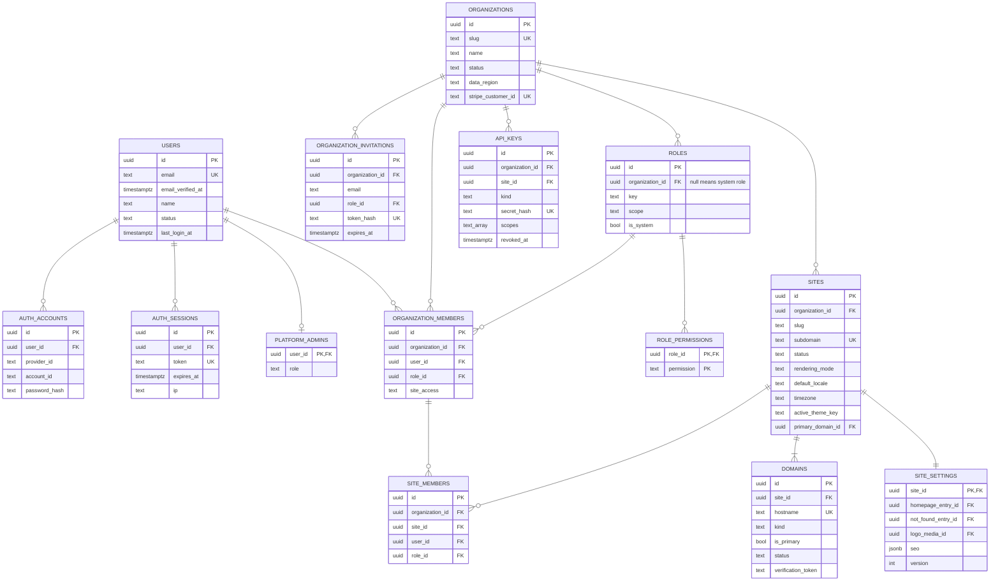
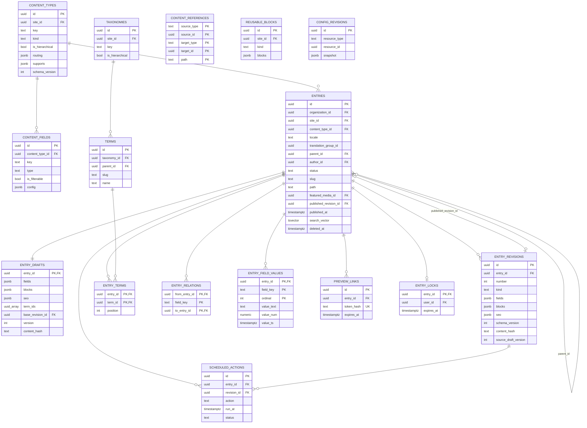
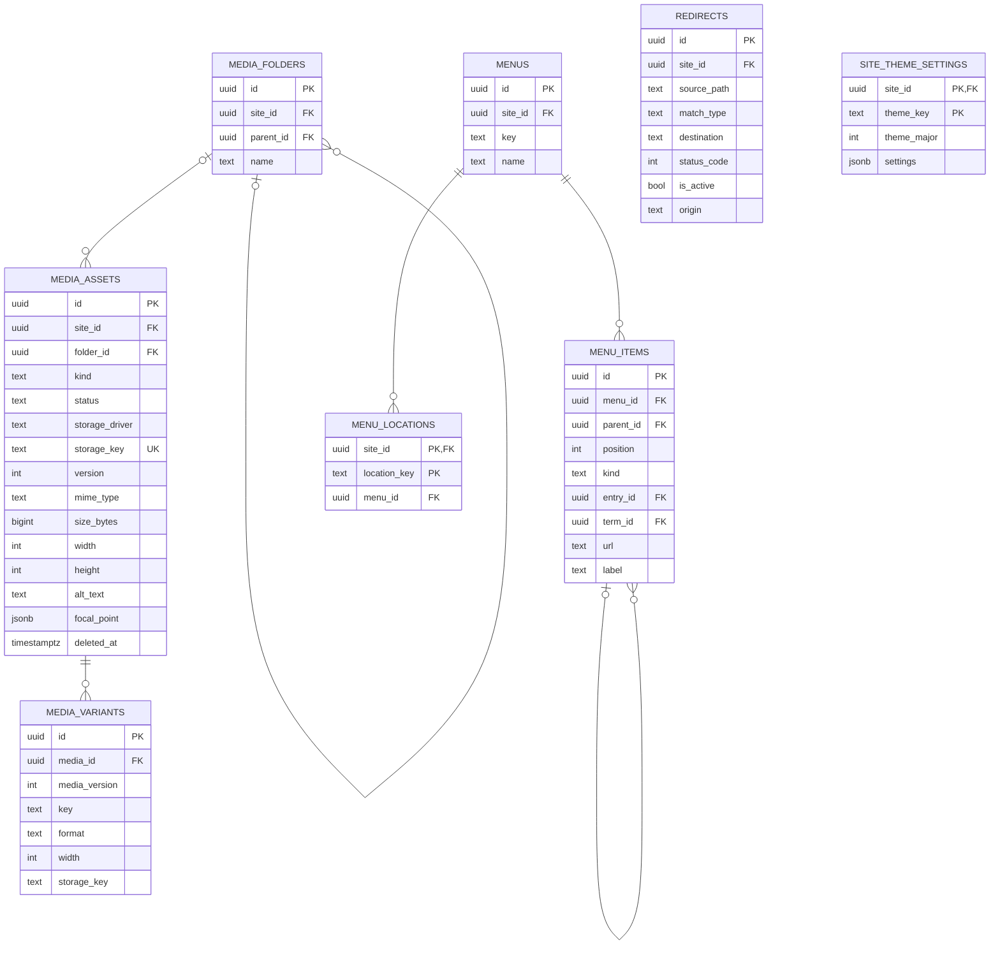
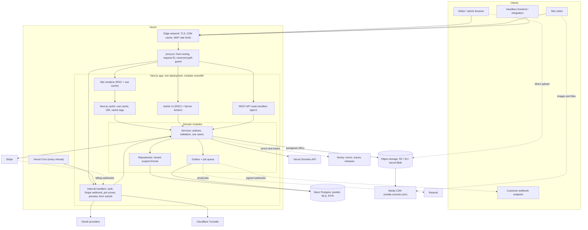
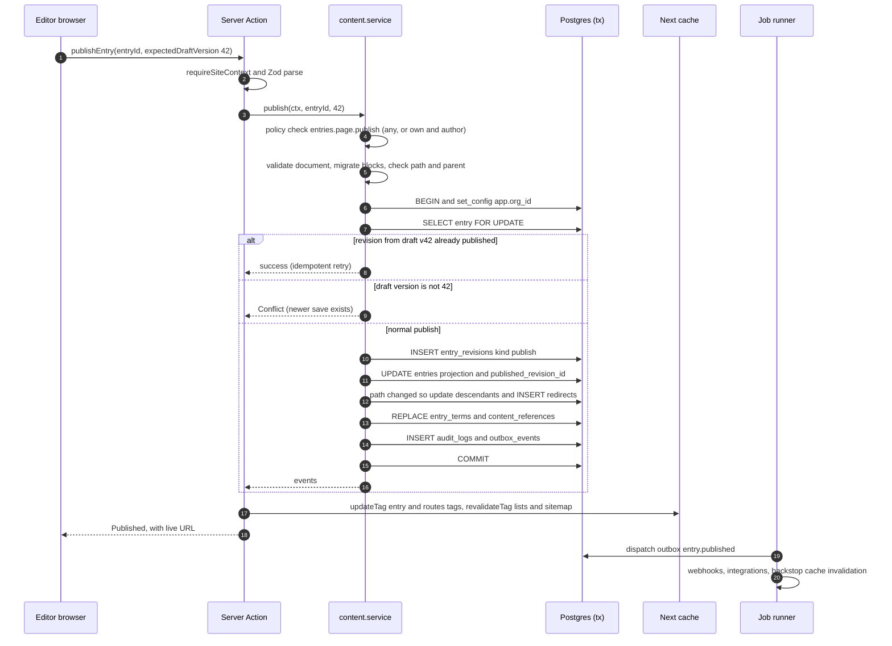
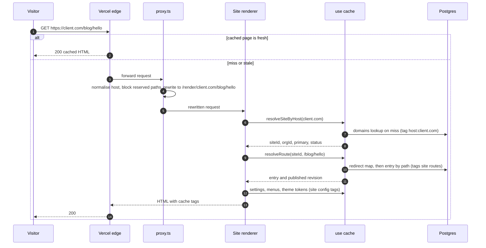

# Forge CMS — Architecture & Implementation Plan

| | |
|---|---|
| **Status** | Draft for team review — v0.1 |
| **Date** | 2026-09-30 |
| **Scope** | Multi-tenant CMS SaaS: admin dashboard, hosted website rendering, headless API |
| **Baseline stack** | Inherited from the Forgeline Technologies codebase (`../forgelinetechnologies`) |
| **Working name** | "Forge" (from this repository's name). All hostnames below are placeholders. |

> **What gets built first:** the first release is defined in **[v1-build-plan.md](v1-build-plan.md)** (with [v1-github-issues.md](v1-github-issues.md)). This document is the long-term target. Where the two differ, the V1 plan governs what is built now, and this document governs what V1 must not make impossible. §37–§38 below are superseded by the V1 plan for sequencing.

**How to read this document.** It is organised in the 40 sections requested, plus a closing answer (§41). Every significant choice is recorded as a numbered decision (**D-01 … D-40**) in the form *Decision → Reason → Tradeoff → Reconsider when*. GitHub issues and PRs should cite decision numbers. To change a decision, edit it here or supersede it with an ADR in `docs/adr/`. Don't let the code quietly diverge from it.

Small code, SQL and type snippets are **illustrative contracts**, not implementation.

### Placeholder hostnames

| Placeholder | Purpose |
|---|---|
| `app.cmsplatform.com` | Admin dashboard, authentication, Server Actions |
| `api.cmsplatform.com` | Public REST API (same deployment, rewritten to `/api/v1`) |
| `{site}.cmssites.com` | Default address of every tenant site. A **separate registrable domain** (D-02) |
| `client.com`, `www.client.com` | Tenant custom domains |
| `media.cmscdn.com` | Media CDN in front of object storage. Also a separate registrable domain |

### Contents

1. [Executive Architecture Summary](#1-executive-architecture-summary)
2. [Architectural Principles](#2-architectural-principles)
3. [System Architecture](#3-system-architecture)
4. [Multi-Tenant Architecture](#4-multi-tenant-architecture) — organizations, sites, custom domains, tenant request flow
5. [Application Architecture](#5-application-architecture) — modular monolith, Server Actions vs API, frontend, dashboard
6. [Database Architecture](#6-database-architecture)
7. [Entity Model](#7-entity-model)
8. [Mermaid ERD](#8-mermaid-erd)
9. [Mermaid System Diagram](#9-mermaid-system-diagram) — plus concrete request flows
10. [Authentication Architecture](#10-authentication-architecture)
11. [Authorization Architecture](#11-authorization-architecture)
12. [CMS Content Architecture](#12-cms-content-architecture) — content types, pages, posts, taxonomies, menus
13. [Media Architecture](#13-media-architecture)
14. [Page Builder Architecture](#14-page-builder-architecture)
15. [Revision Architecture](#15-revision-architecture)
16. [Publishing Architecture](#16-publishing-architecture)
17. [SEO Architecture](#17-seo-architecture) — plus the redirect manager
18. [API Architecture](#18-api-architecture)
19. [Webhook Architecture](#19-webhook-architecture)
20. [Theme Architecture](#20-theme-architecture)
21. [Plugin Architecture](#21-plugin-architecture) — plus analytics
22. [Forms Architecture](#22-forms-architecture) — plus comments
23. [Search Architecture](#23-search-architecture)
24. [Caching Architecture](#24-caching-architecture)
25. [Background Jobs](#25-background-jobs)
26. [Billing Architecture](#26-billing-architecture)
27. [Usage/Limits Architecture](#27-usagelimits-architecture)
28. [Security Architecture](#28-security-architecture) — plus audit logs and platform abuse
29. [Observability](#29-observability)
30. [Testing Architecture](#30-testing-architecture)
31. [Next.js Folder Structure](#31-nextjs-folder-structure)
32. [Drizzle Schema Organization](#32-drizzle-schema-organization)
33. [Environment Variables](#33-environment-variables)
34. [Deployment Architecture](#34-deployment-architecture)
35. [Failure Handling](#35-failure-handling)
36. [Scaling Strategy](#36-scaling-strategy)
37. [MVP Scope](#37-mvp-scope)
38. [Development Phases](#38-development-phases)
39. [Risks and Tradeoffs](#39-risks-and-tradeoffs)
40. [Final Recommended Architecture](#40-final-recommended-architecture)
41. [Five-year question](#41-if-i-had-to-maintain-this-for-five-years)

---

## 0. Baseline: what we inherit from Forgeline, and what changes

The Forgeline project is a single-tenant marketing site with an admin. Several of its patterns are good and carry over directly. Others were right for one tenant and one admin, and would hurt a multi-tenant SaaS.

| Area | Forgeline today | Forge CMS | Why |
|---|---|---|---|
| Framework | Next.js 16.3.4, React 19.2.8, TS strict, App Router | **Same** | Shared expertise; Next 16's Cache Components and `proxy.ts` suit multi-tenant rendering |
| Edge hook | `src/middleware.ts` (deprecated name in Next 16) | **`src/proxy.ts`** (Node runtime by default) | Middleware was renamed to Proxy in v16 |
| DB driver | `drizzle-orm/neon-http` | **`drizzle-orm/node-postgres` + `pg` Pool** on Neon's pooled endpoint, with `attachDatabasePool` (D-05) | neon-http cannot run interactive transactions. The CMS needs them for publish, RLS and the outbox |
| Primary keys | `serial` | **UUIDv7** (D-06) | Non-enumerable, safe to merge/shard/export across tenants |
| Migrations | `drizzle-kit push` | **`drizzle-kit generate` + reviewed SQL + `migrate` in CI** (D-32) | `push` against a database holding customer data is unsafe |
| Sessions | DB-backed opaque ids, revocable, scrypt | **Kept, through Better Auth** (D-07) | Same model, plus OAuth, verification, reset and MFA without hand-rolling each |
| Roles | Hard-coded `admin`/`editor` matrix in `capabilities.ts` | **Permission catalog in code + roles in DB + org/site scope** (D-09) | Multi-tenant, custom roles later |
| Status columns | `varchar` + comment, no pg enums | **Kept**, as `text` + `CHECK` constraint + TS union | Same reasoning (no enum-type migrations), plus DB-enforced validity |
| Audit log | Best-effort insert outside the operation | **Transactional and append-only** (D-30) | With transactions available, atomicity is free and enterprise buyers expect completeness |
| Background work | `after()` from `next/server` | **Durable Postgres job queue + outbox**; `after()` only kicks the runner (D-22) | `after()` is lost if the instance dies |
| Tests | `node --test` | **Vitest + Playwright + real Postgres** (D-31) | Path aliases, module mocking, DB fixtures and browser E2E at CMS scale |
| Rendering safety | Closed Markdown renderer (only tags we emit) | **Same philosophy**: structured JSON → closed React renderer (D-38) | Output is safe by construction |
| URL safety | `lib/prospecting/url-safety.ts` (DNS + private-IP blocking) | **Promoted to `platform/net/url-safety`** | Reused for webhooks, oEmbed and remote-URL import (SSRF) |
| Slugs | "A slug change is a redirect, never an edit" | **Automated**: path changes create 301s (D-20) | Codified as platform behaviour |
| Env handling | Lazy client creation, so a missing env can't crash imports | **Kept**, plus Zod-validated `config/env.ts` and a readiness check | The lesson from the contact-form outage carries over |

---

## 1. Executive Architecture Summary

**Forge is one Next.js 16 application on Vercel, one Neon Postgres database, one object-storage bucket, and a few external services** (Resend, Stripe, Vercel Domains API, Sentry, Cloudflare Turnstile). It is a **modular monolith**: about 20 domain modules with enforced import boundaries, each owning its tables, services and validation. Server Actions, REST handlers, background jobs and the site renderer are all thin adapters over the same services.

**Three faces, one deployment.** `proxy.ts` routes by hostname:
- the **admin app** (`app.cmsplatform.com`)
- the **site renderer**, which serves every tenant website on `*.cmssites.com` and on custom domains
- the **REST API** (`api.cmsplatform.com/v1`)

Tenant sites and media live on **separate registrable domains** from the admin. Tenant-authored HTML can never share cookies, same-site status or search-engine reputation with the control plane.

**Tenancy.** Organization (the tenant, billing and security boundary) → Sites → everything else. Users are global and join organizations through memberships, optionally restricted to specific sites. The data model is a **shared database, shared schema, with `organization_id` on every tenant-owned row**. This is enforced three ways:
1. application-level scoping through a `TenantContext` that only trusted resolvers can create
2. composite foreign keys that make cross-tenant references impossible
3. **Postgres Row-Level Security** as a backstop

For enterprise isolation or data residency, we grow into **cells** (a full copy of the stack per region or large customer), not database-per-tenant.

**Content.** A single `entries` model holds everything. Pages and posts are *system content types*; custom types later reuse the same machinery. Each entry is an aggregate of three parts:
- a relational **projection** (routing, status, dates, taxonomy links) for querying
- a mutable **draft** (the autosave target)
- immutable **revision snapshots**, which store a versioned JSON document (field values plus a block tree)

Publishing moves a pointer to a revision and refreshes the projection, in one transaction. Rich text and blocks are structured JSON rendered by a closed React renderer; HTML is never stored.

**Side effects follow commits.** Every mutation writes domain events to an **outbox** table in the same transaction. A **Postgres job queue**, drained by Vercel Cron every minute and kicked immediately via `after()`, handles:
- webhooks, emails and image variants
- scheduled publishing and cache warm-ups
- usage aggregation and cleanup

There is no Redis and no external queue on day one. Each has a named trigger for when it gets added.

**Caching.** Next.js Cache Components (`'use cache'`, `cacheTag`, `updateTag`/`revalidateTag`) with a strict per-site tag taxonomy. One pure function maps domain events to tags. Media is served from immutable object keys behind a CDN.

**Search** starts as Postgres full-text search plus `pg_trgm`, behind an interface that Typesense or Meilisearch can implement later.

**Billing.** Stripe is the source of truth. Plans and entitlements are versioned code. Usage limits use atomic counters with nightly reconciliation.

**Deliberately not in the design:** microservices, GraphQL, a third-party plugin runtime, tenant-uploaded theme code, Redis, Elasticsearch, real-time co-editing, database-per-tenant, event sourcing.

**Size of the effort.** With 2–3 senior engineers, the MVP (Phases 0–6, §38) is roughly **6–8 months**. A private beta with Forgeline's own agency clients is possible after Phase 5 (roughly 5–6.5 months), using manual billing.

### Decision index

| # | Decision | § |
|---|---|---|
| D-01 | Modular monolith: one Next.js app, one Postgres, object storage, external services | [5](#5-application-architecture) |
| D-02 | Admin, API, tenant sites and media on separated hostnames; sites and media on their own registrable domains | [3](#3-system-architecture) |
| D-03 | Shared database, shared schema, `organization_id` on every tenant row; cells for enterprise | [4](#4-multi-tenant-architecture) |
| D-04 | Defence-in-depth isolation: TenantContext + composite FKs + Postgres RLS | [4](#4-multi-tenant-architecture) |
| D-05 | `pg` Pool over Neon's pooled endpoint with `attachDatabasePool` (replaces neon-http) | [6](#6-database-architecture) |
| D-06 | UUIDv7 primary keys everywhere | [6](#6-database-architecture) |
| D-07 | Better Auth for authentication only; tenancy and RBAC are ours | [10](#10-authentication-architecture) |
| D-08 | Tenant carried in the URL (`/{org}/sites/{site}`), not as "active org" session state | [4](#4-multi-tenant-architecture) |
| D-09 | Permission catalog in code; roles in DB; org + site scope; ownership policies; no per-resource ACLs | [11](#11-authorization-architecture) |
| D-10 | Plan entitlements are a separate axis from RBAC | [11](#11-authorization-architecture) |
| D-11 | One `entries` model; pages and posts are system content types | [12](#12-cms-content-architecture) |
| D-12 | Hybrid storage: relational projection + JSONB documents + typed side index for filterable fields | [12](#12-cms-content-architecture) |
| D-13 | Entry aggregate = projection + mutable draft + immutable revisions + published pointer | [12](#12-cms-content-architecture) |
| D-14 | Block tree as versioned JSON with a code-defined block registry; no BlockInstance table | [14](#14-page-builder-architecture) |
| D-15 | Full-snapshot revisions; diffs computed on read | [15](#15-revision-architecture) |
| D-16 | Scheduling freezes a specific revision into `scheduled_actions` | [16](#16-publishing-architecture) |
| D-17 | Direct-to-storage uploads, immutable keys, pre-generated variant ladder, generic reference graph for usage | [13](#13-media-architecture) |
| D-18 | Storage driver abstraction; Cloudflare R2 as default | [13](#13-media-architecture) |
| D-19 | Field-level SEO precedence resolver as a pure function | [17](#17-seo-architecture) |
| D-20 | Site-scoped redirects, cached map, automatic on path change, chains flattened on write | [17](#17-seo-architecture) |
| D-21 | REST + OpenAPI generated from Zod; no GraphQL | [18](#18-api-architecture) |
| D-22 | Transactional outbox + Postgres job queue + Vercel Cron + `after()` kick | [25](#25-background-jobs) |
| D-23 | Outbound webhooks follow the Standard Webhooks spec | [19](#19-webhook-architecture) |
| D-24 | Integrations are first-party modules configured in the DB; no third-party code execution | [21](#21-plugin-architecture) |
| D-25 | Themes are code inside the app; tenants configure tokens and settings in the DB | [20](#20-theme-architecture) |
| D-26 | Postgres FTS + `pg_trgm`; external engine only on named triggers | [23](#23-search-architecture) |
| D-27 | Cache Components with a per-site tag taxonomy and one invalidation map | [24](#24-caching-architecture) |
| D-28 | Stripe is billing's source of truth; plans are versioned code | [26](#26-billing-architecture) |
| D-29 | Usage counters with atomic conditional increments + nightly reconciliation | [27](#27-usagelimits-architecture) |
| D-30 | Audit log written in the business transaction; append-only by DB grants | [28](#28-security-architecture) |
| D-31 | Vitest + Playwright + real Postgres for integration tests | [30](#30-testing-architecture) |
| D-32 | Generated, reviewed SQL migrations; expand/contract; no `push` outside local | [32](#32-drizzle-schema-organization) |
| D-33 | Sentry + structured logs + request IDs for MVP; OpenTelemetry later | [29](#29-observability) |
| D-34 | Custom domains need our own TXT ownership proof plus Vercel's domain API | [4](#4-multi-tenant-architecture) |
| D-35 | Forms: versioned JSONB definitions; submissions via route handler with idempotency | [22](#22-forms-architecture) |
| D-36 | Server Actions only for first-party UI mutations; Route Handlers for everything external | [5](#5-application-architecture) |
| D-37 | Separate root layouts (and bundles) for the admin and the site renderer | [5](#5-application-architecture) |
| D-38 | Rich text stored as ProseMirror/Tiptap JSON and rendered by a closed node→React mapper | [12](#12-cms-content-architecture) |
| D-39 | `locale` + `translation_group_id` on entries from day one | [12](#12-cms-content-architecture) |
| D-40 | Per-site export/import bundle as the tenant-level backup, restore and portability mechanism | [34](#34-deployment-architecture) |

---

## 2. Architectural Principles

1. **Boring by default.** Every new piece of infrastructure needs a named, measurable trigger that justifies it. Until then Postgres does the job: content, configuration, jobs, events, counters, audit.
2. **Tenant context is explicit and unforgeable.** It comes only from trusted resolution: session plus URL, hostname, API key, or job payload. Never from a request body. Every repository function requires it.
3. **Services are the application.** Business rules live in module services that know nothing about HTTP, React or Next.js. Server Actions, route handlers, jobs and scripts are adapters.
4. **Write ownership is strict; reads are pragmatic.** Only the owning module writes its tables. Read-model queries may join across modules' tables, in explicit `queries.ts` files.
5. **Immutable where possible.** Revisions, storage object keys, audit rows, form versions and webhook deliveries are append-only. Mutable state is the exception, and it is named.
6. **Content is structured data, not HTML.** Documents are versioned JSON validated by code-defined schemas and rendered by closed renderers.
7. **Side effects follow commits.** Emails, webhooks, search indexing and integrations are driven from the outbox. They are never fired from inside a transaction, and never fire-and-forget for must-happen work.
8. **Code defines vocabulary; the database holds choices.** Block types, themes, permissions, plans and integration providers are code. Which ones a tenant uses, and how they are configured, is data.
9. **Fail closed on security, degrade gracefully on everything else.** Unknown roles hold nothing. A failed analytics call costs nothing. A form submission is never lost because a notification failed (the same rule as Forgeline's email module).
10. **Design the data for five years, build the features for five months.** Columns like `locale`, `organization_id` and `schema_version` are cheap now and expensive later. UIs built on them can wait.
11. **Every external dependency sits behind a seam.** Storage, email, queue, search, rate limiting, auth, billing and domains are interfaces with one production implementation, so replacing one is a module change, not a rewrite.

---

## 3. System Architecture

### 3.1 Runtime components

| Component | Where it runs | Responsibility |
|---|---|---|
| **Vercel edge / CDN / WAF** | Vercel | TLS, caching of rendered pages and assets, WAF rate-limit rules, bot protection |
| **`proxy.ts`** | Vercel (Node runtime) | Normalise the host; route to admin, renderer or API; assign request ID; block reserved internal paths; optimistic auth redirect for admin. *Not a security boundary*, as in Forgeline |
| **Admin app** | Next.js RSC + Server Actions | Dashboard UI, editors, settings. Always dynamic, never cached across requests |
| **Site renderer** | Next.js RSC with `'use cache'` | Renders tenant sites by hostname. Cached per site/path, invalidated by tags |
| **REST API** | Next.js route handlers | Management and delivery APIs for headless use and integrations |
| **Internal handlers** | Next.js route handlers | Better Auth handler, Stripe webhooks, job runner (Cron), preview entry, form submissions |
| **Domain modules** | In-process TypeScript | Services, policies, validation, repositories, events |
| **Postgres (Neon)** | Neon, same region as the functions | System of record, job queue, outbox, counters, audit, search |
| **Object storage** | Cloudflare R2 (default) / S3 / Vercel Blob | Media originals and variants, exports |
| **Media CDN** | Cloudflare (for R2) / CloudFront | Immutable media delivery on `media.cmscdn.com` |
| **Vercel Cron** | Vercel | Heartbeat that drains the job queue and sweeps scheduled work every minute |

### 3.2 Hostname topology

> **D-02 — Separate hostnames; tenant sites and media on their own registrable domains**
> - **Decision:** Admin on `app.cmsplatform.com`. API on `api.cmsplatform.com` (same deployment, rewritten to `/api/v1`). Tenant sites on `{site}.cmssites.com` and custom domains. Media on `media.cmscdn.com`. `cmssites.com` and `cmscdn.com` are *different registrable domains* from `cmsplatform.com`.
> - **Reason:**
>   - Tenant pages can contain tenant-authored HTML, embeds and third-party scripts. If they shared a registrable domain with the admin, they would be *same-site* (SameSite cookies would not protect the admin), could set cookies on the parent domain ("cookie tossing"), and could hurt the admin's reputation: one phishing site on a free subdomain can get the whole domain flagged by Safe Browsing.
>   - Uploaded files (SVG, PDF, HTML-sniffable types) get the same isolation on the media domain.
>   - A separate `api.` host lets the API move to another deployment later without breaking clients.
> - **Tradeoff:** More DNS and certificates to manage. Preview (admin → site) needs a signed-token handoff because admin cookies don't exist on site domains (§16). Two extra domains to buy.
> - **Reconsider when:** Never for the admin/sites split. Once there are many tenants, submit `cmssites.com` to the Public Suffix List so tenant subdomains cannot set cookies for each other (as `github.io` and `vercel.app` do).

### 3.3 External services and seams

| Capability | MVP provider | Interface (`src/platform/...`) | Alternatives kept possible |
|---|---|---|---|
| Object storage | Cloudflare R2 (S3 API, no egress fees) | `storage/StorageDriver` | AWS S3, Vercel Blob, MinIO (local), any S3-compatible store |
| Transactional email | Resend | `email/EmailProvider` | Postmark, SES, SMTP (Mailpit locally) |
| Billing | Stripe Billing + Checkout + Customer Portal | `billing/BillingProvider` | Paddle / Lemon Squeezy (merchant-of-record), manual |
| Custom domains + SSL | Vercel Domains API (Vercel for Platforms) | `domains/DomainProvider` | Cloudflare for SaaS (if we ever leave Vercel's edge) |
| Bot protection on forms | Cloudflare Turnstile | `captcha/CaptchaVerifier` | hCaptcha, none |
| Rate limiting | Vercel WAF rules + `@vercel/firewall` `checkRateLimit` | `rate-limit/RateLimiter` | Upstash Redis, Postgres token bucket |
| Error tracking / tracing | Sentry (`@sentry/nextjs`) | `observability/*` | OpenTelemetry exporters (Honeycomb, Grafana, Datadog) |
| Queue | Postgres `jobs` table | `jobs/JobQueue` | Vercel Queues (in beta at time of writing), Inngest, Trigger.dev, Upstash QStash |
| Search | Postgres FTS + `pg_trgm` | `search/SearchIndex` | Typesense, Meilisearch, Algolia |
| OAuth identity | Google (MVP), GitHub/Microsoft next | Better Auth providers | Any OIDC provider; WorkOS for enterprise SSO |

Each interface has exactly one production implementation until a second is needed. A seam is not permission to build two implementations.

### 3.4 Email architecture (Resend, replaceable)

- **Interface:** `EmailProvider.send({ to, from, replyTo, subject, react | html, text, tags, idempotencyKey }) → { providerMessageId }`. The Resend adapter is about 50 lines. Templates are React Email components in `src/platform/email/templates/`, rendered server-side.
- **Emails are always jobs.** Services enqueue `email.send` through the outbox. The job calls the provider with an idempotency key derived from the job ID, so retries never double-send. Auth emails (verify, reset) also get an immediate `after()` kick, so the user doesn't wait for the cron tick.
- **Sender identities:**
  - Platform mail (verification, reset, invitations, billing notices) comes from `notifications@cmsplatform.com`.
  - Tenant-triggered mail (form notifications, comment moderation) also comes from a platform address, with **Reply-To set to the submitter**. This is the pattern Forgeline already uses for enquiries.
  - Tenant custom sending domains (Resend domains API per tenant) are **LATER**.
- **Failure policy:** Forgeline's email rule carries over: *never throw, never lose the underlying record.* A failed form notification leaves the submission stored and visible, and shows the failed notification in the form's delivery log.
- **Bounces and complaints:** Resend webhooks feed an `email_suppressions` list (SHOULD). This protects the platform's sender reputation, which all tenants share.
- **Local/dev:** a `ConsoleEmailProvider` or Mailpit SMTP adapter. E2E tests read captured mail from a test adapter.

---

## 4. Multi-Tenant Architecture

### 4.1 Tenancy model

```text
Platform
└── Organization            ← the tenant: billing, security and data boundary
    ├── Members (users ↔ org, with a role; optionally restricted to some sites)
    ├── Subscription, usage, API keys, audit log, webhooks
    └── Sites               ← a website (hosted) or a content space (headless)
        ├── Domains (subdomain + custom domains)
        ├── Settings, theme settings, menus, redirects
        ├── Content types → Entries (pages, posts, custom) → Drafts, Revisions
        ├── Taxonomies → Terms
        ├── Media (folders, assets, variants)
        └── Forms → Submissions; Comments
```

Worked example from the brief:

```text
User "Raymund"
 ├── member of Organization "Forgeline Technologies" (role: Owner, site access: all)
 │     └── Site "Forgeline Website"
 └── member of Organization "Client Company"        (role: Editor, site access: restricted)
       ├── Site "Main Website"   ← site_members: Editor
       └── Site "Blog Website"   ← no access (not listed, 404 if requested)
```

A user is global: one login, one profile. Membership is per organization. "Agency manages client sites" is modelled either as the agency being members of the client's organization, or the client being members (restricted) of the agency's organization. Both work without special cases. A dedicated agency↔client relationship (white-label, client billing) is **LATER**.

### 4.2 Options compared

| Criterion | A. Database per tenant | B. Schema per tenant | C. Shared schema + tenant key |
|---|---|---|---|
| **Isolation** | Strongest (separate DB; on Neon, a separate project/branch) | Strong-ish (`search_path` mistakes leak) | Logical. Relies on app scoping; with RLS, enforced by Postgres |
| **Query filtering** | None needed | Set `search_path` per request (fragile with pooling) | `WHERE organization_id = …` everywhere; RLS as backstop |
| **Security risks** | Misrouting connections | Pooled connection keeps the wrong `search_path`; schema-name injection | Missing `WHERE` clause (the classic IDOR). Mitigated by D-04 |
| **Performance** | Good per tenant; many cold computes on Neon (scale-to-zero latency) | Postgres catalog bloat beyond a few thousand schemas | Best overall: shared buffers, one pool, one plan cache. Needs tenant-leading indexes |
| **Migration complexity** | N migrations; drift and partial failure across thousands of DBs | N schemas; same drift problem, in one DB | One migration |
| **Backup/restore** | Trivial per tenant | Per-schema dump possible | PITR restores *everyone*. Per-tenant restore needs a logical export/import (D-40) |
| **Scaling** | Horizontal by nature | Vertical, one DB | Vertical first, then shard by `organization_id` (cells) |
| **Cost on Neon** | Per-project overhead; Neon markets this, but ops tooling becomes our job | Low | Lowest |
| **Cross-tenant ops** (analytics, platform admin, migrations) | Hard | Medium | Easy |
| **Fit: early SaaS** | ✗ over-engineered | ✗ | ✅ |
| **Fit: hundreds of tenants** | ✗ | △ | ✅ |
| **Fit: thousands of tenants** | △ (only with heavy automation) | ✗ (catalog bloat) | ✅ with tenant-leading indexes and pooling |
| **Fit: enterprise** | ✅ where contractual isolation or residency is required | △ | ✅ for most; a **dedicated cell** for the few who need physical isolation |

> **D-03 — Shared database, shared schema, `organization_id` on every tenant-owned row**
> - **Decision:** Option C. Every tenant-owned table has `organization_id uuid NOT NULL`. Site-scoped tables also have `site_id uuid NOT NULL`. Enterprise physical isolation and data residency come from **cells**: a complete copy of the stack (Vercel project + Neon project + bucket) per region or large customer, with a small global directory mapping organization → cell.
> - **Reason:** It is the cheapest option to operate, migrate and query. A small team can't run thousands of databases. Neon's branching and PITR still work. `organization_id` on every row is also the sharding key: cells, per-tenant export and per-tenant deletion are all "filter by `organization_id`".
> - **Tradeoff:** Isolation is logical, so it depends on D-04 being done rigorously. Noisy neighbours share one database (mitigations in §36). Per-tenant point-in-time restore requires the export/import tooling in D-40.
> - **Reconsider when:** A signed customer requires physical isolation or residency (→ provision a cell; the code doesn't change), or a single Postgres primary can no longer hold the working set after vertical scaling and read replicas (→ multiple cells split by organization).

### 4.3 Tenant isolation: defence in depth

> **D-04 — Three enforced layers: TenantContext, composite FKs, Postgres RLS**
> - **Decision:**
>   1. **TenantContext.** Repositories cannot be called without a `TenantContext`. Only trusted resolvers can create one: `requireSiteContext()` (session + URL), `resolveSiteByHost()`, `authenticateApiKey()`, `jobContext(payload)`. Every query includes `site_id`/`organization_id` from the context, never from input.
>   2. **Composite foreign keys.** `(organization_id, site_id) → sites(organization_id, id)`, and `(site_id, media_id) → media_assets(site_id, id)` for intra-site references. The database rejects a row that points across tenants, even if the application has a bug.
>   3. **RLS.** Row-Level Security is `ENABLE`d and `FORCE`d on every tenant table. The runtime connects as a role that owns nothing and cannot bypass RLS. Each tenant unit of work runs in a transaction that sets `app.org_id` with `set_config(…, true)` (transaction-local, so it is safe with PgBouncer transaction pooling).
> - **Reason:** Layer 1 catches almost all mistakes cheaply and gives good errors. Layer 2 stops corrupt cross-tenant links. Layer 3 turns the remaining class of bug (a forgotten `WHERE` in a new query) from a data breach into an empty result. RLS is far cheaper to adopt on day one than to retrofit.
> - **Tradeoff:** Every tenant query runs inside a transaction (BEGIN / `set_config` / COMMIT round trips, roughly 1–3 ms when co-located with Neon). Developers must learn `withTenant()`. Some Drizzle conveniences need care. RLS policies must be tested.
> - **Reconsider when:** Measured overhead on hot read paths is significant *after* caching. Then move specific read-only renderer queries to an RLS-exempt read path with explicit filters and a lint rule. Never drop RLS on writes.

**Table classes.** Every table belongs to exactly one class, and the class decides its protection:

| Class | Examples | RLS | Access rule |
|---|---|---|---|
| **Tenant** | `sites`, `entries`, `media_assets`, `forms`, `audit_logs` | `organization_id = app.org_id` | Only through `withTenant()` |
| **Membership** (bridges user ↔ tenant) | `organizations`, `organization_members` | Visible if `organization_id = app.org_id` **or** `user_id = app.user_id` (so the org switcher works) | Tenancy module only |
| **Identity** | `users`, `auth_*` | None (not tenant data) | Identity module only (lint-enforced) |
| **Platform** | `domains`, `jobs`, `outbox_events`, `scheduled_actions`, `billing_events` | None | Owning module only (lint-enforced); rows still carry `organization_id` |
| **Token lookups** | API-key hash → org, invitation token → org, preview token → site | Via `SECURITY DEFINER` SQL functions returning the minimum columns | The only sanctioned RLS bypasses on request paths |

`domains` is a platform table because hostnames are public (DNS is public), and host resolution must happen *before* the tenant is known.

**RLS policy template (illustrative):**

```sql
-- Roles: forge_owner owns the schema and runs migrations (CI only).
--        forge_app is the runtime role: owns nothing, NOBYPASSRLS.
ALTER TABLE entries ENABLE ROW LEVEL SECURITY;
ALTER TABLE entries FORCE  ROW LEVEL SECURITY;

CREATE POLICY tenant_isolation ON entries
  USING      (organization_id = nullif(current_setting('app.org_id', true), '')::uuid)
  WITH CHECK (organization_id = nullif(current_setting('app.org_id', true), '')::uuid);
-- nullif(...,'') matters: once a pooled server connection has seen a
-- transaction-local set_config, current_setting() returns '' instead of NULL.
-- Unset context ⇒ NULL ⇒ no rows. Fails closed.
```

```ts
// Illustrative contract — src/platform/db/tenant.ts
withTenant<T>(ctx: { orgId: string; userId?: string }, work: (tx: TenantTx) => Promise<T>): Promise<T>
// BEGIN; SELECT set_config('app.org_id',$1,true), set_config('app.user_id',$2,true); …work…; COMMIT
```

### 4.4 Organizations

- **`organizations`:** `id`, `name`, `slug` (globally unique; used in admin URLs), `status` (`active` | `suspended` | `pending_deletion`), `billing_email`, `data_region` (default `'default'`, the cell key, D-03), `created_by`, timestamps, `deleted_at`.
- **`organization_members`:** `(organization_id, user_id)` unique, `role_id`, `site_access` (`all` | `restricted`), `status`, `invited_by`, `joined_at`.
- **`organization_invitations`:** email, role, optional site assignments, hashed token, expiry, accepted/revoked timestamps.
- **Invariants:**
  - An organization always has at least one Owner. Enforced in the service under a row lock on the organization, and covered by tests.
  - Ownership transfer is an explicit, re-authenticated, audited action.
- **Deletion lifecycle:**
  1. Owner requests deletion (re-auth).
  2. `pending_deletion` for 30 days: sites offline, data intact, reversible.
  3. A purge job deletes in batches: objects in storage, then rows (per table, by `organization_id`).
  4. Audit rows are anonymised but kept per retention policy.
  5. The Stripe subscription is cancelled at step 1.

### 4.5 Sites

Where each attribute from the brief lives:

| Attribute | Location | Notes |
|---|---|---|
| Name, slug, status | `sites` | status: `active` \| `maintenance` \| `suspended` (billing/abuse) \| `archived` |
| Subdomain | `sites.subdomain` (globally unique) + a `domains` row of kind `subdomain` | Reserved-word list (`www`, `app`, `api`, `admin`, `mail`, `status`, …) |
| Domain, custom domain | `domains` (many per site); `sites.primary_domain_id` | §4.6 |
| Rendering mode | `sites.rendering_mode` | `hosted` (we render) \| `headless` (API + webhooks + preview URL template only) |
| Theme | `sites.active_theme_key`; settings in `site_theme_settings` | Settings kept per theme, so switching back restores them |
| Locale, timezone | `sites.default_locale`, `sites.timezone` (IANA) | Timezone drives scheduling UI and archive dates |
| Default SEO | `site_settings.seo` (JSONB, Zod-validated) | Title template, default description/image, robots default, organization schema |
| Analytics | `integration_installations` (provider `ga4`, `plausible`, `gtm`) | §21.4 |
| Branding, logo, favicon | `site_settings.logo_media_id`, `favicon_media_id` (composite FKs to media) + theme tokens | Favicon variants generated by the media job |
| Social links | `site_settings.social` | Used by themes and `Organization` JSON-LD |
| Navigation | `menus`, `menu_items`, `menu_locations` | §12.8 |
| Homepage | `site_settings.homepage_entry_id` (null = latest posts) | Composite FK |
| 404 page | `site_settings.not_found_entry_id` (null = theme default) | |
| Maintenance mode | `sites.status = 'maintenance'` + `site_settings.maintenance` (message, allow-list) | Visitors get 503 + `Retry-After`; editors bypass via preview token |

Setting changes write a `config_revisions` snapshot, so they can be restored (§15).

### 4.6 Custom domains

> **D-34 — Custom domains need our own TXT ownership proof plus Vercel's domain API**
> - **Decision:** A custom domain goes live only after:
>   1. The tenant proves ownership with a TXT record `_cms-challenge.<domain>` containing a per-claim random token.
>   2. The domain is attached to our Vercel project via the Domains API (`projectsAddProjectDomain`).
>   3. Vercel reports it configured (`getDomainConfig` shows it not misconfigured) and its certificate issued.
> - **Reason:** Checking only "DNS points at us" invites **domain takeover**. When a customer deletes a site but leaves their DNS pointing at Vercel, anyone could claim the domain on our platform and serve content on it. It also enables **squatting**: someone claims `bigbrand.com` first and blocks the real owner. A per-claim TXT token proves control of the zone.
> - **Tradeoff:** One more DNS record for customers. Onboarding copy must be very clear, with a live checker.
> - **Reconsider when:** Never remove the proof. If we move off Vercel's edge, swap the `DomainProvider` implementation (e.g., Cloudflare for SaaS custom hostnames, which have equivalent pre-validation).

**Domain lifecycle:**

```text
pending_verification ──TXT ok──▶ pending_dns ──Vercel verified + configured + cert──▶ active
        │                              │                                               │
        └── 7 days, no TXT ──▶ expired  └── 14 days misconfigured ──▶ failed            └── removed ──▶ (row deleted, detached from Vercel)
```

- **Adding:**
  1. Normalise (lowercase, strip port and trailing dot, IDNA/punycode) and parse with the Public Suffix List (`tldts`).
  2. Reject platform domains, IP addresses, and hostnames already claimed by an *active* domain.
  3. Show the DNS instructions: an apex `A` record to Vercel's anycast address, or a `CNAME` for subdomains, exactly as the Vercel API response dictates. Never hard-code them.
  4. The TXT record is shown alongside.
- **`www` + apex:** add both. One is primary; the other is added with Vercel's domain-level redirect (`redirect`, `redirectStatusCode: 308`). The renderer also 308s any non-primary host to the primary host, so canonical URLs are always correct.
- **SSL:**
  - Custom domains: Vercel issues and renews certificates automatically (HTTP-01) once DNS points at it.
  - `*.cmssites.com`: a wildcard certificate, which **requires the `cmssites.com` zone to use Vercel nameservers** (DNS-01).
- **Status polling:** a `domain.check` job with backoff (1 min → 5 min → 30 min → 6 h), running until active or failed. A "Check now" button runs it immediately. Active domains are rechecked daily to detect DNS drift, and owners are emailed on breakage.
- **Security:**
  - Unique index on `domains.hostname` (one claim platform-wide).
  - Homograph check: flag mixed-script IDNs for review.
  - A blocklist of well-known brands and phishing patterns applies to *subdomains* on free plans.
  - Removing a site detaches its domains from Vercel *first*, then deletes the rows.
- **Scale check:** confirm the per-project custom-domain limit on our Vercel plan before GA. It is a scaling trigger (§36).

### 4.7 Tenant resolution and the multi-tenant request flow

There are exactly four ways a request acquires a tenant. Nothing else may construct a `TenantContext`.

**(a) Admin request: tenant comes from the URL**

```text
Request  GET app.cmsplatform.com/acme/sites/main-site/posts
 ↓ proxy.ts: host = app.* → pass through; assign x-request-id; cookie-present check (UX only)
 ↓ Route segment layout: requireSiteContext({ orgSlug: "acme", siteSlug: "main-site" })
     1. session  = identity.getSession()               → userId            (401 → /login)
     2. org      = SELECT org + membership WHERE slug = 'acme' AND user_id = userId
                                                       → orgId, orgRole    (none → 404)
     3. site     = SELECT site WHERE org_id = orgId AND slug = 'main-site'
                                                       → siteId            (none → 404)
     4. access   = site_access = 'all' OR site_members row exists           (no → 404)
     5. perms    = effectivePermissions(orgRole, siteRole)   (React cache(): once per request)
 ↓ ctx = { userId, orgId, siteId, permissions, requestId, actor: {type: 'user'} }
 ↓ Service → policy check can(ctx, 'entries.post.read')                     (no → 403)
 ↓ withTenant(ctx) → BEGIN; set_config('app.org_id', orgId, true)
 ↓ Repository: … WHERE site_id = ctx.siteId AND id = $input                 (RLS re-checks org)
 ↓ COMMIT → render
```

> **D-08 — Tenant carried in the URL, not as "active org" session state**
> - **Decision:** Admin URLs are `/{orgSlug}/sites/{siteSlug}/...` (org pages: `/{orgSlug}/members`, `/billing`, …). Sessions hold no tenant state.
> - **Reason:** Two tabs on two organizations just work. Links are shareable. There is no "which org am I in?" bug class. Server Actions re-derive the tenant from arguments that are checked against membership.
> - **Tradeoff:** A few URL-level reserved words (`settings`, `account`, `new`, `api`, `login`, …) and an extra membership query per request (one indexed join, deduped per request).
> - **Reconsider when:** Not expected.

**(b) Public site request: tenant comes from the hostname**

```text
Request  GET https://client.com/blog/hello
 ↓ Vercel edge: CDN hit? → serve cached HTML (done)
 ↓ proxy.ts: host = client.com → not app/api → rewrite to /render/client.com/blog/hello
            (direct requests to /render/* on ANY host → 404; any `Next-Action` POST on a site host → 404)
 ↓ app/(sites)/render/[host]/layout.tsx: resolveSiteByHost("client.com")   ['use cache', tag host:client.com]
     domains (platform table) → { siteId, orgId, isPrimary, status }       (none → platform "site not found" page)
     not primary → 308 to primary host
     site suspended → "site unavailable" page (503); maintenance → 503 unless draftMode
 ↓ ctx = { orgId, siteId, actor: {type:'anonymous'} }  (read-only; public visibility rules enforced in queries)
 ↓ resolveRoute(siteId, "/blog/hello") ['use cache', tags site:{id}:routes]
     redirect map hit → 301/308 ; entry by path → render ; archive route → render ; else 404 page
 ↓ withTenant({orgId}) for every uncached read → RLS applies to anonymous reads too
```

**(c) API request: tenant comes from the API key**

```text
Authorization: Bearer fk_live_…  → sha256 → resolve_api_key(hash)  [SECURITY DEFINER fn]
 → { keyId, orgId, siteId?, scopes, expiresAt, revokedAt }       (invalid → 401, uniform timing)
 → rate limit by keyId → ctx = { orgId, siteId, permissions: scopes, actor: {type:'api_key', id} }
 → path siteId must equal key.siteId (site-bound keys) or belong to orgId (org keys)  (else 404)
```

**(d) Job: tenant comes from the payload written by trusted code**

```text
jobs.payload = { orgId, siteId, … } (written by a service inside withTenant)
 → runner validates payload with the job's Zod schema → withTenant({orgId}) → handler
```

**Preventing cross-tenant access: the checklist every PR is reviewed against**

1. `organization_id`/`site_id` are never read from request bodies, query strings or form fields. Only from `ctx`.
2. Every lookup by ID is `WHERE id = $id AND site_id = ctx.siteId`. A miss is **404**, never 403, so existence doesn't leak.
3. Repositories take `ctx` (or `TenantTx`) as their first parameter. Lint forbids importing `platform/db` outside `modules/*/repository*.ts`, `modules/*/queries.ts` and `platform/*`.
4. Composite FKs make cross-site references unrepresentable.
5. RLS is `FORCE`d. The runtime role cannot bypass it. CI checks `pg_class.relrowsecurity` for every table that has `organization_id`.
6. Cache keys always include `siteId` (it is an argument of every `'use cache'` function); tags are prefixed `site:{id}:`.
7. Storage keys are prefixed `o/{orgId}/s/{siteId}/…`. Signed URLs are generated only after a scoped DB lookup.
8. Search queries are filtered by `site_id` inside the repository, never by the caller.
9. Job payloads are Zod-validated, and handlers re-load rows through tenant-scoped repositories.
10. The isolation test suite (§30) creates two tenants and asserts that every repository, route and action returns nothing from the other.

---

## 5. Application Architecture

### 5.1 Options compared

| Criterion | A. Next.js monolith | B. Next.js + separate API service | C. Next.js frontend + backend service(s) |
|---|---|---|---|
| Velocity for 2–4 engineers | Highest: one repo, one deploy, shared types | Medium: two deploys, versioned contract | Lowest: service contracts, distributed debugging |
| Type sharing | Direct imports | Via generated client/OpenAPI | Via generated clients |
| Transactions across features | Local DB transactions | Local inside the API | Distributed (sagas) if split by domain |
| Scaling | Vercel scales functions per route automatically | API can scale separately | Independent per service |
| Failure isolation | Shared deployment (mitigated by per-route functions) | Better | Best |
| Latency | In-process calls | Extra network hop for every admin read | Extra hops |
| Ops cost | Lowest | Medium | Highest |
| Right when | Until a runtime profile (not a business domain) needs different scaling or limits | Non-JS or third-party clients dominate *and* need a separate SLA | Long-running compute, very different scaling, separate teams |

> **D-01 — Modular monolith: one Next.js app + one Postgres + object storage + external services**
> - **Decision:** Build Option A with hard internal boundaries: modules, public APIs, lint rules and ownership of tables. Services are transport-agnostic, so extracting a deployable later is a move, not a rewrite.
> - **Reason:** Fastest path to a correct product for a small team. Transactions stay local. Vercel already runs each route as an independently scaled function.
> - **Tradeoff:** One deploy ships everything; one bad dependency affects all surfaces. Boundaries depend on lint discipline, not network walls.
> - **Reconsider when:** A *runtime profile* diverges. Examples: media processing needs more memory or time than functions allow; the renderer's traffic or domain count needs its own project; a second team owns a surface. Split by deployable (admin / renderer / API+workers) from the same codebase. Don't split by business domain into microservices.

**Recommendation by stage:**

| Stage | Shape |
|---|---|
| **MVP** | One Next.js app, one Neon database, one bucket, Postgres job queue |
| **~100 customers** | Same. Turn off Neon scale-to-zero for production; add Sentry performance tracing |
| **~1,000 customers** | Same app. Possibly a managed queue (Vercel Queues once GA, or Inngest) if the cron-drained queue lags. Possibly a separate *worker* Vercel project (same repo) for media processing. Neon read replica for exports and reporting |
| **10,000+ customers** | Split deployables from one repo (convert to a pnpm workspace then): `admin`, `renderer`, `api+workers`, sharing `modules/*` as packages. External search engine. Cells for enterprise and residency (D-03) |

### 5.2 Module map

| Module | Owns tables | Responsibility | Depends on |
|---|---|---|---|
| `identity` | `users`, `auth_accounts`, `auth_sessions`, `auth_verifications`, `user_two_factors`, `platform_admins` | Authentication, profile, sessions, MFA | — |
| `tenancy` | `organizations`, `organization_members`, `organization_invitations`, `site_members` | Orgs, membership, invitations, ownership | identity, access, usage, audit |
| `access` | `roles`, `role_permissions`, `api_keys` | Permission catalog, policies, roles, API keys | tenancy |
| `sites` | `sites`, `site_settings`, `domains` | Sites, settings, domain lifecycle | tenancy, media, content (homepage ref), usage |
| `content` | `content_types`, `content_fields`, `entries`, `entry_drafts`, `entry_revisions`, `taxonomies`, `terms`, `entry_terms`, `entry_relations`, `entry_field_values`, `entry_locks`, `preview_links`, `scheduled_actions`, `reusable_blocks`, `config_revisions` | Content modelling, editing, revisions, publishing, taxonomies | blocks, media, references, seo, usage |
| `blocks` | — (code registry) | Block definitions, validation, migrations, renderers, extractors | media |
| `media` | `media_folders`, `media_assets`, `media_variants` | Uploads, processing, library | platform/storage, references, usage |
| `references` | `content_references` | "Where is X used" graph | — |
| `navigation` | `menus`, `menu_items`, `menu_locations` | Menus | content |
| `seo` | `redirects` | SEO resolver, sitemaps, robots, JSON-LD, redirects | content, sites |
| `forms` | `forms`, `form_versions`, `form_submissions`, `form_notifications` | Form builder, submissions, notifications | platform/captcha, platform/email |
| `comments` | `comments` | Comments and moderation | content |
| `themes` | `site_theme_settings` | Theme registry, settings, tokens | — |
| `rendering` | — | Public route resolution and page assembly | content, seo, navigation, themes, blocks, media |
| `webhooks` | `webhook_endpoints`, `webhook_deliveries` | Endpoints, dispatch, delivery | platform/jobs |
| `integrations` | `integration_installations` | Provider registry and per-site config | — |
| `billing` | `subscriptions`, `billing_events`, `entitlement_overrides` | Plans, Stripe, entitlements | usage |
| `usage` | `usage_counters` | Metering and limit enforcement | billing |
| `audit` | `audit_logs` | Append-only audit and activity feed | — |
| `search` | — (search columns live on owning tables) | Search interface and query building | content, media |
| `platform/*` (not a domain) | `jobs`, `outbox_events`, `idempotency_keys` | DB, jobs/outbox, cache, storage, email, rate limit, crypto, net, observability, config | — |

### 5.3 Layers inside a module and dependency rules

```text
src/app/…            routes, layouts, pages, Server Action entry points, route handlers
   │                 may import ONLY  @/modules/<m>  (the module's index.ts) and @/components
   ▼
modules/<m>/service  use cases: authorize → validate → load → decide → persist → record events → audit
   │                 pure helpers beside it (state machines, resolvers, calculators) — unit tested
   ▼
modules/<m>/repository   Drizzle queries; tenant-scoped; no business rules; returns typed rows
modules/<m>/queries      read models for RSC; may JOIN other modules' tables (read-only)
   ▼
platform/db          pool, withTenant(), transaction/unit-of-work, column helpers
```

**Rules:**
- Services never import `next/*`. No `headers()`, `cookies()`, `redirect()` or `updateTag()` in services. Adapters do that.
- **Services return domain events.** The adapter flushes cache invalidation: `updateTag` in Server Actions, `revalidateTag(…, 'max' | {expire:0})` in handlers and jobs. The outbox also triggers an invalidation job as a backstop (§24).
- Only the owning module writes its tables. Other modules call its service. Pure reactions (search index, webhooks, integrations) subscribe to events asynchronously.
- A service opens the transaction (`withTenant`) and passes `tx` to repositories. A service that composes another module's write passes its `tx` through (unit of work), so one use case is one transaction.
- Lint enforces imports with ESLint `no-restricted-imports` patterns (no new dependency). `@/modules/*/!(index)` is forbidden outside the module. `@/platform/db` is forbidden outside repositories, queries and platform. `dependency-cruiser` can be added to CI if the rules outgrow ESLint.

### 5.4 Request context

```ts
// Illustrative contract — src/platform/context.ts
type Actor =
  | { type: 'user'; userId: string }
  | { type: 'api_key'; keyId: string; createdBy: string }
  | { type: 'system'; job: string }
  | { type: 'platform_admin'; userId: string; impersonatingOrgId: string }
  | { type: 'anonymous' };

type RequestContext = {
  requestId: string;
  actor: Actor;
  orgId: string;
  siteId?: string;
  permissions: PermissionSet;             // resolved once per request (§11)
  ip?: string; userAgent?: string;        // for audit only
};
```

`AsyncLocalStorage` is used *only* for log correlation (request ID). Tenant data is always passed explicitly, so it stays greppable and testable.

### 5.5 Server Actions vs Route Handlers vs Background Jobs vs Database

> **D-36 — Server Actions for first-party UI mutations only; Route Handlers for everything external**
> - **Decision:** Follow the table below. Every Server Action is a public POST endpoint: it authenticates, authorizes and validates on its own, every time.
> - **Reason:** Actions give the admin progressive enhancement, typed results and `updateTag` read-your-writes. Route handlers give external callers stable URLs, HTTP semantics, CORS, caching headers and versioning.
> - **Tradeoff:** Two adapters over the same service for some operations (for example, create entry via action and via REST). They stay thin, so the duplication is a few lines.
> - **Reconsider when:** Not expected.

| Mechanism | Use it for | Rules |
|---|---|---|
| **Server Component read** (via `modules/<m>/queries.ts`) | Rendering admin and public pages | No raw `db` in components. Public reads go through `'use cache'` query functions; admin reads are uncached and deduped with React `cache()` |
| **Server Action** | Mutations started by our own admin UI (forms, buttons, autosave) | Parse input with Zod → `requireSiteContext` → service → flush invalidation → return `ActionResult`. Never for reads (serialised POSTs, uncached). Never called by third parties |
| **Route Handler** | Anything whose caller is *not* our own React UI: REST API; Stripe/Resend webhooks; Cron and job runner; Better Auth; public form and comment submissions (cross-origin, headless); preview entry; sitemap, robots, RSS, OG images; CSV/export downloads; client-side JSON reads for pickers (`/api/app/*`, session auth) | Explicit auth (API key, signature, secret or session). Errors as RFC 9457 `problem+json` |
| **Background job** | Work over ~1 s; external calls that need retries; fan-out; scheduled work; anything that must happen after the user closes the tab | Enqueued inside the business transaction (outbox or `jobs.enqueue`). Handlers are idempotent |
| **`after()`** | Best-effort follow-ups that may be lost: kick the job runner, update `last_used_at`, non-critical metrics | Never the only path for must-happen work |
| **Database** (constraints, RLS, grants) | Invariants that must hold on every code path: uniqueness, FKs, CHECKs, tenant isolation, append-only tables | No business logic in triggers. The app sets `updated_at`, as in Forgeline |

**Rules of thumb:**
- Could a server, script or partner call it? → Route Handler.
- Does the user need the result to continue? → Action or handler, synchronously.
- Could it take longer than a second, or does it hit a third party? → Job.
- Must it hold even if someone bypasses the app? → Database constraint.

### 5.6 Error model

Services throw typed `AppError`s:

| Error | Meaning |
|---|---|
| `NotFound` | Also used for anything outside the caller's tenant |
| `Forbidden` | Inside the tenant, but the caller lacks permission |
| `Validation` | Carries field errors |
| `Conflict` | Version mismatch, slug taken |
| `LimitExceeded` | Carries the entitlement key |
| `RateLimited` | |
| `Unavailable` | Transient infrastructure failure |

Adapters map them. Server Actions return `{ ok: false, error, fieldErrors? }` (the Forgeline `LoginState` style). REST returns `problem+json` with a stable `type` URI. Unexpected errors are logged to Sentry with the request ID and shown as a generic message that includes the request ID.

### 5.7 Frontend architecture

> **D-37 — Separate root layouts (and bundles) for the admin and the site renderer**
> - **Decision:** `app/(admin)/layout.tsx` and `app/(sites)/render/[host]/layout.tsx` are separate root layouts, each with its own `<html>`, CSS and providers.
> - **Reason:** Public sites ship none of the admin's JS or CSS, and the admin ships no theme CSS. Security headers and CSP differ per surface (§28).
> - **Tradeoff:** Navigating between the two is a full page load. That never happens in practice, because they are on different hosts.
> - **Reconsider when:** Not expected.

**Admin UI:**
- **RSC first.** Pages and lists are Server Components reading `queries.ts`. Client components are islands for interactivity: editor, media picker, drag and drop, dialogs.
- **Props are DTOs.** Serializable data mapped from rows. Never pass raw Drizzle rows that might carry secrets.
- **Forms** use React 19 `useActionState` with Server Actions. Zod schemas live in `modules/<m>/validation.ts`, free of server imports, so the same schema validates instantly in the browser and authoritatively on the server.
- **Lists:** filters, sort and pagination live in the URL (`searchParams`). This gives server pagination and shareable views, with no client state library.
- **Client-side JSON** (media picker infinite scroll, link picker, command palette) comes from `/api/app/*` route handlers with session auth.
- **UI kit:** Tailwind CSS 4 (already in Forgeline) plus shadcn/ui components copied into `src/components/ui` (Radix primitives, owned code), with lucide icons. Accessible dialogs, menus and comboboxes are not worth hand-rolling for a SaaS dashboard. Target WCAG 2.2 AA. Dark mode as in the Forgeline admin.

**Editor:**
- Tiptap (ProseMirror) for rich text. A block-editor shell for pages (§14).
- Editor document state lives in one Zustand store. Justification: a large, frequently changing tree needs selector-based subscriptions so a keystroke doesn't re-render the whole document. Zustand is used **only** in the editor.
- Undo/redo: document-level history in the store; Tiptap's own history handles text.
- **Autosave:** debounced 2 s after the last change, forced every 30 s. The client sends `expectedVersion`. There is an offline buffer in `localStorage`/IndexedDB keyed by entry and version, so a network drop loses nothing (§35).
- **Preview pane:** an iframe on the *site* domain, opened with a signed preview token (§16). Tenant HTML is never rendered on the admin origin.
- **Performance:** the editor bundle is dynamically imported on editor routes only.

**Language and dates:** the admin UI is English-only at MVP, with no string concatenation for sentences (keeps later i18n possible). Dates and numbers use `Intl`, in the site's timezone.

### 5.8 Dashboard information architecture

| Area | Level | Contents | Phase |
|---|---|---|---|
| Overview | Org | Sites, usage vs. plan, recent activity | P1 (basic) → P6 (usage) |
| Sites | Org | List, create, archive | P1 |
| Members | Org | Members, invitations, roles, site restrictions | P1 (restrictions P1 data / P4 UI) |
| Roles | Org | System roles (view); custom roles | view P1, custom P7 |
| Billing | Org | Plan, invoices via Stripe Portal, usage | P6 |
| API keys, Webhooks | Org/Site | Keys, endpoints, delivery logs | P7 |
| Audit log | Org | Filterable audit trail | P1 (write) / P3 (viewer) |
| Site overview | Site | Drafts, scheduled items, recent submissions, activity | P3 |
| Pages, Posts | Site | Lists, editor, revisions, scheduling | P2–P3 |
| Categories, Tags | Site | Term management | P2 |
| Custom content | Site | Content types and their entries | P7 |
| Media | Site | Library, folders, usage | P2 (folders SHOULD) |
| Comments | Site | Moderation queue | SHOULD (post-MVP) |
| Forms | Site | Builder, submissions, export | P5 |
| Menus | Site | Menu editor, locations | P4 |
| Themes (Appearance) | Site | Theme choice, tokens, header/footer variants | P4 |
| SEO | Site | Defaults, redirects, sitemap status | P4 |
| Plugins (Integrations) | Site | Analytics (P4); Mailchimp/HubSpot/Slack (P7) | P4/P7 |
| Analytics | Site | Provider configuration + deep links (no in-house stats) | P4 |
| Settings | Site | General, domains, reading, discussion, maintenance | P1–P4 |
| Activity | Site | Site-filtered audit feed | P3 |
| Account | User | Profile, avatar, password, sessions, connected accounts, MFA | P1 (MFA later) |
| Platform admin | Staff | Orgs, sites, suspend, jobs/DLQ, webhook failures, impersonation | P1 (minimal) → P8 |

---

## 6. Database Architecture

### 6.1 Conventions

| Topic | Rule |
|---|---|
| Naming | `snake_case`, plural table names; FKs `<entity>_id`; timestamps `*_at`; booleans `is_*` / `has_*` |
| Primary keys | `id uuid` UUIDv7, generated in the application (D-06) |
| Enumerations | `text` + `CHECK (col IN (...))` + TS union exported from the module (keeps Forgeline's "no enum type migrations") |
| JSONB | Every JSONB column has a Zod schema in its module. Documents carry a `v` field. Validated on write; parsed and migrated on read |
| Time | `timestamptz`, stored in UTC. Site timezone is used only for display and schedule input |
| Emails | Stored lowercased; uniqueness on the stored value |
| Text | `text` with explicit `CHECK (char_length(...) <= n)` where limits matter (slug ≤ 200, title ≤ 500) |
| Money | Not stored. Amounts come from Stripe; we store Stripe IDs and plan keys |
| Tenant columns | `organization_id` on every tenant row; `site_id` on every site-scoped row (D-03) |

> **D-06 — UUIDv7 primary keys everywhere**
> - **Decision:** All primary keys are UUIDv7, generated in the app (a tiny dependency, or Postgres `uuidv7()` if our Neon version provides it). No `serial`.
> - **Reason:**
>   - Non-enumerable IDs, so IDOR probing yields nothing.
>   - Globally unique, so site export/import, cells, shard moves and WordPress imports never collide.
>   - Time-ordered, so B-tree locality stays good (unlike UUIDv4).
>   - Clients can generate IDs up front (blocks, idempotency keys).
> - **Tradeoff:** 16 bytes versus 4–8, so slightly larger indexes. The embedded timestamp leaks creation time (acceptable).
> - **Reconsider when:** Not expected.

### 6.2 Connection and driver

> **D-05 — `pg` Pool over Neon's pooled endpoint, with `attachDatabasePool`**
> - **Decision:**
>   - Use `drizzle-orm/node-postgres` with a module-level `pg.Pool` (small `max`, e.g. 5–10 per instance) against Neon's **pooled** (PgBouncer, transaction mode) connection string.
>   - Register it with `attachDatabasePool(pool)` from `@vercel/functions`, so idle clients are released before Fluid compute suspends an instance.
>   - Keep Forgeline's lazy `getDb()` and its transient-error `withRetry` for idempotent reads.
>   - Migrations use the direct (unpooled) URL, from CI only.
> - **Reason:**
>   - Interactive transactions are required: publish, outbox, counters, RLS settings. neon-http is one-shot HTTP.
>   - Fluid compute reuses instances, so the pool is amortised.
>   - The same driver runs against plain Postgres in CI and locally.
> - **Tradeoff:** Session features are unavailable through PgBouncer: session `SET`, `LISTEN/NOTIFY`, session advisory locks. We use `set_config(…, true)` and `pg_advisory_xact_lock` instead. Pool sizing needs attention.
> - **Reconsider when:** Deploying to an edge runtime (switch to `@neondatabase/serverless` Pool over WebSockets; same Drizzle API), or connection counts approach Neon limits (lower `max`; run heavy jobs on a separate deployment).

**Neon production settings:**
- **Disable scale-to-zero on the production branch.** Forgeline's `withRetry` exists because cold starts caused 500s. A SaaS admin should never see that.
- Fix the minimum compute size and allow autoscaling up.

### 6.3 Tenant columns and composite foreign keys

```ts
// Illustrative — every site-scoped table
organizationId: uuid('organization_id').notNull(),
siteId:         uuid('site_id').notNull(),
// constraints
foreignKey({ columns: [t.organizationId, t.siteId], foreignColumns: [sites.organizationId, sites.id] }).onDelete('cascade'),
unique().on(t.siteId, t.id),        // allows other tables to reference (site_id, id)
// intra-site reference, e.g. entries.featured_media_id:
// FOREIGN KEY (site_id, featured_media_id) REFERENCES media_assets (site_id, id) ON DELETE SET NULL (featured_media_id)
```

`ON DELETE SET NULL (column_list)` (Postgres 15+) is needed so a composite FK only nulls the reference column, never `site_id`. Drizzle's DSL can't express the column list yet, so these FKs are written in the generated migration's SQL by hand (§32).

### 6.4 Foreign-key delete behaviour

| Relationship | Behaviour | Example |
|---|---|---|
| Inside one aggregate | `CASCADE` | entry → draft, revisions, entry_terms, locks, preview links |
| Tenant ownership | `CASCADE` as a safety net only. Real deletion is a batched purge job (avoids huge locking transactions) | site → entries; org → sites |
| Optional cross-aggregate reference | `SET NULL (col)` | featured media, logo, homepage entry, menu item → entry |
| People in history | `SET NULL` + a label snapshot where history matters | `audit_logs.actor_id`, `entries.author_id` |
| Required reference data | `RESTRICT` | `entries.content_type_id`, `organization_members.role_id` |

### 6.5 Key unique constraints

- `users(email)` · `organizations(slug)` · `organization_members(organization_id, user_id)` · `site_members(site_id, user_id)`
- `sites(organization_id, slug)` · `sites(subdomain)` · `domains(hostname)` · one primary domain per site: partial unique `(site_id) WHERE is_primary`
- `roles(organization_id, key) NULLS NOT DISTINCT` (system roles have `organization_id` null; PG15+)
- `content_types(site_id, key)` · `content_fields(content_type_id, key)` · `taxonomies(site_id, key)` · `terms(taxonomy_id, slug)`
- `entries(site_id, locale, path) WHERE deleted_at IS NULL` · `entry_revisions(entry_id, number)`
- `media_assets(storage_key)` · `media_variants(media_id, media_version, key, format)` · `media_folders(site_id, parent_id, name) NULLS NOT DISTINCT`
- `menus(site_id, key)` · `redirects(site_id, source_path, match_type)`
- `forms(site_id, key)` · `form_submissions(form_id, idempotency_key)`
- `api_keys(secret_hash)` · `webhook_deliveries(endpoint_id, event_id, attempt)` · `billing_events(id)` (provider event ID)
- `subscriptions(organization_id)` · `usage_counters(organization_id, metric, period)` (PK)
- `scheduled_actions(entry_id, action) WHERE status = 'pending'` · `jobs(dedupe_key) WHERE status IN ('queued','running')`

### 6.6 Index strategy

1. **Tenant-leading composite indexes.** Every index on a tenant table starts with `site_id` (or `organization_id`) and then follows the access pattern, e.g. `(site_id, content_type_id, status, published_at DESC)`.
2. **No standalone indexes on low-cardinality columns** such as `status` or `featured`. They were fine in single-tenant Forgeline; at multi-tenant scale they are write cost without benefit.
3. **Partial indexes for hot subsets:** queued jobs, pending scheduled actions, undispatched outbox rows, non-deleted entries.
4. **GIN only where it is queried:**
   - `tsvector` for search
   - `gin_trgm_ops` for admin type-ahead on titles, filenames and emails
   - `uuid[]` for draft term filters
   - JSONB containment only if a real query needs it
5. **Review loop:** `pg_stat_statements` on Neon; a monthly review of the top 20 queries by total time; every new list query ships with its index in the same PR.

### 6.7 Soft-deletion strategy

**Rule: soft delete is a product feature, not a default.**

| Entity | Mechanism | Retention |
|---|---|---|
| Entries (pages, posts, custom) | `deleted_at` = "Trash"; restorable; `status` preserved | Purged after 30 days (job) |
| Media assets | `deleted_at`; objects kept | Objects and rows purged after 30 days |
| Forms | `deleted_at` (submissions kept while in trash) | 30 days |
| Sites | `status = 'archived'` (reversible), then deletion → `deleted_at` + purge job | 30 days |
| Organizations | `status = 'pending_deletion'` | 30 days, then batched purge |
| Users | Deactivate (`status`), or anonymise on account deletion (email/name scrubbed, row kept for FK history) | Anonymised immediately on request |
| Menus, redirects, terms, domains, webhooks, API keys | Hard delete + audit entry (+ `config_revisions` snapshot for menus) | — |
| Revisions, audit, deliveries, jobs | Never soft-deleted; pruned by retention jobs | See §6.9 |

Partial unique indexes (`WHERE deleted_at IS NULL`) release slugs and paths while an item is in the trash. Restore re-suffixes the slug if it has been taken meanwhile.

### 6.8 Timestamps

- Every mutable table has `created_at` and `updated_at`. The app sets `updated_at` (Drizzle `$onUpdate`); there are no triggers.
- Immutable tables (revisions, audit, deliveries, form versions) have only `created_at`.
- Lifecycle timestamps are explicit columns, never inferred: `published_at`, `first_published_at`, `scheduled_at`, `verified_at`, `accepted_at`, `revoked_at`, `last_login_at`, `last_used_at`.

### 6.9 JSONB rules and data retention

**Use JSONB for:**
- versioned documents (entry fields, block trees, SEO overrides)
- settings bags validated by Zod
- provider configuration
- event and job payloads
- form field definitions and submission data

**Never use JSONB for anything we filter, join, sort or foreign-key on in hot paths.** Promote those to columns, or to the typed side index (D-12).

| Data | Retention |
|---|---|
| Entry revisions | All `publish` revisions; manual saves up to the plan limit (e.g. last 50 or 90 days); autosave checkpoints 7 days |
| Audit logs | By plan: 30 days / 1 year / custom (enterprise) |
| Webhook deliveries | 30 days |
| Jobs (finished) | 14 days (`dead` jobs: 30 days) |
| Outbox events (dispatched) | 7 days |
| Sessions | Expired rows purged daily |
| Pending uploads | 24 h, then row and object deleted |
| Preview links | Expired links purged daily |
| Form submissions | Per-form setting (default: keep; optional auto-delete after N days) |

---

## 7. Entity Model

**Legend:** *class* (§4.3) · *phase* in which the table is introduced · **UQ** unique · **IX** index · **FK** foreign key. Every tenant table also has `organization_id`. Site-scoped tables also have `site_id` with the composite FK to `sites`, and `created_at`/`updated_at` unless noted. These are omitted below.

### 7.1 Identity

**`users`** — identity · P1
- **Purpose:** a global person account.
- **Columns:** `id`, `email`, `email_verified_at`, `name`, `avatar_url`, `status` (`active` | `suspended` | `deactivated` | `anonymized`), `locale`, `timezone`, `last_login_at`, `profile` (JSONB: bio, website, social links for author pages).
- **Keys:** UQ `email`.
- **Delete:** anonymise.

**`auth_accounts`** — identity · P1
- **Purpose:** login methods per user. Password credentials and OAuth identities (Better Auth's `account`).
- **Columns:** `id`, `user_id`, `provider_id` (`credential` | `google` | `github` | …), `account_id` (provider subject), `password_hash` (credential only; scrypt).
- Provider access/refresh tokens are stored **only if** we call the provider's API, and then encrypted.
- **Keys:** UQ `(provider_id, account_id)`; IX `user_id`.

**`auth_sessions`** — identity · P1
- **Purpose:** DB-backed, revocable sessions.
- **Columns:** `id`, `user_id`, `token` (opaque; hashed if the library supports it), `expires_at`, `ip`, `user_agent`, `impersonated_by` (later).
- **Keys:** UQ `token`; IX `user_id`, `expires_at`.

**`auth_verifications`** — identity · P1
- **Purpose:** single-use tokens for email verification, password reset and email change.
- **Columns:** `id`, `identifier`, `value` (hashed), `expires_at`.
- **Keys:** IX `identifier`.

**`user_two_factors`** — identity · LATER
- **Columns:** `user_id`, `totp_secret` (encrypted), `backup_codes` (hashed), `enabled_at`.

**`platform_admins`** — identity · P1
- **Purpose:** staff access to platform tooling. This is not a tenant role.
- **Columns:** `user_id` (PK), `role` (`support` | `superadmin`), `granted_by`, `created_at`.

### 7.2 Tenancy and access

**`organizations`** — membership · P1
- **Columns:** `id`, `name`, `slug`, `status`, `billing_email`, `data_region`, `stripe_customer_id`, `created_by`, `deleted_at`.
- **Keys:** UQ `slug`, UQ `stripe_customer_id`.

**`organization_members`** — membership · P1
- **Columns:** `id`, `organization_id`, `user_id`, `role_id`, `site_access` (`all` | `restricted`), `status`, `invited_by`, `joined_at`.
- **Keys:** UQ `(organization_id, user_id)`; IX `user_id`; FK `role_id` RESTRICT.

**`organization_invitations`** — tenant · P1
- **Columns:** `id`, `organization_id`, `email`, `role_id`, `site_assignments` (JSONB: `[{siteId, roleId}]` for restricted invites), `token_hash`, `invited_by`, `expires_at`, `accepted_at`, `revoked_at`.
- **Keys:** UQ `token_hash`; partial UQ `(organization_id, email) WHERE accepted_at IS NULL AND revoked_at IS NULL`.
- Resolved on accept by a `SECURITY DEFINER` lookup.

**`roles`** — tenant (system rows are visible to all) · P1
- **Columns:** `id`, `organization_id` (null = system role), `key`, `name`, `description`, `scope` (`organization` | `site`), `is_system`.
- **Keys:** UQ `(organization_id, key) NULLS NOT DISTINCT`.
- System roles are seeded by migration. Their permissions come **from code** (§11).

**`role_permissions`** — tenant · P7 (custom roles)
- **Columns:** `role_id`, `permission` (text, validated against the catalog on write).
- **Keys:** PK `(role_id, permission)`.

**`site_members`** — tenant · P1
- **Purpose:** site-level role for members with `site_access = 'restricted'`, or a per-site elevation.
- **Columns:** `id`, `organization_id`, `site_id`, `user_id`, `role_id`.
- **Keys:** UQ `(site_id, user_id)`; FK `(organization_id, user_id) → organization_members(organization_id, user_id)` CASCADE, so removing the membership removes the site grants.

**`api_keys`** — tenant · P7 (delivery keys may land in P4 for headless)
- **Columns:** `id`, `organization_id`, `site_id` (null = org-wide), `name`, `kind` (`management` | `delivery`), `prefix` (display only, e.g. `fk_live_ab12`), `secret_hash` (SHA-256), `scopes` (text[]), `created_by`, `last_used_at`, `expires_at`, `revoked_at`.
- **Keys:** UQ `secret_hash`; IX `(organization_id)`.
- Resolved via the `SECURITY DEFINER` function `resolve_api_key(hash)`.

### 7.3 Sites and domains

**`sites`** — tenant · P1
- **Columns:** `id`, `organization_id`, `name`, `slug`, `subdomain`, `status`, `rendering_mode`, `default_locale`, `timezone`, `active_theme_key`, `primary_domain_id`, `created_by`, `deleted_at`.
- **Keys:** UQ `(organization_id, slug)`, UQ `subdomain`, UQ `(organization_id, id)` (target of composite FKs).

**`site_settings`** — tenant · P1
- **Purpose:** 1:1 with `sites`.
- **Columns:**
  - references: `site_id` (PK), `homepage_entry_id`, `posts_page_entry_id`, `not_found_entry_id`, `logo_media_id`, `favicon_media_id`, `default_social_image_media_id` (all composite FKs, SET NULL)
  - Zod-validated JSONB: `general`, `seo`, `social`, `reading`, `discussion`, `maintenance`
  - `version` (optimistic locking), `updated_by`
- **Delete:** each save snapshots to `config_revisions`.

**`domains`** — platform · P1 (subdomains) / P4 (custom)
- **Columns:** `id`, `organization_id`, `site_id`, `hostname`, `kind` (`subdomain` | `custom`), `is_primary`, `status`, `verification_token`, `verified_at`, `provider_state` (JSONB: last Vercel config/verification response), `ssl_status`, `failure_reason`, `last_checked_at`, `next_check_at`, `created_by`.
- **Keys:** UQ `hostname`; partial UQ `(site_id) WHERE is_primary`; IX `(next_check_at) WHERE status IN ('pending_verification','pending_dns')`.

**`site_theme_settings`** — tenant · P4
- **Columns:** `site_id`, `theme_key`, `theme_major`, `settings` (JSONB validated by the theme's schema), `updated_by`.
- **Keys:** PK `(site_id, theme_key)`.

### 7.4 Content

**`content_types`** — tenant · P2 (system types) / P7 (custom)
- **Columns:** `id`, `site_id`, `key`, `name_singular`, `name_plural`, `kind` (`page` | `post` | `custom`), `is_system`, `is_hierarchical`, `routing` (JSONB: `{ pattern: "/blog/{slug}", archivePath: "/blog" }`), `supports` (JSONB: revisions, comments, taxonomies[], featuredImage, excerpt, editor: `blocks` | `fields` | `both`), `seo_defaults` (JSONB), `schema_version`, `icon`, `position`, `deleted_at`.
- **Keys:** UQ `(site_id, key)`.

**`content_fields`** — tenant · P7
- **Columns:** `id`, `site_id`, `content_type_id`, `key`, `label`, `type`, `is_required`, `is_localized` (later), `is_filterable`, `config` (JSONB: validation, options, min/max, allowed types), `position`.
- **Keys:** UQ `(content_type_id, key)`.

**`entries`** — tenant · P2
- **Purpose:** every content item's identity, lifecycle and **published projection** (the columns used for routing, listing and filtering the live site).
- **Columns:** `id`, `site_id`, `content_type_id`, `locale`, `translation_group_id`, `parent_id`, `author_id`, `status` (`draft` | `in_review` | `scheduled` | `published` | `archived`), `title`, `slug`, `path`, `excerpt`, `featured_media_id`, `published_revision_id`, `published_at` (display date), `first_published_at`, `scheduled_at` (mirror for list display), `menu_order`, `comment_status`, `search_vector` (tsvector), `created_by`, `updated_by`, `deleted_at`.
- **Keys:**
  - UQ `(site_id, id)`; UQ `(site_id, locale, path) WHERE deleted_at IS NULL`
  - FK `(site_id, content_type_id)` RESTRICT; `(site_id, parent_id)`; `(site_id, featured_media_id)` SET NULL
  - FK `published_revision_id → entry_revisions`
- **IX:** `(site_id, content_type_id, status, published_at DESC)`; `(site_id, content_type_id, updated_at DESC) WHERE deleted_at IS NULL`; `(site_id, author_id)`; `(site_id, parent_id, menu_order)`; GIN `search_vector`; `(translation_group_id)`.
- **Delete:** trash.

**`entry_drafts`** — tenant · P2
- **Purpose:** the mutable working copy (1:1), and the autosave target.
- **Columns:** `entry_id` (PK), `site_id`, `title`, `slug`, `excerpt`, `featured_media_id`, `template`, `fields` (JSONB), `blocks` (JSONB), `seo` (JSONB), `term_ids` (uuid[]), `base_revision_id`, `version` (int, optimistic concurrency), `content_hash`, `updated_by`.
- **IX:** GIN `term_ids`; GIN trigram `(title)` for admin search.
- **Delete:** CASCADE from `entries`.

**`entry_revisions`** — tenant · P3 (P2 creates publish revisions)
- **Purpose:** immutable snapshots.
- **Columns:** `id`, `site_id`, `entry_id`, `number`, `kind` (`manual` | `autosave_checkpoint` | `publish` | `scheduled` | `restore` | `import`), `label`, `title`, `slug`, `excerpt`, `featured_media_id`, `template`, `fields`, `blocks`, `seo`, `term_ids`, `schema_version`, `content_hash`, `source_draft_version`, `created_by`, `created_at`.
- **Keys:** UQ `(entry_id, number)`; IX `(entry_id, created_at DESC)`.
- **Grants:** `forge_app` has no `UPDATE`.

**`taxonomies`** — tenant · P2
- **Columns:** `id`, `site_id`, `key` (`category`, `tag`, custom), `name`, `is_hierarchical`, `content_type_keys` (text[]), `is_system`.
- **Keys:** UQ `(site_id, key)`.

**`terms`** — tenant · P2
- **Columns:** `id`, `site_id`, `taxonomy_id`, `parent_id`, `name`, `slug`, `description`, `seo` (JSONB), `position`.
- **Keys:** UQ `(taxonomy_id, slug)`; IX `(site_id, taxonomy_id, parent_id, position)`.

**`entry_terms`** — tenant · P2
- **Purpose:** **published** term assignments. Draft assignments live in `entry_drafts.term_ids`.
- **Columns:** `site_id`, `entry_id`, `term_id`, `position`.
- **Keys:** PK `(entry_id, term_id)`; IX `(term_id, entry_id)`; composite FKs.

**`entry_relations`** — tenant · P7
- **Purpose:** published entry→entry references from relation fields (and manual related posts).
- **Keys:** PK `(from_entry_id, field_key, to_entry_id)`; IX `(to_entry_id)`.

**`entry_field_values`** — tenant · P7
- **Purpose:** typed side index for `is_filterable` fields (D-12).
- **Columns:** `site_id`, `entry_id`, `content_type_id`, `field_key`, `ordinal`, `value_text`, `value_num` (numeric), `value_ts` (timestamptz), `value_bool`.
- **Keys:** PK `(entry_id, field_key, ordinal)`; IX `(site_id, content_type_id, field_key, value_num)`, `(…, value_ts)`, `(…, value_text)`.

**`reusable_blocks`** — tenant · P7
- **Columns:** `id`, `site_id`, `name`, `kind` (`synced` | `pattern`), `blocks` (JSONB), `version`, `deleted_at`.

**`content_references`** — tenant · P2
- **Purpose:** generic usage graph. "Media usage" is `target_type = 'media'`.
- **Columns:** `site_id`, `source_type` (`entry_draft` | `entry_published` | `site_settings` | `menu` | `theme_settings` | `form` | `term` | `reusable_block`), `source_id`, `target_type` (`media` | `entry` | `form` | `reusable_block` | `term`), `target_id`, `path` (JSON pointer).
- **Keys:** PK `(source_type, source_id, target_type, target_id, path)`; IX `(site_id, target_type, target_id)`.
- **Write rule:** replaced wholesale per source on every save, in the same transaction.

**`scheduled_actions`** — platform · P3
- **Columns:** `id`, `organization_id`, `site_id`, `entry_id`, `action` (`publish` | `unpublish`), `revision_id`, `run_at`, `status` (`pending` | `running` | `done` | `failed` | `canceled`), `attempts`, `last_error`, `created_by`, `executed_at`.
- **Keys:** partial UQ `(entry_id, action) WHERE status = 'pending'`; IX `(run_at) WHERE status = 'pending'`.

**`entry_locks`** — tenant · P3
- **Purpose:** soft editing presence.
- **Columns:** `entry_id` (PK), `site_id`, `user_id`, `acquired_at`, `heartbeat_at`, `expires_at`.
- Could be an `UNLOGGED` table: ephemeral by nature.

**`preview_links`** — tenant · P3
- **Columns:** `id`, `site_id`, `entry_id`, `token_hash`, `created_by`, `expires_at`, `revoked_at`, `last_used_at`.
- **Keys:** UQ `token_hash`.
- Resolved via a `SECURITY DEFINER` lookup.

**`config_revisions`** — tenant · P3
- **Purpose:** snapshots of low-volume configuration objects.
- **Columns:** `id`, `site_id`, `resource_type` (`site_settings` | `menu` | `theme_settings` | `content_type`), `resource_id`, `snapshot` (JSONB), `created_by`, `created_at`.
- **IX:** `(resource_type, resource_id, created_at DESC)`.

### 7.5 Media

**`media_folders`** — tenant · SHOULD (P2 stretch)
- **Columns:** `id`, `site_id`, `parent_id`, `name`.
- **Keys:** UQ `(site_id, parent_id, name) NULLS NOT DISTINCT`.

**`media_assets`** — tenant · P2
- **Columns:**
  - identity and storage: `id`, `site_id`, `folder_id`, `kind` (`image` | `video` | `audio` | `document` | `other`), `status` (`pending` | `processing` | `ready` | `failed`), `storage_driver`, `bucket`, `storage_key`, `version`
  - file facts: `original_filename`, `mime_type` (sniffed), `declared_mime_type`, `extension`, `size_bytes`, `checksum_sha256`, `width`, `height`, `duration_ms`, `placeholder` (LQIP/dominant colour)
  - editorial: `title`, `alt_text`, `caption`, `description`, `focal_point` (JSONB `{x,y}`), `metadata` (JSONB, EXIF subset with GPS removed)
  - lifecycle: `uploaded_by`, `deleted_at`
- **Keys:** UQ `(site_id, id)`; UQ `storage_key`.
- **IX:** `(site_id, created_at DESC) WHERE deleted_at IS NULL`; `(site_id, kind)`; `(site_id, folder_id)`; GIN trigram on `title || ' ' || original_filename || ' ' || alt_text`.

**`media_variants`** — tenant · P2
- **Columns:** `id`, `site_id`, `media_id`, `media_version`, `key` (`w320` … `w2560`, `thumb`, `og`), `format` (`webp` | `avif` | `jpeg` | `png`), `width`, `height`, `size_bytes`, `storage_key`.
- **Keys:** UQ `(media_id, media_version, key, format)`.

### 7.6 Navigation and SEO

**`menus`** — tenant · P4
- **Columns:** `id`, `site_id`, `key`, `name`.
- **Keys:** UQ `(site_id, key)`.

**`menu_items`** — tenant · P4
- **Columns:** `id`, `site_id`, `menu_id`, `parent_id`, `position`, `kind` (`entry` | `term` | `archive` | `url`), `entry_id`, `term_id`, `content_type_key`, `url`, `label` (override), `open_in_new_tab`, `rel`.
- **IX:** `(menu_id, parent_id, position)`, `(site_id, entry_id)`.
- **CHECK:** exactly one target column is set for the item's `kind`.

**`menu_locations`** — tenant · P4
- **Columns:** `site_id`, `location_key` (`header` | `footer` | `mobile` | theme-declared), `menu_id`.
- **Keys:** PK `(site_id, location_key)`.

**`redirects`** — tenant · P4
- **Columns:** `id`, `site_id`, `source_path` (normalised), `match_type` (`exact` | `prefix`), `destination`, `status_code` (CHECK in 301, 302, 307, 308), `preserve_query`, `is_active`, `origin` (`manual` | `auto_path_change` | `import`), `entry_id`, `hit_count`, `last_hit_at`, `created_by`.
- **Keys:** UQ `(site_id, source_path, match_type)`.

### 7.7 Forms and comments

**`forms`** — tenant · P5
- **Columns:** `id`, `site_id`, `key`, `name`, `status` (`active` | `closed` | `archived`), `current_version`, `settings` (JSONB: success message/redirect, spam options, retention days, notification defaults), `deleted_at`.
- **Keys:** UQ `(site_id, key)`.

**`form_versions`** — tenant · P5
- **Columns:** `form_id`, `version`, `site_id`, `fields` (JSONB), `created_by`, `created_at`.
- **Keys:** PK `(form_id, version)`.
- Immutable.

**`form_submissions`** — tenant · P5
- **Columns:** `id`, `site_id`, `form_id`, `form_version`, `data` (JSONB), `status` (`new` | `read` | `spam` | `archived`), `spam_score`, `spam_reasons` (text[]), `idempotency_key`, `ip_hash`, `user_agent`, `page_url`, `referrer`, `created_at`.
- **Keys:** UQ `(form_id, idempotency_key)`; IX `(site_id, form_id, created_at DESC)`, `(form_id, status)`.

**`form_notifications`** — tenant · P5
- **Columns:** `id`, `site_id`, `form_id`, `channel` (`email` | `webhook` | `integration`), `config` (JSONB), `is_active`.

**`comments`** — tenant · SHOULD
- **Columns:** `id`, `site_id`, `entry_id`, `parent_id`, `author_user_id`, `author_name`, `author_email`, `author_url`, `body` (plain text), `status` (`pending` | `approved` | `spam` | `trash`), `ip_hash`, `user_agent`, `moderated_by`, `moderated_at`.
- **IX:** `(entry_id, status, created_at)`, `(site_id, status, created_at DESC)`.

### 7.8 Integrations and API

**`integration_installations`** — tenant · P4 (analytics) / P7
- **Columns:** `id`, `site_id` (nullable = org-level), `provider_key`, `config` (JSONB, non-secret), `secrets_encrypted`, `status`, `last_error`, `installed_by`.
- **Keys:** UQ `(organization_id, site_id, provider_key) NULLS NOT DISTINCT`.

**`webhook_endpoints`** — tenant · P7
- **Columns:** `id`, `site_id` (nullable), `url`, `description`, `event_types` (text[]), `secret_encrypted`, `previous_secret_encrypted`, `secret_rotated_at`, `is_active`, `disabled_reason`, `consecutive_failures`, `created_by`.

**`webhook_deliveries`** — tenant · P7
- **Columns:** `id`, `endpoint_id`, `event_id`, `event_type`, `attempt`, `status` (`pending` | `succeeded` | `failed` | `dead`), `response_status`, `response_snippet` (≤ 2 KB), `duration_ms`, `next_attempt_at`, `created_at`, `completed_at`.
- **Keys:** UQ `(endpoint_id, event_id, attempt)`; IX `(endpoint_id, created_at DESC)`.

**`idempotency_keys`** — platform · P7
- **Columns:** `organization_id`, `key`, `principal_id`, `request_hash`, `response_status`, `response_body`, `expires_at`.
- **Keys:** PK `(organization_id, key)`.

### 7.9 Billing and usage

**`subscriptions`** — tenant · P6
- **Columns:** `id`, `organization_id`, `provider` (`stripe` | `manual`), `provider_customer_id`, `provider_subscription_id`, `plan_key`, `plan_version`, `status` (`trialing` | `active` | `past_due` | `canceled` | `incomplete` | `paused`), `trial_ends_at`, `current_period_start`, `current_period_end`, `cancel_at_period_end`, `canceled_at`, `grace_until`, `provider_snapshot` (JSONB).
- **Keys:** UQ `organization_id`; UQ `provider_subscription_id`.

**`billing_events`** — platform · P6
- **Columns:** `id` (provider event ID, PK), `provider`, `type`, `organization_id`, `payload`, `received_at`, `processed_at`, `error`.

**`entitlement_overrides`** — tenant · P1 (manual beta billing) / P6
- **Columns:** `id`, `organization_id`, `key`, `value` (JSONB), `reason`, `expires_at`, `created_by` (platform admin).

**`usage_counters`** — tenant · P1 (resource counts) / P6
- **Columns:** `organization_id`, `metric`, `period` (`lifetime` | `YYYY-MM` | `YYYY-MM-DD`), `value` (bigint), `updated_at`.
- **Keys:** PK `(organization_id, metric, period)`.

### 7.10 Platform

**`audit_logs`** — tenant (platform rows have null org; visible to staff only) · P1
- **Columns:** `id`, `organization_id`, `site_id`, `actor_type`, `actor_id`, `actor_label` (e.g. email snapshot), `action`, `resource_type`, `resource_id`, `request_id`, `ip`, `user_agent`, `metadata` (JSONB, small), `created_at`.
- **IX:** `(organization_id, created_at DESC)`, `(organization_id, resource_type, resource_id, created_at DESC)`, `(actor_id, created_at DESC)`.
- **Grants:** INSERT/SELECT only.
- Partitioned monthly later.

**`outbox_events`** — platform · P1
- **Columns:** `id`, `organization_id`, `site_id`, `type`, `aggregate_type`, `aggregate_id`, `payload` (JSONB), `created_at`, `dispatched_at`, `attempts`, `last_error`.
- **IX:** `(created_at) WHERE dispatched_at IS NULL`.

**`jobs`** — platform · P1
- **Columns:** `id`, `type`, `organization_id`, `payload` (JSONB), `status` (`queued` | `running` | `succeeded` | `failed` | `dead` | `canceled`), `priority`, `run_at`, `attempts`, `max_attempts`, `locked_until`, `locked_by`, `last_error`, `dedupe_key`, `finished_at`.
- **IX:** `(priority DESC, run_at) WHERE status = 'queued'`; partial UQ `dedupe_key WHERE status IN ('queued','running')`.

**`email_suppressions`** — platform · SHOULD
- **Columns:** `email`, `reason` (`bounce` | `complaint`), `created_at`.

The MVP creates about 45 of these ~57 tables. `content_fields`, `entry_relations`, `entry_field_values`, `reusable_blocks`, `role_permissions`, `webhook_*`, `idempotency_keys` and `user_two_factors` arrive in P7 or later.

---

## 8. Mermaid ERD

GitHub renders these diagrams natively. §8.1 shows every entity and relationship. §8.2–§8.5 add the key attributes per domain. The column-level truth is §7 and, later, the Drizzle schema.

### 8.1 Overview (all entities, relationships only)

```mermaid
erDiagram
    USERS ||--o{ AUTH_ACCOUNTS : "logs in with"
    USERS ||--o{ AUTH_SESSIONS : "has"
    USERS ||--o| PLATFORM_ADMINS : "may be"
    USERS ||--o{ ORGANIZATION_MEMBERS : "joins via"
    ORGANIZATIONS ||--o{ ORGANIZATION_MEMBERS : "has"
    ORGANIZATIONS ||--o{ ORGANIZATION_INVITATIONS : "issues"
    ORGANIZATIONS ||--o{ ROLES : "defines custom"
    ROLES ||--o{ ROLE_PERMISSIONS : "grants"
    ROLES ||--o{ ORGANIZATION_MEMBERS : "assigned to"
    ROLES ||--o{ SITE_MEMBERS : "assigned to"
    ORGANIZATION_MEMBERS ||--o{ SITE_MEMBERS : "restricted to"
    ORGANIZATIONS ||--o{ SITES : "owns"
    ORGANIZATIONS ||--o| SUBSCRIPTIONS : "billed by"
    ORGANIZATIONS ||--o{ USAGE_COUNTERS : "meters"
    ORGANIZATIONS ||--o{ ENTITLEMENT_OVERRIDES : "granted"
    ORGANIZATIONS ||--o{ API_KEYS : "issues"
    ORGANIZATIONS ||--o{ AUDIT_LOGS : "records"
    ORGANIZATIONS ||--o{ WEBHOOK_ENDPOINTS : "configures"
    ORGANIZATIONS ||--o{ OUTBOX_EVENTS : "emits"
    ORGANIZATIONS ||--o{ JOBS : "queues"
    SITES ||--o{ SITE_MEMBERS : "grants"
    SITES ||--|{ DOMAINS : "served at"
    SITES ||--|| SITE_SETTINGS : "configured by"
    SITES ||--o{ SITE_THEME_SETTINGS : "styled by"
    SITES ||--|{ CONTENT_TYPES : "defines"
    CONTENT_TYPES ||--o{ CONTENT_FIELDS : "has"
    CONTENT_TYPES ||--o{ ENTRIES : "classifies"
    SITES ||--o{ ENTRIES : "contains"
    USERS |o--o{ ENTRIES : "authors"
    ENTRIES |o--o{ ENTRIES : "parent of"
    ENTRIES ||--|| ENTRY_DRAFTS : "edited as"
    ENTRIES ||--o{ ENTRY_REVISIONS : "history"
    ENTRIES |o--o| ENTRY_REVISIONS : "live version"
    SITES ||--|{ TAXONOMIES : "defines"
    TAXONOMIES ||--o{ TERMS : "contains"
    TERMS |o--o{ TERMS : "parent of"
    ENTRIES ||--o{ ENTRY_TERMS : "tagged"
    TERMS ||--o{ ENTRY_TERMS : "applied"
    ENTRIES ||--o{ ENTRY_RELATIONS : "relates"
    ENTRIES ||--o{ ENTRY_FIELD_VALUES : "indexed by"
    ENTRIES ||--o{ SCHEDULED_ACTIONS : "scheduled"
    ENTRY_REVISIONS ||--o{ SCHEDULED_ACTIONS : "applied by"
    ENTRIES ||--o| ENTRY_LOCKS : "locked by"
    ENTRIES ||--o{ PREVIEW_LINKS : "previewed via"
    ENTRIES ||--o{ COMMENTS : "receives"
    COMMENTS |o--o{ COMMENTS : "replies"
    SITES ||--o{ MEDIA_FOLDERS : "organizes"
    MEDIA_FOLDERS |o--o{ MEDIA_FOLDERS : "nests"
    MEDIA_FOLDERS |o--o{ MEDIA_ASSETS : "holds"
    SITES ||--o{ MEDIA_ASSETS : "stores"
    MEDIA_ASSETS ||--o{ MEDIA_VARIANTS : "renditions"
    MEDIA_ASSETS |o--o{ ENTRIES : "featured in"
    SITES ||--o{ CONTENT_REFERENCES : "tracks usage"
    SITES ||--o{ REUSABLE_BLOCKS : "has"
    SITES ||--o{ CONFIG_REVISIONS : "history"
    SITES ||--o{ MENUS : "has"
    MENUS ||--o{ MENU_ITEMS : "contains"
    MENU_ITEMS |o--o{ MENU_ITEMS : "nests"
    ENTRIES |o--o{ MENU_ITEMS : "linked by"
    MENUS ||--o{ MENU_LOCATIONS : "placed at"
    SITES ||--o{ REDIRECTS : "has"
    SITES ||--o{ FORMS : "has"
    FORMS ||--|{ FORM_VERSIONS : "versioned as"
    FORMS ||--o{ FORM_SUBMISSIONS : "receives"
    FORMS ||--o{ FORM_NOTIFICATIONS : "notifies"
    SITES ||--o{ INTEGRATION_INSTALLATIONS : "installs"
    WEBHOOK_ENDPOINTS ||--o{ WEBHOOK_DELIVERIES : "logs"
    OUTBOX_EVENTS ||--o{ WEBHOOK_DELIVERIES : "delivered as"
```



### 8.2 Identity, tenancy and access



### 8.3 Content



### 8.4 Media, navigation and SEO



### 8.5 Forms, comments, integrations, billing and platform

```mermaid
erDiagram
    FORMS {
        uuid id PK
        uuid site_id FK
        text key
        text status
        int current_version
        jsonb settings
    }
    FORM_VERSIONS {
        uuid form_id PK, FK
        int version PK
        jsonb fields
    }
    FORM_SUBMISSIONS {
        uuid id PK
        uuid form_id FK
        int form_version
        jsonb data
        text status
        text idempotency_key
        text ip_hash
    }
    FORM_NOTIFICATIONS {
        uuid id PK
        uuid form_id FK
        text channel
        jsonb config
    }
    COMMENTS {
        uuid id PK
        uuid entry_id FK
        uuid parent_id FK
        uuid author_user_id FK
        text author_name
        text body
        text status
    }
    INTEGRATION_INSTALLATIONS {
        uuid id PK
        uuid site_id FK
        text provider_key
        jsonb config
        text secrets_encrypted
    }
    WEBHOOK_ENDPOINTS {
        uuid id PK
        uuid organization_id FK
        text url
        text_array event_types
        text secret_encrypted
        int consecutive_failures
    }
    WEBHOOK_DELIVERIES {
        uuid id PK
        uuid endpoint_id FK
        uuid event_id FK
        int attempt
        text status
        int response_status
        timestamptz next_attempt_at
    }
    OUTBOX_EVENTS {
        uuid id PK
        uuid organization_id
        text type
        jsonb payload
        timestamptz dispatched_at
    }
    JOBS {
        uuid id PK
        text type
        uuid organization_id
        text status
        timestamptz run_at
        int attempts
        text dedupe_key
    }
    SUBSCRIPTIONS {
        uuid id PK
        uuid organization_id FK
        text provider_subscription_id UK
        text plan_key
        text plan_version
        text status
        timestamptz current_period_end
    }
    BILLING_EVENTS {
        text id PK
        text type
        timestamptz processed_at
    }
    ENTITLEMENT_OVERRIDES {
        uuid id PK
        uuid organization_id FK
        text key
        jsonb value
        timestamptz expires_at
    }
    USAGE_COUNTERS {
        uuid organization_id PK, FK
        text metric PK
        text period PK
        bigint value
    }
    AUDIT_LOGS {
        uuid id PK
        uuid organization_id FK
        uuid site_id
        text actor_type
        uuid actor_id
        text action
        text resource_type
        uuid resource_id
        text request_id
        jsonb metadata
        timestamptz created_at
    }
    FORMS ||--|{ FORM_VERSIONS : ""
    FORMS ||--o{ FORM_SUBMISSIONS : ""
    FORMS ||--o{ FORM_NOTIFICATIONS : ""
    COMMENTS |o--o{ COMMENTS : ""
    WEBHOOK_ENDPOINTS ||--o{ WEBHOOK_DELIVERIES : ""
    OUTBOX_EVENTS ||--o{ WEBHOOK_DELIVERIES : ""
```



---

## 9. Mermaid System Diagram



### 9.1 Request flows

Each flow names the module functions a developer will implement. "tx" means one `withTenant` transaction.

**Create post (Server Action)**

```text
Browser ("New post")
→ Server Action content.actions.createEntry(orgSlug, siteSlug, { typeKey: 'post' })
→ requireSiteContext: session (Better Auth) → membership → site → effective permissions
→ Zod parse
→ content.service.createEntry(ctx, input)
    → policy: can(ctx, 'entries.post.create')                        else Forbidden
    → tx:
        → usage.consume(ctx, 'entries', 1)   conditional atomic increment (§27)   else LimitExceeded
        → slug = uniqueSlug(site, 'untitled')  partial unique index; retry with suffix on conflict
        → INSERT entries (status 'draft', path = type pattern + slug)
        → INSERT entry_drafts (version 1, empty document v1)
        → INSERT audit_logs ('entry.created')
        → INSERT outbox_events ('entry.created')
      COMMIT
    → returns { entryId, events }
→ adapter: nothing public to invalidate (drafts are not public) → redirect to editor
→ async: outbox dispatcher → webhook fan-out (if any endpoint subscribes)
```

**Login**

```text
Browser → POST app.cmsplatform.com/api/auth/sign-in/email   (Better Auth route handler)
→ WAF rule on /api/auth/* (per-IP burst) → Better Auth rate limiter (per IP + per email)
→ look up account → scrypt verify; unknown email still pays full scrypt cost (as Forgeline does today)
→ user.status active? → (later) MFA required → TOTP challenge step
→ INSERT auth_sessions → Set-Cookie (host-only, HttpOnly, Secure, SameSite=Lax; __Host- prefix where supported)
→ audit 'auth.login' (standalone, no tenant) · on failure 'auth.login_failed' + one generic error message
→ after(): users.last_login_at
→ redirect: ?next=… (validated same-origin path) or the org picker (last org remembered in a plain preference cookie)
```

**Upload media (direct to storage)**

```text
Browser selects N files
→ Server Action media.actions.requestUploads(ctx, files[{ name, size, type }])
    → policy media.upload → type allow-list + per-file size limit (plan) → usage.reserve('storage_bytes', Σsize)
    → tx: INSERT media_assets (status 'pending', storage_key = o/{org}/s/{site}/m/{id}/v1/original.{ext})
    → storage.createUpload({ key, contentType, contentLength, expiresIn: 600 }) → presigned PUT (R2/S3) | client token (Vercel Blob)
→ Browser PUTs each file straight to storage (parallel, progress, per-file retry; no 4.5 MB function body limit)
→ Server Action media.actions.completeUpload(ctx, mediaId)
    → storage.head(key): size equals declared → read first 4 KB → magic-byte sniff → allowed and consistent with kind?
        no → delete object, status 'failed', release reservation
    → tx: status 'processing', mime, size → usage commit → outbox 'media.uploaded' → job media.process → audit
→ after(): kick the job runner
→ Job media.process: fetch original → sharp (limitInputPixels, rotate, strip metadata) → dimensions, placeholder,
  EXIF subset without GPS → variant ladder (webp) → PUT variants → INSERT media_variants → status 'ready'
→ Library tile updates (polls /api/app/media/{id} while processing)
```

**Publish page**



**Visitor request on a custom domain**



**Form submission**

```text
Visitor submits the form block on https://client.com/contact
→ POST https://client.com/_forge/forms/{formId}                   (reserved prefix; proxy → renderer route handler)
   body: fields + honeypot + Turnstile token (if enabled) + idempotency key
         (crypto.randomUUID() generated in the browser on mount — cached HTML can't carry per-visitor tokens;
          without JS: dedupe on hash(form, ip_hash, data) within 60 s)
→ resolveSiteByHost → load form + current version (cached) → form active?
→ rate limit checkRateLimit('form-submit', key = siteId:formId:ip) → 429
→ spam: honeypot empty · Turnstile verify · link-count and content heuristics → spam_score (spam is stored, flagged, not notified)
→ validate data with a Zod schema generated from form_versions.fields → 422 with field errors
→ tx: INSERT form_submissions … ON CONFLICT (form_id, idempotency_key) DO NOTHING
      duplicate → return the original success
      → usage.increment('form_submissions', month)   soft limit — never rejects (§27)
      → outbox 'form.submitted' → jobs: email notifications, webhooks, integration destinations
   COMMIT
→ 200 JSON { ok, message } or 303 to the success URL (no JS)
→ Job email.send → Resend (idempotency key = job id) → retries with backoff; the submission is safe either way
```

**Scheduled post**

```text
Editor schedules for 2026-10-05 09:00 in the site's timezone (stored in UTC)
→ Server Action scheduleEntry(ctx, entryId, runAt, expectedDraftVersion)
   → same validation as publish (fail now, not at 09:00)
   → tx: INSERT entry_revisions (kind 'scheduled') → INSERT scheduled_actions (publish, revision_id, run_at)
         → entries.status = 'scheduled' (if never published) · entries.scheduled_at → audit → outbox
→ Vercel Cron, every minute → GET /api/internal/cron (Bearer CRON_SECRET)
   → SELECT … FROM scheduled_actions WHERE status='pending' AND run_at <= now()
       ORDER BY run_at LIMIT 50 FOR UPDATE SKIP LOCKED → status 'running'
   → per row: withTenant(org) → content.service.publishRevision(systemCtx, entryId, revisionId)   (same path as publish; idempotent)
   → revalidateTag(entry and route tags, { expire: 0 })     (updateTag is Server-Action-only)
   → failure: attempts++ → retried next minute (max 5) → 'failed' → email the scheduler + banner in admin
→ Worst-case lateness is about 60 s. Overdue items (> 5 min) raise an alert (§29)
```

**Webhook delivery**

```text
tx commits an outbox row ('entry.published')
→ Job outbox.dispatch (runner claims undispatched rows, SKIP LOCKED)
   → webhooks.fanout: active endpoints for org/site subscribed to the type
       → INSERT webhook_deliveries (pending) + job webhook.deliver (dedupe_key = endpoint:event)
   → other subscribers: search indexer (later), integrations, cache backstop
   → mark outbox row dispatched
→ Job webhook.deliver
   → body = { id: eventId, type, created_at, data } (thin payload: IDs + key fields + API URL)
   → headers per Standard Webhooks: webhook-id, webhook-timestamp,
     webhook-signature: v1,<base64 HMAC-SHA256(id.timestamp.body)> (both secrets during rotation)
   → URL safety: https only, DNS resolved, private/link-local/metadata IPs blocked, no redirects followed
   → POST, 10 s timeout
       2xx → succeeded · consecutive_failures = 0
       else → failed · next_attempt_at per schedule (§19) · consecutive_failures++
   → final attempt fails → 'dead' · endpoint failing > 3 days → auto-disable + email org owners
```

---

## 10. Authentication Architecture

| Option | Pros | Cons |
|---|---|---|
| Extend Forgeline's custom auth | Known code, zero dependency, good session model | OAuth, email verification, reset, MFA, passkeys and account linking are each a security project |
| Auth.js (NextAuth v5) | Popular, many providers | Credentials (email/password) is second-class; DB sessions with credentials is awkward; long beta history |
| **Better Auth** | TypeScript-first; Drizzle adapter; **our tables in our Neon DB**; DB-backed sessions; email/password (scrypt), verification, reset, OAuth, 2FA and passkey plugins, built-in rate limiting | A younger library in the most sensitive area; API churn |
| Clerk | Fastest to integrate, hosted UI | User data outside our DB; per-MAU pricing; less control over sessions and tenancy; lock-in |
| WorkOS AuthKit | Excellent enterprise SSO/SCIM | Hosted, cost; overkill before enterprise |

> **D-07 — Better Auth for authentication only; tenancy and RBAC are ours**
> - **Decision:**
>   - Better Auth handles identity: users, credentials, OAuth accounts, sessions, verification and reset tokens, and later MFA and passkeys.
>   - Its tables are mapped to our names (`users`, `auth_accounts`, `auth_sessions`, `auth_verifications`).
>   - **We do not use its organization plugin.** Organizations, memberships, roles and permissions are our schema (§11).
>   - It is mounted at `/api/auth/[...all]` on the app host only, with `trustedOrigins` set to the app origin.
>   - Emails it triggers are routed into our `email.send` jobs.
> - **Reason:** It keeps Forgeline's properties: revocable DB sessions, scrypt, data in our database. It saves months of security-sensitive work. Owning tenancy keeps the most business-critical model independent of an auth library's opinions.
> - **Tradeoff:** A dependency in the auth path (pin versions, review changelogs). Schema mapping must be kept in sync with library upgrades.
> - **Reconsider when:** Enterprise SSO/SCIM demand arrives. Add WorkOS (or Better Auth's SSO plugin, if mature by then) *for SSO connections only*; sessions stay ours. Replace the library entirely only if it is abandoned. `modules/identity` is the only importer, so the swap is contained.

### 10.1 Flows

| Flow | Design |
|---|---|
| **Sign-up** (email + password) | Minimum 12 characters (as Forgeline's admin); Turnstile on the form. User is created unverified and the verification email is queued with an immediate kick. Onboarding creates the first organization and site. **Until the email is verified:** no inviting, no custom domains, no API keys, no publishing to the public site (anti-abuse) |
| **OAuth** | Google at MVP; GitHub and Microsoft next. Auto-link to an existing account **only** when the provider asserts a verified email equal to the account's verified email. Otherwise the user signs in and links from Account settings (prevents takeover via an unverified provider email) |
| **Email verification** | Hashed single-use token, 24 h expiry, resend throttled (1/min, 5/day) |
| **Password reset** | Always answers "If an account exists, we've emailed a link." Token is hashed, single-use, 60 min. On reset, **revoke all sessions** and notify the email address |
| **Email change** | Verify the new address; notify the old one with a revert link valid for 72 h |
| **Sessions** | DB-backed, opaque token, host-only cookie on the app domain (`HttpOnly`, `Secure`, `SameSite=Lax`, `__Host-` prefix where the library supports it). 7-day sliding idle, 30-day absolute. Session list with revoke in Account settings. All sessions revoked on password, email or MFA change. **`cookieCache` off** (or ≤ 60 s), so revocation is immediate, as in Forgeline |
| **Step-up re-auth** | A "fresh" session (authenticated in the last 10 min) is required to: change email, password or MFA; delete an org or site; transfer ownership; create API keys; change billing |
| **MFA** (LATER, but staff day one) | TOTP + hashed backup codes via the Better Auth plugin; passkeys after that; enterprise policy "require MFA for members". **Platform admins must use MFA from Phase 1** |
| **Enterprise SSO** (LATER) | SAML/OIDC per organization with verified email domains; SCIM provisioning |
| **Brute force** | WAF rule on `/api/auth/*`; library rate limiter per IP and per identifier; generic errors; constant-time verification; Turnstile after N failures; breached-password check via HIBP k-anonymity (SHOULD); new-device login email (SHOULD) |
| **Account deletion** | Blocked while the user is the sole Owner of any organization. Otherwise anonymise the user row and delete auth rows and sessions |

### 10.2 Boundaries

- `modules/identity` exports `getCurrentUser()` (wrapped in React `cache()`), `requireUser()` and `requireFreshSession()`. Nothing else talks to Better Auth.
- `proxy.ts` only checks that the session cookie is present, to redirect browsers early. It is **not** a boundary, the same rule as Forgeline's middleware.
- **Tenant-site visitors have no accounts in the MVP.** Comments are guest comments. If gated content or memberships come later, site members get a **separate identity pool per site** (their own tables, their own cookies on the site domain) and are never mixed with platform users.

---

## 11. Authorization Architecture

> **D-09 — Permission catalog in code; roles in the DB; org + site scope; ownership policies; no per-resource ACLs**
> - **Decision:**
>   - Permissions are string keys defined in code (`modules/access/permissions.ts`), with a typed union.
>   - **System roles** (Owner, Admin, Editor, Author, Contributor, Viewer) exist as `roles` rows for FK integrity, but their permission sets come from code.
>   - **Custom roles** (P7, plan-gated) store their permissions in `role_permissions`, validated against the catalog.
>   - A member has one role at org scope (`organization_members.role_id`) and optionally one per site (`site_members.role_id`).
>   - Resource-level rules ("own" vs "any") are policy functions, not ACL rows.
> - **Reason:** A catalog in code is typed, reviewable and versioned with the code that enforces it. Changing a default role ships with a deploy, not a data migration. Two scopes cover the agency case ("client edits only their site") without a general ACL system.
> - **Tradeoff:** No arbitrary per-document sharing. The DB cannot enforce that a permission string is valid (service validation + tests).
> - **Reconsider when:** Plugins need to register permissions at runtime (→ add a `permissions` table synced from registries), or customers need per-entry sharing (→ add an `entry_grants` table evaluated inside the same `can()`).

### 11.1 At which scope do permissions live?

| Scope | Examples | Stored as | Checked against |
|---|---|---|---|
| **Global (platform)** | Staff: view any org, suspend site, impersonate | `platform_admins` | Separate `requirePlatformAdmin()`. Never mixed with tenant RBAC |
| **Organization** | Billing, members, roles, API keys, create or delete sites, audit | Org role | `ctx.orgId` |
| **Site** | Content, media, menus, SEO, settings, domains, forms | Org role (if `site_access = 'all'`) ∪ site role | `ctx.siteId` |
| **Resource** | "Edit own posts", "delete own drafts" | Policy functions over resource attributes | Entry `author_id`, status |

### 11.2 Catalog and default role matrix

Entry permissions are a family parameterised by content type: `entries.{typeKey}.{action}`. A role may grant `*` in the type position, and custom content types get permissions automatically.

The brief's names map as: `posts.create` ≡ `entries.post.create`, `pages.publish` ≡ `entries.page.publish.any`, `users.*` ≡ `org.members.manage`, `settings.manage` ≡ `site.settings.manage`, `site.manage` ≡ `site.settings.manage` + `site.domains.manage`.

**Organization permissions**

| Permission | Owner | Admin | Editor | Author | Contributor | Viewer |
|---|:-:|:-:|:-:|:-:|:-:|:-:|
| `org.manage` (rename, delete, transfer) | ✓ | | | | | |
| `org.billing.manage` | ✓ | | | | | |
| `org.members.manage` | ✓ | ✓ | | | | |
| `org.roles.manage` | ✓ | ✓ | | | | |
| `org.audit.read` | ✓ | ✓ | | | | |
| `org.api_keys.manage`, `org.webhooks.manage` | ✓ | ✓ | | | | |
| `sites.create` | ✓ | ✓ | | | | |
| `sites.delete` | ✓ | | | | | |

**Site-level permissions**

| Permission | Owner | Admin | Editor | Author | Contributor | Viewer |
|---|:-:|:-:|:-:|:-:|:-:|:-:|
| `site.settings.manage`, `site.domains.manage`, `site.theme.manage`, `site.integrations.manage` | ✓ | ✓ | | | | |
| `site.menus.manage`, `site.seo.manage` (defaults, redirects) | ✓ | ✓ | ✓ | | | |
| `site.activity.read` | ✓ | ✓ | ✓ | | | |
| `content_types.manage` | ✓ | ✓ | | | | |
| `taxonomies.manage` | ✓ | ✓ | ✓ | | | |
| `terms.assign` | ✓ | ✓ | ✓ | ✓ | ✓ | |
| `entries.*.read` (admin read, incl. drafts) | ✓ | ✓ | ✓ | ✓ | ✓ | ✓ |
| `entries.{t}.create` | ✓ `*` | ✓ `*` | ✓ `*` | `post` | `post` | |
| `entries.{t}.update.own` | ✓ | ✓ | ✓ | `post` | `post` | |
| `entries.{t}.update.any` | ✓ | ✓ | ✓ | | | |
| `entries.{t}.publish.own` | ✓ | ✓ | ✓ | `post` | | |
| `entries.{t}.publish.any` | ✓ | ✓ | ✓ | | | |
| `entries.{t}.delete.own` | ✓ | ✓ | ✓ | `post` | `post` (never-published) | |
| `entries.{t}.delete.any` | ✓ | ✓ | ✓ | | | |
| `entries.unfiltered_html` (HTML/script blocks, SVG upload) | ✓ | ✓ | | | | |
| `media.upload` | ✓ | ✓ | ✓ | ✓ | | |
| `media.update.own`, `media.delete.own` | ✓ | ✓ | ✓ | ✓ | | |
| `media.update.any`, `media.delete.any` | ✓ | ✓ | ✓ | | | |
| `forms.manage`, `forms.submissions.read` | ✓ | ✓ | ✓ | | | |
| `forms.submissions.export` | ✓ | ✓ | | | | |
| `comments.moderate` | ✓ | ✓ | ✓ | | | |

Viewer is read-only admin access, useful for clients reviewing work before launch.

### 11.3 Why no generic `user_roles` table

A membership has exactly one role per scope: the org role on `organization_members`, the site role on `site_members`. Multiple roles per scope force union semantics everywhere for little benefit. WordPress also has one role per site. The brief's `UserRole` concept is exactly those two columns.

A role's `scope` constrains it. A site-scoped role can only contribute site permissions; any org permissions in it are ignored.

### 11.4 Effective permissions

```text
orgRolePerms  = permsOf(member.role)                        // code for system roles, rows for custom
siteRolePerms = permsOf(siteMember?.role) ∩ SITE_PERMISSIONS
effective     = (orgRolePerms ∩ ORG_PERMISSIONS)
              ∪ (member.site_access = 'all' ? (orgRolePerms ∩ SITE_PERMISSIONS) : ∅)
              ∪ siteRolePerms
match(key)    = exact key, or wildcard in the {type} segment only. Unknown keys never match (fail closed)
```

This is computed once per request in `requireSiteContext`, via React `cache()`. It is **not** cached across requests, so demotions and removals take effect on the next request (Forgeline's revocation property).

### 11.5 Policies and conventions

- Resource checks live in `modules/<m>/policies.ts`. For example:

  ```ts
  canUpdateEntry(ctx, e) =
    has(`entries.${t}.update.any`) ||
    (has(`entries.${t}.update.own`) && e.authorId === ctx.actor.userId)
  ```

  A Contributor may submit for review but never publish. Editing a *published* entry's draft is allowed with `update.*`, but taking it live needs `publish.*`.
- **Check order in every service:** authenticate → resolve tenant → RBAC → entitlement (D-10) → validate input → business rules.
- **404 vs 403:** anything outside the caller's tenant or site is **404**. Inside the tenant without permission is **403**. The UI hides actions the user can't take, and the server always re-checks.
- **API key scopes** are a subset of the catalog, capped at the creator's permissions when the key is created. Site-bound keys can't touch other sites. Delivery keys hold only `delivery.read`.
- **Platform admins:** impersonation is read-only by default, requires MFA, has a reason field, and writes an audit row visible to the tenant ("Support accessed your organization").
- **Tests** generate the matrix from the catalog × roles (the same approach as Forgeline's `capabilities.test.ts`), including "unknown role holds nothing" and "wildcards don't cross segments".

> **D-10 — Plan entitlements are a separate axis from RBAC**
> - **Decision:** `can(ctx, permission)` answers "is this person allowed?". `entitlements.check(org, feature | limit)` answers "does this plan include it?". Both must pass. Plans never appear in roles, and roles never encode plan features.
> - **Reason:** Plans change commercially (grandfathering, overrides, trials); roles change organisationally. Mixing them makes every pricing change a permissions migration.
> - **Tradeoff:** Two checks per gated action. A `requireFeature()` helper keeps call sites short.
> - **Reconsider when:** Not expected.

---

## 12. CMS Content Architecture

> **D-11 — One `entries` model; pages and posts are system content types**
> - **Decision:** Every content item (page, post, and later product, event, team member, case study) is a row in `entries` with a `content_type_id`. Each site is seeded with system types `page` and `post`. The admin shows "Pages" and "Posts" as dedicated, type-specific screens over the same model.
> - **Reason:** One implementation of revisions, publishing, scheduling, preview, SEO, search, trash, permissions, API and webhooks. Custom types become configuration instead of a second system (WordPress's `wp_posts` got this right; we keep the idea and fix the data layout).
> - **Tradeoff:** Page-only and post-only behaviour is driven by type flags (`is_hierarchical`, `supports`, `routing`) rather than separate tables. A few type-specific branches in the UI.
> - **Reconsider when:** A type needs relational integrity that JSON can't give (e.g. e-commerce inventory with transactions). Model that as its own module with its own tables, referencing entries, not inside `entries`.

### 12.1 System content types

| Type | Hierarchical | Default routing | Supports |
|---|---|---|---|
| `page` | Yes (parent/child) | `/{path}` (e.g. `/about/team`) | Blocks, templates, featured image, SEO. No taxonomies, archive or comments by default |
| `post` | No | `/blog/{slug}` (configurable per site); archive `/blog`; term archives `/category/{slug}`, `/tag/{slug}` | Rich-text body, excerpt, featured image, categories, tags, author, comments, RSS, related posts |

### 12.2 How custom content is stored

| Approach | Reads | Filtering/sorting | Schema changes | Type safety | Verdict |
|---|---|---|---|---|---|
| Relational table per type (runtime DDL) | Fast | Excellent | `ALTER TABLE` at runtime in a shared multi-tenant schema: locks, drift, migration nightmares | Dynamic | ✗ |
| EAV (row per field value) | N joins to assemble one entry | Poor and complex | Easy | Weak | ✗ |
| Pure JSONB document | One row | Awkward (expression indexes per tenant field) | Easy | Via Zod | △ |
| **Hybrid** | One row plus a PK join | Projection columns + typed side index | Easy | Zod generated from definitions | ✅ |

> **D-12 — Hybrid storage: relational projection + JSONB documents + a typed side index for filterable fields**
> - **Decision:**
>   - Common, queryable attributes are real columns on `entries`: type, status, slug/path, dates, author, parent, locale, featured media, search vector.
>   - Type-specific field values and the block tree are a **versioned JSONB document** in drafts and revisions.
>   - Fields a type marks `is_filterable` are also written, on publish, into `entry_field_values` (typed columns, B-tree indexes) for filtering and sorting (e.g. events by `start_date`, properties by `price`).
>   - Relation fields also write `entry_relations`.
> - **Reason:** Documents are read and written whole, so JSONB fits. The few things we filter on get real indexes without runtime DDL. Everything stays in Postgres.
> - **Tradeoff:** Filterable values are denormalised (written by one code path: publish). Deep ad-hoc queries on non-filterable fields aren't supported; marking a field filterable triggers a backfill job.
> - **Reconsider when:** Customers need arbitrary faceted querying across many fields. That is a search-engine job (§23), not a database redesign.

### 12.3 The entry aggregate

> **D-13 — Entry = projection + mutable draft + immutable revisions + a published pointer**
> - **Decision:**
>   - `entries` holds identity, lifecycle and the **published projection**, written only by the publish, unpublish and scheduled executors.
>   - `entry_drafts` (1:1) is the **working copy**: every autosave writes here, guarded by an optimistic `version`.
>   - `entry_revisions` are **immutable snapshots**, created on manual save, publish, schedule, restore and periodic autosave checkpoints.
>   - `entries.published_revision_id` points at the live snapshot.
>   - Public rendering reads the `entries` projection joined with its published revision (one PK join). The editor reads the draft.
> - **Reason:**
>   - Draft and live content never interfere: a draft slug change can't break a live URL, and draft term changes don't alter live archives.
>   - Autosave doesn't bloat history.
>   - "Has unpublished changes" is a hash comparison.
>   - Scheduling can pin an exact snapshot.
> - **Tradeoff:** Three tables and a clear rule about who writes what. The projection duplicates a few revision fields on purpose.
> - **Reconsider when:** Not expected. This is the core of the CMS.

**Invariants (tests enforce them):**
1. Only `content.service.publish*` and `unpublish*` write projection columns.
2. `entry_revisions` is insert-only (no `UPDATE` grant).
3. `status = 'published'` ⇔ `published_revision_id IS NOT NULL AND deleted_at IS NULL`.
4. Every draft save increments `version`. Saves carry `expectedVersion`.
5. Public queries use one function, `publiclyVisible()`: `status = 'published' AND deleted_at IS NULL` and site `status IN ('active')`.

### 12.4 Document format

```json
{
  "v": 1,
  "fields": { "subtitle": "…", "readingTime": 4 },
  "blocks": { "v": 1, "blocks": [ { "id": "01J9Z…", "type": "core/richtext", "version": 1, "props": { "doc": { "type": "doc", "content": [] } } } ] },
  "seo": { "title": null, "description": null, "canonical": null, "robots": { "index": true, "follow": true }, "og": {}, "twitter": {}, "schema": {} }
}
```

These are stored as separate JSONB columns (`fields`, `blocks`, `seo`) on drafts and revisions. Every object carries a version (`v` / `version`) so it can be migrated lazily on read and eagerly on save.

### 12.5 Content types and fields (custom types: P7)

- **Field types:** `text`, `textarea`, `richtext`, `number`, `boolean`, `date`, `datetime`, `select` (single/multi), `media` (single/multi), `entry_ref` (relation), `term_ref`, `url`, `email`, `color`, `json` (developer), `group`, `repeater`, `blocks` (a nested block area).
- **Validation:** the service builds a **Zod schema at runtime** from `content_fields`. Drafts are validated leniently (required fields may be empty); publishing is validated strictly. The schema is memoised per `(content_type_id, schema_version)`.
- **Schema evolution:**
  - Adding a field is free.
  - Renaming changes the label only; the `key` is immutable.
  - Deleting a field hides it; data remains until "Clean up data" runs a job.
  - Changing a field's type is allowed only between compatible types, or via an explicit conversion job.
  - Every change bumps `content_types.schema_version` and writes a `config_revisions` snapshot.
- **Limits** (anti-abuse, plan-gated): ≤ 50 types per site, ≤ 100 fields per type, ≤ 3 nesting levels for group/repeater.

### 12.6 Taxonomies and terms

- Each site is seeded with `category` (hierarchical) and `tag` (flat). Custom taxonomies come in P7, attached to types via `content_type_keys`.
- Draft term assignments live in `entry_drafts.term_ids`; published assignments in `entry_terms`. Archives therefore only change on publish.
- A term slug change auto-creates a redirect for its archive URL. Deleting a term removes its assignments (confirm dialog shows the count) and creates no redirect by default (optional in the dialog).

### 12.7 URLs and routing

- `entries.path` is the full live path, computed from the type's `routing.pattern`, the slug and (for pages) the parent's path. **Any entry resolves with one indexed lookup** `(site_id, locale, path)`.
- **Reserved:** `/_forge/*` (platform endpoints on site hosts: preview, forms, comments), `/sitemap.xml`, `/sitemaps/*`, `/robots.txt`, `/feed.xml`, and each type's archive path. The slug validator rejects them.
- **Route resolution order in the renderer:**
  1. exact redirect
  2. entry by path
  3. archive routes (type archives, term archives, pagination `/page/{n}`)
  4. prefix redirect
  5. 404 (site's custom 404 entry or theme default)
  Publishing an entry at a path that has an active redirect deactivates that redirect and tells the editor.
- **Path changes** on publish (slug change, parent change, type pattern change):
  - recompute descendants' paths in the same transaction (a job for subtrees over 200 entries)
  - insert 301s old → new (D-20)
  - invalidate the affected tags
- **Internal links** in rich text and menus store `entryId`, not a URL, and resolve to the live path at render time, so slug changes never break links. `content_references` tracks them for "what links here".
- **Related posts:** the top N published posts sharing the most terms, recency as tiebreak, one cached query per post (tag `site:{id}:type:post`). Manual override through a relation field arrives in P7.
- **Authors:** byline from `users.name` and `users.profile`; author archive `/author/{userSlug}` is SHOULD.

### 12.8 Navigation and menus

- `menus` (per site) → `menu_items` (a tree via `parent_id` and `position`) → `menu_locations` (`header`, `footer`, `mobile`, plus theme-declared locations).
- **Item kinds:**
  - `entry`: internal page or post, by ID; label defaults to the entry title
  - `term`: category or tag archive
  - `archive`: a type archive, e.g. `/blog`
  - `url`: absolute `http(s)` or `mailto:`/`tel:`; validated, no `javascript:`
- **Rendering:** items pointing at unpublished or trashed entries are *omitted* publicly and flagged "broken" in the admin.
- **Editing:** the editor saves the **whole tree** in one transaction (upsert by client-generated UUIDv7 IDs, delete missing). Limits: depth ≤ 3, ≤ 200 items. Each save snapshots to `config_revisions` (restore = re-apply the snapshot).
- **Caching:** tag `site:{id}:menus`.

### 12.9 Localisation readiness

> **D-39 — `locale` and `translation_group_id` on entries from day one**
> - **Decision:**
>   - `entries.locale` is NOT NULL (defaults to the site's default locale).
>   - `entries.translation_group_id` links translations of the same content.
>   - Path uniqueness is per `(site_id, locale, path)`.
>   - No translation UI in the MVP.
> - **Reason:** Retrofitting locale into unique constraints, routes, caches, sitemaps and the API is one of the most common CMS rewrites. The columns cost nothing now.
> - **Tradeoff:** A column that stays constant for most sites for a while.
> - **Reconsider when:** Building multilingual (LATER). Add a `site_locales` table, locale-prefixed routing (`/fr/...`), hreflang and per-locale search configuration. The data model is already there.

### 12.10 Rich text

> **D-38 — Rich text is stored as ProseMirror/Tiptap JSON and rendered by a closed node→React mapper**
> - **Decision:**
>   - The editor is Tiptap. The stored form is its JSON document, with an allow-listed set of nodes and marks: paragraph, heading 2–4, lists, blockquote, code, hard break, link, bold, italic, underline, strike, inline code, and image referencing a `mediaId`.
>   - The server renders JSON → React elements through our own ~200-line mapper. **No HTML is stored, and nothing uses `dangerouslySetInnerHTML`.**
>   - Links accept only `http(s)`, `mailto`, `tel`, site-relative paths and `entry:{id}` references. This is the rule of Forgeline's `lib/markdown.ts`.
>   - Pasted HTML is converted to the schema by Tiptap on paste; unknown markup is dropped.
> - **Reason:** Output can only contain elements we chose, so XSS safety comes by construction, not by sanitiser configuration. The same JSON drives search text, reference extraction, excerpts and future real-time collaboration (Yjs).
> - **Tradeoff:** Customers can't paste arbitrary HTML into rich text. That is what the permission-gated HTML block is for (§14).
> - **Reconsider when:** Not expected.

---

## 13. Media Architecture

### 13.1 The four entities from the brief

| Entity | Exists? | Why |
|---|---|---|
| **Media** (`media_assets`) | Yes | One row per logical asset: editorial metadata (alt, caption, focal point), storage location, lifecycle. The ID is stable across file replacement |
| **MediaFolder** (`media_folders`) | Yes (SHOULD) | Editors expect folders. It is a simple adjacency list; one asset lives in one folder. Tags on media are LATER |
| **MediaVariant** (`media_variants`) | Yes | Responsive renditions are real files with their own keys, sizes and formats. `srcset` needs their dimensions without touching storage |
| **MediaUsage** | Yes, **generalised** as `content_references` | "Where is this used?" also applies to entries (internal links), forms (embedded form blocks) and reusable blocks. One graph, one extraction mechanism, one UI component |

### 13.2 Storage abstraction

> **D-18 — Storage driver abstraction; Cloudflare R2 as default**
> - **Decision:** A `StorageDriver` interface with an S3-compatible implementation (R2, S3, MinIO locally) and a Vercel Blob implementation. Each `media_assets` row records `storage_driver` and `bucket`, so assets can move between providers row by row. Default: **Cloudflare R2**, public read through a custom domain on Cloudflare's CDN.
> - **Reason:** R2 has no egress fees, which dominate a media-heavy multi-tenant bill. The S3 API means AWS or any compatible store is a config change.
> - **Tradeoff:** Media is served from Cloudflare while pages come from Vercel (two CDNs). Vercel Blob's upload model differs, so the interface returns a discriminated union.
> - **Reconsider when:** Cost, residency (a cell may use S3 in-region) or a customer contract dictates otherwise.

```ts
// Illustrative contract — src/platform/storage/types.ts
interface StorageDriver {
  createUpload(i: { key: string; contentType: string; contentLength: number; expiresInSec: number }): Promise<UploadTarget>;
  head(key: string): Promise<{ size: number; contentType?: string } | null>;
  readRange(key: string, start: number, end: number): Promise<Uint8Array>;   // magic-byte sniffing
  get(key: string): Promise<ReadableStream>;
  put(key: string, body: Uint8Array | ReadableStream, o: { contentType: string; cacheControl: string; contentDisposition?: string }): Promise<void>;
  delete(keys: string[]): Promise<void>;
  deletePrefix(prefix: string): Promise<void>;                                 // tenant purge
  signedGetUrl(key: string, expiresInSec: number): Promise<string>;            // private files, exports
  publicUrl(key: string): string;
}
type UploadTarget =
  | { kind: 'presigned-put'; url: string; headers: Record<string, string> }   // R2 / S3 (content-length signed)
  | { kind: 'client-token'; token: string; pathname: string };               // Vercel Blob
```

**Key layout (immutable per version):**

```text
o/{orgId}/s/{siteId}/m/{mediaId}/v{version}/original.{ext}
o/{orgId}/s/{siteId}/m/{mediaId}/v{version}/w640/{slugified-filename}.webp
```

Tenant-prefixed keys make purge and export a prefix operation. The human-readable filename at the end helps image SEO. Uploads never overwrite a key.

### 13.3 Upload pipeline

> **D-17 — Direct-to-storage uploads, immutable keys, pre-generated variant ladder, generic reference graph**
> - **Decision:**
>   - Browsers upload **straight to object storage** with short-lived presigned PUTs that sign `Content-Type` and `Content-Length`.
>   - The server verifies the result: HEAD + magic-byte sniff.
>   - A job generates a fixed ladder of variants with `sharp`.
>   - Keys are immutable per asset version, so CDN caching is `immutable` and nothing is ever purged.
>   - Usage is tracked in `content_references`.
> - **Reason:**
>   - It avoids Vercel's ~4.5 MB function request-body limit and function time spent streaming.
>   - Pre-generated variants have predictable cost, work for headless consumers (plain URLs) and don't depend on Next's image optimiser.
>   - Immutable keys remove cache-invalidation problems entirely.
> - **Tradeoff:** Upload is a 3-step protocol (request → PUT → complete), with orphan cleanup. Variants cost about 3–5× the storage of the original. `sharp` needs memory headroom in functions.
> - **Reconsider when:** On-the-fly transformation becomes cheaper and simpler (e.g. Cloudflare Image Transformations on the same zone), or video becomes a first-class need (→ Mux integration).

- **Steps:** see the request flow in §9.1.
- **Multiple uploads:** parallel, with per-file state; three concurrent PUTs by default.
- **Large files over 100 MB:** multipart upload (LATER).
- **Allowed types:**
  - images: JPEG, PNG, WebP, AVIF, GIF; SVG only with `entries.unfiltered_html`, and sanitised server-side
  - video: MP4, WebM
  - audio: MP3, M4A
  - documents: PDF, DOCX, XLSX, PPTX, TXT, CSV
- **Per-plan size caps**, e.g. images 20 MB, documents 50 MB, video 200 MB.
- **Validation on complete:**
  - the object's size equals the declared size
  - the first 4 KB are sniffed (`file-type`); the detected MIME type must be on the allow-list *and* consistent with the declared kind
  - on a mismatch, delete the object and fail
- **Quota:** storage bytes are reserved at request time, committed on complete, and released on failure or expiry.
- **Orphans:** assets `pending` for more than 24 h are deleted with their objects (cleanup job).

### 13.4 Processing (`media.process` job)

- `sharp` with `limitInputPixels` (e.g. 50 MP, a decompression-bomb guard), auto-rotate, and colour conversion to sRGB.
- **Variant ladder:** widths 320, 640, 960, 1280, 1920, 2560, never above the original width. Format WebP at quality ~75. AVIF is LATER (CPU cost). Special variants:
  - `thumb`: 400×400 cover crop around the focal point, for the admin grid
  - `og`: 1200×630 around the focal point
- **Variants are stripped of all metadata.** The original keeps its bytes (for fidelity and re-processing), but public rendering never links the original of an image unless the editor explicitly links "download original". This keeps GPS EXIF from leaking.
- **Recorded:** width, height, placeholder (dominant colour, or a tiny blur data URL), an EXIF subset (camera, date; never GPS).
- **Animated GIFs:** the first-frame poster as WebP, and the original served as-is.
- **SVG:** sanitised (DOMPurify SVG profile), served only from the media domain.
- **Video:** served as-is (the CDN supports range requests). No transcoding and no poster extraction in serverless at MVP.
- **PDF:** stored as-is; icon in the library; thumbnail LATER.
- **Favicons:** generated from the site's chosen image at settings save: ICO/PNG sizes + apple-touch.

### 13.5 Delivery

- `https://media.cmscdn.com/<key>` with `Cache-Control: public, max-age=31536000, immutable`.
- The media domain adds `X-Content-Type-Options: nosniff` and `Content-Security-Policy: default-src 'none'; style-src 'unsafe-inline'; sandbox` to **every** response (Cloudflare transform rule). A malicious SVG or HTML-sniffable file opened directly can't run script. Documents are served with `Content-Disposition: attachment` unless they are PDFs.
- **Renderer output:** `` from `media_variants`, with the placeholder as background and `fetchpriority="high"` for the LCP image. `next/image` isn't needed for tenant media.
- **Private files** (form attachments, exports: LATER) use `signedGetUrl` with short expiry, issued after a tenant-scoped lookup.
- Serving media from the tenant's own domain (`client.com/media/...`) is LATER; it needs a proxying route (function cost).

### 13.6 Replace, delete, usage

- **Replace:**
  1. `version + 1`, new original key, variants regenerated.
  2. References (by `mediaId`) are unchanged, so every page shows the new file after its cache revalidates. The `media:{id}` tag is invalidated.
  3. Old-version objects are deleted 7 days later, for cached HTML still pointing at them.
- **Usage extraction:**
  - block prop schemas mark media with a `mediaRef()` Zod helper; the extractor walks the document by schema, never by regex
  - rich-text image nodes, `media` fields, and settings logo/favicon/social image are extracted the same way
  - rebuilt per source in the same transaction as the save
- **"Used in" panel:** lists draft and published usages separately. Revision history does *not* count as usage, otherwise nothing could ever be deleted.
- **Delete:**
  - If there is published usage, a confirmation lists the pages. Proceeding trashes the asset: public pages omit the image (never a broken ``), and the admin shows "missing media".
  - Purge after 30 days removes objects and rows.
  - Restoring an old revision that references purged media shows placeholders and a warning.
- **Library:**
  - search: trigram over title, filename and alt text
  - filters: kind, folder, uploader, date range, **unused**, **missing alt text** (an accessibility nudge)
  - sort: newest, name, size

---

## 14. Page Builder Architecture

| Option | Pros | Cons |
|---|---|---|
| `BlockDefinition` + `BlockInstance` tables (a row per block) | Blocks individually queryable | Loading a page is a recursive tree query over hundreds of rows. Reordering updates many rows. Revisions mean copying rows. Blocks aren't queried individually anyway |
| **JSON block tree** in the document + **code-defined block registry** | One read per page. Atomic saves. Revisions are just snapshots. New block types need no migration | Querying inside blocks needs extraction (search text, references), which we do anyway |

> **D-14 — Block tree as versioned JSON with a code-defined block registry; no BlockInstance table**
> - **Decision:**
>   - Pages store `{ v, blocks: BlockNode[] }`.
>   - Each node is `{ id, type, version, props, children? }` with a **stable ID** (UUIDv7 generated client-side), used for diffs, comments and references.
>   - Block *definitions* live in code (`src/blocks/*`), each with a Zod props schema, defaults, allowed children and parents, per-version `migrate` functions, a server renderer, a lazy client editor, and text/reference extractors.
>   - There is no `block_definitions` table. Rendering requires code, and data-only definitions can't render.
> - **Reason:** Adding a block is a code change with zero schema migrations. Documents stay self-contained and diffable. Unknown or removed block types degrade gracefully.
> - **Tradeoff:** Block evolution must be disciplined: bump `version` and write `migrate`. Tenants can't author new block *types* (they compose existing ones and save reusable blocks).
> - **Reconsider when:** We allow third-party block types (→ sandboxed iframe blocks with a manifest, LATER).

### 14.1 Document example

```json
{
  "v": 1,
  "blocks": [
    { "id": "01J9ZQ3…", "type": "core/hero", "version": 2,
      "props": { "heading": "Build faster", "image": { "mediaId": "0192a…" }, "align": { "base": "center", "md": "left" } } },
    { "id": "01J9ZQ4…", "type": "core/columns", "version": 1,
      "props": { "gap": "md", "columns": { "base": 1, "md": 2 } },
      "children": [
        { "id": "01J9ZQ5…", "type": "core/column", "version": 1, "props": {},
          "children": [ { "id": "01J9ZQ6…", "type": "core/richtext", "version": 1, "props": { "doc": { "type": "doc", "content": [] } } } ] },
        { "id": "01J9ZQ7…", "type": "core/column", "version": 1, "props": {},
          "children": [ { "id": "01J9ZQ8…", "type": "core/form", "version": 1, "props": { "formId": "0192b…" } } ] }
      ] }
  ]
}
```

### 14.2 Block registry contract

```ts
// Illustrative contract — src/blocks/types.ts
interface BlockDefinition<P> {
  type: `core/${string}` | `theme/${string}`;
  version: number;
  label: string; icon: string;
  category: 'text' | 'media' | 'layout' | 'marketing' | 'embed' | 'form';
  props: z.ZodType<P>;                      // uses mediaRef(), entryRef(), formRef(), richText(), responsive() markers
  defaults: P;
  children?: { allowed: string[] | 'any'; min?: number; max?: number };
  parents?: string[];                       // e.g. core/column only inside core/columns
  migrate?: Record<number, (props: unknown) => unknown>;   // v(n) → v(n+1)
  requires?: { permission?: Permission; feature?: FeatureKey };  // core/html → entries.unfiltered_html
  Render: (p: { node: BlockNode<P>; ctx: RenderContext }) => Promise<ReactNode> | ReactNode;  // server
  Editor: () => Promise<{ default: ComponentType<BlockEditorProps<P>> }>;                    // lazy client
  extractText?: (props: P) => string;       // search index + excerpt
}
```

### 14.3 Block set

| Phase | Blocks |
|---|---|
| **MVP (P2–P4)** | `core/richtext` (covers paragraph, heading, list, quote, inline image), `core/heading` (for layout contexts), `core/image`, `core/gallery`, `core/video` (media or YouTube/Vimeo URL), `core/buttons`/`core/button`, `core/columns`/`core/column` (one nesting level), `core/hero`, `core/cta`, `core/divider`, `core/spacer`, `core/embed` (oEmbed allow-list) |
| **P5** | `core/form` |
| **P7** | `core/faq` (+ FAQPage JSON-LD), `core/testimonials`, `core/pricing`, `core/tabs`, `core/table`, `core/code`, `core/reusable` (synced), `core/html` (permission-gated), `core/map`, container/section blocks with backgrounds, theme-provided `theme/*` blocks |

### 14.4 Nesting, responsive settings, reusable and global blocks

- **Nesting:** the registry enforces `children.allowed` and `parents` on save. Hard limits reject oversized documents with a validation error:
  - depth ≤ 6
  - ≤ 500 blocks per document
  - document ≤ 1 MB
- **Responsive props** use a `responsive()` helper: `{ base, sm?, md?, lg? }` for layout props (alignment, columns, spacing, visibility). The renderer maps them to theme-defined utility classes, never inline arbitrary CSS.
- **Block styles:** themes declare named style variants per block type (e.g. `core/button`: `primary`, `secondary`, `ghost`). Blocks store the variant *name*.
- **Reusable blocks (P7):**
  - *pattern:* copy-on-insert, not linked
  - *synced:* a `core/reusable` node with `ref` to `reusable_blocks.id`, rendered live, tracked in `content_references`; editing it invalidates every page using it via the `site:{id}:reusable:{rid}` tag
  - **Global blocks** are synced blocks (site-wide CTA, announcement bar). Theme header/footer "template parts" editable in the builder are LATER.
- **Rendering:** validate → migrate to the latest block versions → recursive server render through the registry. Unknown types render nothing and log a warning (forward/backward compatible). Only interactive blocks (form, gallery lightbox, tabs) hydrate as client islands.

### 14.5 Editor evolution

| Phase | Editor capability |
|---|---|
| **MVP** | **Posts:** a clean document editor (one `core/richtext` + featured image + excerpt + SEO panel). **Pages:** a *section list*: add, reorder (drag handle or keyboard), duplicate and remove top-level blocks from a palette. Props edited in a side panel **auto-generated from the Zod schema**, with inline rich text. Columns one level deep. Preview in an iframe on the site domain |
| **P7** | Full nested builder: drag across levels (`dnd-kit`), per-breakpoint controls, canvas editing inside the site-domain iframe via a `postMessage` bridge, copy/paste blocks, patterns library, synced blocks, keyboard-first navigation, block comments (LATER) |
| **P7 spike** | Build vs adopt: evaluate **Puck** (MIT, React, JSON component tree close to ours) as the builder UI over our registry and storage format. The storage format stays ours either way |

---

## 15. Revision Architecture

> **D-15 — Full-snapshot revisions; diffs computed on read**
> - **Decision:** Every revision is a full snapshot of the document (fields, blocks, SEO, term IDs, key scalars). Diffs are computed when a user compares revisions. No diff storage, no event sourcing.
> - **Reason:** Restore and preview of any revision is one read. There are no diff chains to corrupt or replay. Postgres TOAST compresses JSONB (switch the column to `lz4` compression if available), and dedupe-by-hash skips identical snapshots. Event sourcing would make every read path a projection problem, for audit value we already get from `audit_logs`.
> - **Tradeoff:** More storage than diffs (estimate below). "Who changed which field" is per revision, not per keystroke.
> - **Reconsider when:** Revision storage exceeds roughly 30% of the database or hurts backups. Archive old revisions to object storage (gzipped JSON per entry, with a stub row) before considering diffs.

| Concern | Design |
|---|---|
| **Autosave** | Writes `entry_drafts` (`version` + 1), **not** a revision. Every 10 minutes of active editing, an `autosave_checkpoint` revision is created (deduped by `content_hash`) |
| **Manual save** ("Save draft") | Creates a `manual` revision, optionally labelled ("Before redesign") |
| **Publish / schedule / restore / import** | Always create a revision of the corresponding `kind` |
| **Revision history** | List with author, time, kind, label, and a "published" marker for live and past-live revisions |
| **Compare** | Server-side, block-aware diff: blocks matched by stable `id` → added / removed / moved / changed; changed rich text → text diff on extracted text; fields and SEO → per-key diff. Rendered side by side or inline |
| **Restore** | Copies the revision into the draft (new `version`) and records a `restore` revision. **Never publishes automatically.** Blocks are migrated to current versions; missing media or entries are flagged |
| **Draft vs published** | The editor always edits the draft. A banner shows "Unpublished changes" when `draft.content_hash ≠ published revision hash`, with a "Compare with live" button |
| **Settings, menus, theme settings, content types** | `config_revisions` snapshots on every save, with restore. Forms use immutable `form_versions` instead |
| **Retention** | Publish revisions kept forever. Manual revisions by plan (e.g. 10 / 50 / unlimited). Autosave checkpoints 7 days. A daily prune job |

**Storage estimate.** Assume ~15 KB per revision JSON, ~5 KB after compression. 1,000 sites × 300 entries × 20 retained revisions × 5 KB ≈ **30 GB**. At 10,000 sites that is ~300 GB, which is the trigger for cold archival of revisions older than a year.

---

## 16. Publishing Architecture

### 16.1 States and transitions

Trash is orthogonal (`deleted_at`). "Published with unpublished changes" is derived, not a status.

| From | Action | To | Permission | Side effects |
|---|---|---|---|---|
| — | create | `draft` | `entries.{t}.create` | Draft row, audit |
| `draft` | submit for review | `in_review` | `update.own` | Notify users with `publish.any` (email job + in-app) |
| `in_review` | request changes | `draft` | `publish.any` | Notify author with a note |
| `draft`/`in_review` | publish | `published` | `publish.own` (own) or `publish.any` | Publish transaction (§9.1) |
| `draft`/`in_review` | schedule | `scheduled` | as publish | Freeze revision + `scheduled_actions` |
| `scheduled` | cancel schedule | `draft` | as publish | Action → `canceled` |
| `scheduled` | time reached | `published` | system | Same publish code path |
| `published` | publish changes | `published` | as publish | New publish revision |
| `published` | schedule changes | `published` (+ pending) | as publish | Pinned revision goes live at `run_at` |
| `published` | unpublish | `draft` | as publish | Removed from site (404), optional redirect prompt; sitemap and lists invalidated |
| `published` | schedule unpublish | `published` (+ pending) | as publish | LATER |
| `published`/`draft` | archive | `archived` | `publish.any` | Not public; hidden from default lists; kept for reference |
| `archived` | restore | `draft` | `publish.any` | — |
| any | trash | (`deleted_at` set) | `delete.own` / `delete.any` | If live: unpublish first, same transaction; path released |
| trash | restore | `draft` (never auto-republished) | as trash | Slug re-suffixed if taken |
| trash | purge (manual or 30-day job) | — | `delete.any` | Cascade; references removed; audit |

The state machine is one pure module (`content/lifecycle.ts`), so every transition is unit-testable.

### 16.2 Scheduling

> **D-16 — Scheduling freezes a specific revision into `scheduled_actions`**
> - **Decision:** Scheduling snapshots the draft into a `scheduled` revision and stores `scheduled_actions(entry_id, action, revision_id, run_at)`. The minute cron publishes *that revision*. Later draft edits don't sneak into a scheduled publish: the UI warns "Your draft differs from the scheduled version — reschedule to include changes?"
> - **Reason:** What was reviewed is what goes live (editorial integrity). It also enables scheduled *updates* of already-published content, which WordPress handles poorly.
> - **Tradeoff:** Editors must reschedule to include later edits (made explicit in the UI).
> - **Reconsider when:** Not expected.

- **Precision:** ≤ 60 s (cron cadence; Vercel Pro allows per-minute cron). The executor is idempotent and catches up on missed ticks (`run_at <= now()`), so work is delayed, never lost.
- **Timezones:** input in the site timezone, stored in UTC, displayed in both when they differ.
- **Monitoring:** actions overdue by more than 5 minutes alert (§29) and show in the site overview.

### 16.3 Preview

- **Editor preview (iframe):** `https://{subdomain}.cmssites.com/_forge/preview/{token}`. Previews always use the platform subdomain, never the custom domain, so the admin CSP can allow `frame-src https://*.cmssites.com` only. `/_forge/preview/*` is exempt from the non-primary-host 308. The token is an HMAC-signed, 15-minute, entry-bound payload `{siteId, entryId, userId, exp, nonce}`. The renderer verifies it and renders the **draft**, dynamically, with `Cache-Control: private, no-store` and `X-Robots-Tag: noindex`.
- **Stateless on purpose.** A draft-mode *cookie* set inside a cross-site iframe (admin → client.com) is a third-party cookie and is blocked by Safari and increasingly by Chrome, so the iframe preview must not depend on cookies.
- **"Browse the site as draft"** (top-level tab, first-party context) may use Next's `draftMode()` via `/_forge/preview/enter?token=…`. Nice-to-have.
- **Shareable preview links:** `preview_links` rows with a random token (only the hash is stored), 7-day default expiry (max 30), revocable, listing last use. They render the current draft (or a pinned revision). No login required. Always `noindex` and `no-store`.
- **Freshness:** MVP preview shows the last autosave; the iframe reloads after each autosave. Live keystroke preview (`postMessage` of the draft document to a client-rendered canvas) comes with the P7 builder.
- **Headless sites:** the site stores a preview URL template (e.g. `https://customer-app.com/api/preview?secret={token}&id={entryId}`). The customer's frontend calls the Delivery API with the token to fetch the draft.

### 16.4 Concurrent editing

- **Soft lock:** opening the editor acquires `entry_locks` with a 30 s heartbeat and 2 min expiry. Others see "Maria is editing" and open read-only, or **Take over**, which notifies Maria's session and makes it read-only on her next heartbeat.
- **Optimistic concurrency:** every draft save sends `expectedVersion`; a mismatch returns **409 Conflict**. The UI offers: reload theirs; overwrite with mine (current draft saved as a revision first, so nothing is lost); or copy my content to the clipboard.
- **Real-time co-editing** (Yjs + Tiptap Collaboration): DO NOT BUILD YET. The JSON model and stable block IDs keep it possible.

### 16.5 Site-level publishing controls

- **Maintenance mode:** visitors get 503 with `Retry-After`; editors bypass with a preview token.
- A **site status** of `suspended` (billing or abuse) serves a neutral "site unavailable" page. It never exposes billing details publicly.
- **Bulk actions** (publish, unpublish, trash, change category) run inline for ≤ 20 entries and as a job beyond, with progress shown.

---

## 17. SEO Architecture

> **D-19 — Field-level SEO precedence resolver as a pure function**
> - **Decision:** SEO metadata is resolved **per field** by `resolveSeo({ platform, site, type, entry, derived, flags })`. For each field the order is: entry override → value derived from content → content-type template → site default → platform default. Safety overrides are applied last.
> - **Reason:** Object-level precedence ("the entry has SEO settings, so ignore the site's") is the classic bug. Per-field resolution is predictable, and a pure function is exhaustively testable.
> - **Tradeoff:** Editors need UI hints showing where each resolved value came from (the admin SEO panel shows "inherited from site").
> - **Reconsider when:** Not expected.

### 17.1 Levels and precedence

| Level | Stored in | Can set |
|---|---|---|
| **Platform (global)** | Code (`modules/seo/defaults.ts`) | Title separator, fallback robots, **safety overrides** |
| **Site** | `site_settings.seo` | Title template (`%title% %sep% %site%`), default description, default OG image, "discourage search engines", Organization/Person schema, search-engine verification tokens, social profiles |
| **Content type** | `content_types.seo_defaults` | Per-type title template, schema.org type (`WebPage`, `Article`, `BlogPosting`, later `Event`, `Product`), description source field, OG image source, sitemap inclusion |
| **Entry** | Revision `seo` JSONB | Title, description, canonical, robots (`index`/`follow`), OG and Twitter/X overrides, schema overrides, sitemap exclusion |

- **Derived defaults:** description ← excerpt ← first 160 characters of extracted body text. OG image ← entry override ← featured image `og` variant ← site default.
- **Safety overrides (always win):** `noindex` when:
  - the site has "discourage search engines" on or is in maintenance
  - the response is a preview or draft render
  - `VERCEL_ENV !== 'production'`
  - the request is on a non-primary host (those 308 anyway)

### 17.2 Output

- **Meta and link tags:**
  - `<title>`, description
  - canonical (absolute, on the primary domain; overrides validated as absolute `https` URLs)
  - robots meta (+ `X-Robots-Tag` for non-HTML)
  - Open Graph: `og:title`, `og:description`, `og:image` with width, height and alt, `og:type`, `og:url`
  - Twitter/X card: `summary_large_image` by default
- **Sitemap:**
  - `/sitemap.xml` is an index pointing to `/sitemaps/{type}-{n}.xml` chunks (≤ 10,000 URLs each, well under the 50k / 50 MB limits)
  - `lastmod` is the published revision time
  - excludes `noindex` entries and empty term archives
  - cached with tag `site:{id}:sitemap`, stale-while-revalidate on publish
  - pre-generated to storage by a job only for sites over 50k URLs
- **robots.txt:** per site. `Disallow: /_forge/`, plus validated custom rules, plus `Sitemap:` on the primary domain. "Discourage search engines" → `Disallow: /`.
- **Structured data (JSON-LD):**
  - `WebSite` (with `SearchAction` when site search is on), `Organization`/`Person`
  - per-type `WebPage`/`Article`/`BlogPosting`, `BreadcrumbList`, `ImageObject`; `FAQPage` from the FAQ block (P7)
  - serialised with `<` escaped as `<`, so content can never close the `<script>` tag
- **Breadcrumbs:** from page ancestry, or type archive + primary category. Exposed to themes and to JSON-LD.
- **404:** the site's custom 404 entry or the theme default, always with a real `404` status (no soft 404s). A "404 monitor" suggesting redirects is LATER.
- **Image metadata:** width/height from media, alt text from the asset (overridable per use), a "missing alt text" warning in the editor's SEO panel.
- **Feeds:** RSS/Atom `/feed.xml` for posts (SHOULD). `hreflang` arrives with multilingual (LATER).

### 17.3 Redirect manager

> **D-20 — Site-scoped redirects, cached map, automatic on path change, chains flattened on write**
> - **Decision:**
>   - `redirects` rows per site: `exact` or `prefix` match; status 301, 302, 307 or 308.
>   - A 301 is created **automatically** whenever a published entry's or term's path changes. This codifies Forgeline's rule that a slug change is a redirect, never an edit.
>   - The renderer loads a site's redirect map through a cached function (tag `site:{id}:redirects`) and matches in memory.
> - **Reason:** Redirects are hit on every request that misses the CDN, so they must cost no DB round trip. Auto-redirects protect customers' SEO without them knowing the concept.
> - **Tradeoff:** The whole map is cached per site. Plan limits (e.g. 1k / 10k) keep it bounded.
> - **Reconsider when:** A site needs over 50k redirects (→ an indexed per-path lookup cached per path) or regex rules (→ RE2-based matching with limits; never JavaScript regexes on untrusted patterns, because of ReDoS).

**Validation on write:**
- **Source:** must start with `/`; must not be reserved (`/_forge`); normalised (percent-decoded, duplicate slashes collapsed, trailing slash per site setting, lowercased; slugs are lowercase by rule). The query string is ignored unless `preserve_query`.
- **Destination:** an internal path or an absolute `http(s)` URL; no `javascript:` or `data:`.
- **Status code:** one of 301, 302, 307, 308 (DB CHECK).
- **No self-redirect.**
- **Loop detection:** follow internal destinations through the site's map up to depth 10. Reject if it returns to the source, or exceeds the depth.
- **Chain flattening:**
  - Inserting `A→B` while `B→C` exists stores `A→C`.
  - Inserting `B→C` while `A→B` exists rewrites `A→C`.
  - Result: at most one hop per request.
- **Precedence:** exact before prefix; longest prefix wins. A prefix rule carries the suffix (`/old/*` → `/new/*`).
- **Hit counting:** `after()`-batched, sampled increments (SHOULD). Never a synchronous write on the request path.
- **Import:** CSV import (SHOULD), and the WordPress importer (LATER) produces redirects from old permalinks.

---

## 18. API Architecture

> **D-21 — REST with OpenAPI generated from Zod; no GraphQL**
> - **Decision:** A resource-oriented JSON REST API, versioned in the URL (`/v1`). Request and response schemas are the same Zod schemas the services use, exported to OpenAPI 3.1 via Zod 4's native JSON Schema conversion plus a thin assembler.
> - **Reason:**
>   - REST caches naturally at the CDN (the Delivery API), rate-limits simply per request, and maps one-to-one onto service use cases.
>   - It is what Zapier, Make and most integrators expect.
>   - GraphQL in a multi-tenant system adds query-cost analysis, N+1 control across tenants, and a harder caching story, for a flexibility headless customers rarely need at this stage.
> - **Tradeoff:** Clients may over- or under-fetch. Mitigated by `fields=` (sparse fieldsets) and `include=` (embedding).
> - **Reconsider when:** Headless customers repeatedly need deep, client-shaped queries. Add a **read-only GraphQL Delivery endpoint** over the same services, with persisted queries and cost limits. Mutations stay REST.

### 18.1 Three API surfaces

| Surface | Base | Auth | Purpose | Caching |
|---|---|---|---|---|
| **Management API** | `api.cmsplatform.com/v1/…` | Management API key (org- or site-bound, scoped) | Integrations, CI, migration scripts, headless authoring | `no-store` |
| **Delivery API** | `api.cmsplatform.com/v1/delivery/sites/{siteId}/…` | Delivery key (site-bound, read-only) | Headless frontends reading **published** content | `s-maxage=60, stale-while-revalidate=600` + tagged data cache |
| **Internal app API** | `app.cmsplatform.com/api/app/…` | Session | The admin's own client components (pickers, polling) | `no-store`; **not a public contract**, unversioned |

**Delivery content is treated as public.** It serves only published content, which is public by definition. The delivery key identifies the caller and rate-limits it; it is not a confidentiality control. Draft access requires preview tokens and is never CDN-cached.

### 18.2 Resources (v1)

```text
GET    /v1/sites                                   GET/PATCH /v1/sites/{siteId}
GET    /v1/sites/{siteId}/content-types
GET    /v1/sites/{siteId}/entries?type=post&status=published&term=news&author={id}&q=…
                                   &sort=-publishedAt&limit=20&cursor=…&include=author,terms,featuredMedia&fields=title,slug
POST   /v1/sites/{siteId}/entries
GET    /v1/sites/{siteId}/entries/{entryId}?version=draft|published|{revisionId}
PATCH  /v1/sites/{siteId}/entries/{entryId}          (draft update · If-Match: "<draft version>")
POST   /v1/sites/{siteId}/entries/{entryId}/publish  (Idempotency-Key) · /unpublish · /schedule
GET    /v1/sites/{siteId}/entries/{entryId}/revisions
DELETE /v1/sites/{siteId}/entries/{entryId}          (moves to trash)
GET    /v1/sites/{siteId}/posts · /pages             (aliases for entries?type=post|page)
GET    /v1/sites/{siteId}/media · POST /media/uploads (presigned targets) · POST /media/{id}/complete · PATCH · DELETE
GET/POST/PATCH/DELETE /v1/sites/{siteId}/taxonomies/{taxonomyKey}/terms[/{termId}]
GET/PUT /v1/sites/{siteId}/menus/{menuKey}
GET/POST/DELETE /v1/sites/{siteId}/redirects[/{id}]
GET    /v1/sites/{siteId}/forms · GET /forms/{formId}/submissions · POST /forms/{formId}/submissions/export
GET    /v1/orgs/{orgId}/members                      (read-only in v1; membership changes stay in the admin)
GET/POST/DELETE /v1/orgs/{orgId}/webhook-endpoints[/{id}] · GET /{id}/deliveries · POST /deliveries/{id}/redeliver

Delivery:
GET /v1/delivery/sites/{siteId}/entries?type=…      GET /v1/delivery/sites/{siteId}/entries/by-path?path=/about
GET /v1/delivery/sites/{siteId}/menus/{location}    GET /v1/delivery/sites/{siteId}/settings   (public subset)
POST /v1/delivery/sites/{siteId}/forms/{formId}/submissions   (CORS allow-list per site)
```

The brief's `/api/v1/users` becomes `/v1/orgs/{orgId}/members`. Users are global identities, so the tenant-relevant resource is membership.

### 18.3 Conventions

| Topic | Rule |
|---|---|
| Format | JSON, `camelCase`, ISO-8601 UTC timestamps, UUID string IDs. Unknown fields must be ignored by clients (additive evolution) |
| Envelope | `{ "data": … }`; lists `{ "data": [...], "page": { "nextCursor": "…", "hasMore": true } }` |
| Pagination | Cursor only (opaque base64url of the sort key + ID). `limit` defaults to 20, max 100. No offset pagination on public APIs |
| Filtering | Explicit, whitelisted query params per resource (`type`, `status`, `term`, `author`, `parent`, `locale`, `publishedAfter`, `publishedBefore`). Custom-field filters `field.price[gte]=100` only on filterable fields (P7). No generic query language |
| Sorting | `sort=-publishedAt,title`, whitelisted per resource |
| Search | `q=` → Postgres FTS (§23) |
| Shaping | `fields=` (sparse fieldset), `include=author,terms,featuredMedia` (embedded objects) |
| Errors | RFC 9457 `application/problem+json`: `{ type, title, status, detail, instance: requestId, errors: [{ path, message }] }` |
| Concurrency | `ETag` = draft version; `If-Match` required on PATCH; 412 on mismatch |
| Idempotency | `Idempotency-Key` on POSTs, stored 24 h in `idempotency_keys`; a replay returns the stored response; same key with a different body → 422 |
| Rate limits | Per key, by plan (`checkRateLimit` with `rateLimitKey = keyId`) + monthly quota (§27). `RateLimit-*` headers; `429` with `Retry-After` |
| Versioning | URL major version. Breaking changes → `/v2` with ≥ 12 months overlap and `Deprecation`/`Sunset` headers. Webhook payload versions follow the API version |
| Spec | `/v1/openapi.json`, generated at build. CI runs a breaking-change diff (e.g. `oasdiff`) against `main` |
| CORS | Delivery: `*` for GET, per-site allow-list for form POSTs. Management: none (server-to-server only) |
| Keys | Format `fk_live_<32 random bytes base58>`, recognisable for secret scanning (GitHub secret-scanning partnership LATER). Only the SHA-256 is stored. Shown once |
| SDK | Typed TS client generated from OpenAPI (LATER) |

**Implementation:** `app/api/v1/**/route.ts` handlers are three lines each, wrapped with `withApi({ scope, rateLimit, input })`. The wrapper authenticates the key, builds `ctx`, rate-limits, parses the query and body with Zod, calls the service, and maps errors to `problem+json`.

---

## 19. Webhook Architecture

> **D-23 — Outbound webhooks follow the Standard Webhooks specification**
> - **Decision:**
>   - Endpoints are configured per org (optionally site-bound) with event subscriptions.
>   - Deliveries are signed per the Standard Webhooks spec (`webhook-id`, `webhook-timestamp`, `webhook-signature: v1,<base64 HMAC-SHA256>`).
>   - They are driven from the outbox through jobs, with retries, logs, manual redelivery and auto-disable.
> - **Reason:** A published spec means consumers can use off-the-shelf verification libraries. The outbox guarantees an event exists if and only if its transaction committed.
> - **Tradeoff:** At-least-once delivery, not ordered. Consumers must be idempotent (documented).
> - **Reconsider when:** Volume makes per-delivery jobs expensive. Then move delivery to a managed service (e.g. Svix) behind the same `webhooks` module.

**Event catalog (v1):**

| Group | Events |
|---|---|
| Entries | `entry.created`, `entry.published`, `entry.unpublished`, `entry.scheduled`, `entry.trashed`, `entry.restored`, `entry.deleted` |
| Type aliases | Subscribing to `post.published` or `page.published` (any `{typeKey}.{action}`) is sugar for the entry event filtered by type. This covers the brief's `page.*` and `post.*` events |
| Media | `media.uploaded` (fires when variants are ready), `media.updated`, `media.deleted` |
| Forms | `form.submitted` (non-spam only) |
| Comments | `comment.created`, `comment.approved` |
| Taxonomy, navigation | `term.created`, `term.updated`, `term.deleted`, `menu.updated` |
| Site | `site.updated`, `domain.activated`, `domain.failed` |
| Membership | `member.added`, `member.removed`, `invitation.accepted`. The brief's `user.created`: users are global, so tenants see membership events |

**Payload envelope** (thin: identifiers, key fields and an API link; consumers fetch full data):

```json
{
  "id": "0192f3…",
  "type": "entry.published",
  "apiVersion": "v1",
  "createdAt": "2026-10-05T09:00:03Z",
  "organizationId": "…", "siteId": "…",
  "data": { "entry": { "id": "…", "type": "post", "title": "…", "slug": "hello", "path": "/blog/hello",
            "url": "https://client.com/blog/hello", "status": "published", "revisionId": "…",
            "apiUrl": "https://api.cmsplatform.com/v1/sites/…/entries/…" } }
}
```

| Concern | Design |
|---|---|
| Signing | Per-endpoint secret (`whsec_…`, encrypted at rest). Signature over `id.timestamp.body`. Rotation keeps the previous secret valid for 24 h and sends both signatures. We document 5-minute timestamp tolerance for consumers |
| Delivery | `POST`, `Content-Type: application/json`, 10 s timeout. Response body read capped at 2 KB. **No redirects followed** |
| Retries | Attempts at: immediately, 1 min, 5 min, 30 min, 2 h, 6 h, 12 h, 24 h, 24 h (9 attempts over ~3 days), with jitter. `2xx` = success. `410 Gone` = disable the endpoint immediately. Everything else retries |
| Failure | After the final attempt the delivery is `dead`. An endpoint with only failures for > 3 days is auto-disabled and org Owners/Admins are emailed. Manual re-enable. **Send test event** button |
| Logs | `webhook_deliveries` per attempt: status, code, duration, response snippet. The payload is referenced from the outbox, not copied. 30-day retention. "Redeliver" creates a new attempt |
| SSRF | `https` only (localhost allowed in dev). DNS resolved and private, link-local, loopback and metadata ranges blocked *after* resolution, reusing Forgeline's `url-safety`. Validated when the endpoint is created and before each delivery (DNS rebinding) |
| Fairness | Per-endpoint concurrency ≤ 3. Per-org fan-out limits by plan |
| Ordering | Not guaranteed. Consumers use `createdAt` and fetch the latest state; `webhook-id` is the idempotency key |
| Plan | Professional and above |

---

## 20. Theme Architecture

> **D-25 — Themes are code inside the app; tenants configure tokens and settings in the DB**
> - **Decision:**
>   - A theme is a directory in `src/themes/<key>/`: a typed **manifest**, React Server Component templates and parts, scoped CSS driven by CSS custom properties, and optional block style variants and block renderer overrides.
>   - A site selects a theme (`sites.active_theme_key`) and stores **settings** (`site_theme_settings`) validated by the theme's Zod schema.
>   - Tenants never upload theme code.
> - **Reason:**
>   - Arbitrary tenant code would need build isolation, sandboxing and a separate cache story, all at odds with a serverless monolith.
>   - Code themes are fast, typed, reviewable and share the block system.
>   - Tokens plus variants plus the page builder cover what most customers change.
>   - Bespoke themes become a **professional-services line for Forgeline**: private themes built in the repo for agency or enterprise clients.
> - **Tradeoff:** New themes need a deploy. There is no marketplace of community themes.
> - **Reconsider when:** There is demand for third-party themes. That means a separate build pipeline producing isolated bundles, loaded as sandboxed microfrontends. A large project; LATER at best.

```ts
// Illustrative contract — src/themes/types.ts
interface ThemeManifest<S> {
  key: string; name: string; version: string;            // semver; major changes carry settings migrations
  visibility: 'public' | { orgIds: string[] };            // private client themes
  settings: z.ZodType<S>; defaults: S;
  migrateSettings?: Record<number, (old: unknown) => unknown>;   // from major n → n+1
  templates: {
    page: Record<string, TemplateComponent>;              // 'default' | 'full-width' | 'landing' …
    single: Record<string, TemplateComponent>;            // per content type key, with 'default'
    archive: TemplateComponent; term: TemplateComponent; search: TemplateComponent; notFound: TemplateComponent;
  };
  parts: { Header: PartComponent; Footer: PartComponent };  // variants chosen via settings
  menuLocations: { key: string; label: string }[];          // standard: header, footer, mobile
  blockStyles?: Partial<Record<BlockType, { name: string; label: string }[]>>;
  blockOverrides?: Partial<Record<BlockType, BlockRenderer>>;
  fonts: FontKey[];                                          // subset of the curated list
}
```

| Concern | Design |
|---|---|
| **Global styles / tokens** | Colours (primary, secondary, accent, background, foreground, muted; validated, with contrast warnings), typography (heading and body font from a curated list, type scale), spacing density, radius, content width, colour scheme (light/dark/auto) |
| **Injection** | The server renders a `<style>` block of CSS custom properties computed from *validated* values, never tenant-provided CSS text, so there is no CSS injection. Theme CSS is scoped under `[data-theme="<key>"]` |
| **Typography** | A curated font set bundled via `next/font` (self-hosted: no runtime Google Fonts request, which matters for UK/EU privacy). Only the selected fonts are preloaded |
| **Header / footer** | Variants selected in settings (logo position, sticky, CTA button, footer columns, social row), populated from menus and site settings. Editable "template parts" in the builder are LATER |
| **Page templates** | The `template` field on the draft/revision picks one of the manifest's templates; an unknown template falls back to default |
| **Block styles** | Themes declare named variants per block type; blocks store the name |
| **Custom CSS** | Plan-gated, P7+: a size cap, no `@import`, `url()` only to the media domain, parsed and re-serialised, emitted in `@layer tenant` |
| **Versioning** | Theme code follows semver. Minor and patch changes apply to all sites on deploy, protected by **Playwright visual-regression snapshots** of a fixture site per theme. Majors ship `migrateSettings` |
| **Switching** | Settings are kept per theme (`PK(site_id, theme_key)`); menu locations map through standard keys. Preview a theme with a preview token before activating |
| **Headless sites** | No theme; the Delivery API only |
| **MVP** | One well-built theme with 3 header and 2 footer variants and page templates default/full-width/landing (P4). A second theme after launch |

**Inside Next.js, or externally configurable?** Both, split by responsibility. Theme *code* lives inside the app. Theme *configuration* is external data in the DB, editable by tenants.

---

## 21. Plugin Architecture

| Option | Verdict |
|---|---|
| Internal modules (first-party integrations in the repo) | ✅ **MVP → P7** |
| npm packages installed per tenant, running in our runtime | ✗ **Never.** Arbitrary code in a multi-tenant process breaks isolation, security review, caching and serverless cold starts |
| Database-configured integrations (per-site config for built-in providers) | ✅ How internal modules are *enabled* |
| Webhook-based integrations (Zapier, Make, n8n, custom) | ✅ P7: outbound webhooks + REST API cover the long tail |
| External apps (third-party OAuth apps with scopes, webhooks, UI extensions in sandboxed iframes) | LATER. The long-term "plugin ecosystem" |

> **D-24 — Integrations are first-party modules configured in the DB; no third-party code execution**
> - **Decision:**
>   - Each integration is an `IntegrationProvider` in `src/integrations/<key>/` implementing optional capability hooks.
>   - Tenants *install* a provider per site (or org), creating `integration_installations` with config validated by the provider's schema and encrypted secrets.
>   - Generic extensibility comes from webhooks and the REST API. A third-party app platform is LATER.
> - **Reason:** It covers the brief's integrations with typed code we control. The capability-hook shape is the same one a future external-app platform would expose, so nothing is thrown away.
> - **Tradeoff:** We build every native integration ourselves. The long tail goes through Zapier and webhooks.
> - **Reconsider when:** Partners ask to build integrations. Then open an **Apps** platform: OAuth apps, scoped tokens, webhook subscriptions, iframe UI slots with `postMessage` APIs. Still no code in our runtime.

```ts
// Illustrative contract — src/integrations/types.ts
interface IntegrationProvider<Config, Secrets = never> {
  key: string; name: string;
  category: 'analytics' | 'marketing' | 'notifications' | 'seo' | 'automation' | 'commerce';
  scope: 'site' | 'organization';
  config: z.ZodType<Config>; secrets?: z.ZodType<Secrets>;
  auth?: { type: 'api_key' } | { type: 'oauth2'; authorizeUrl: string; tokenUrl: string; scopes: string[] };
  requires?: FeatureKey;                                           // plan gate
  headTags?(config: Config): HeadTag[];                            // render slot (analytics)
  onEvent?: Partial<Record<EventType, (e: DomainEvent, i: Installed<Config, Secrets>) => Promise<void>>>;  // runs in jobs
  formDestination?(s: FormSubmission, i: Installed<Config, Secrets>): Promise<void>;
  healthCheck?(i: Installed<Config, Secrets>): Promise<{ ok: boolean; message?: string }>;
}
```

**Hook points** (the only places integrations can act):
- render slots: `<head>` tags and end of `<body>`
- domain events via outbox → jobs
- form destinations
- a settings panel auto-generated from the config schema

Failures mark the installation `error` with a message and never break rendering or the originating transaction.

| Integration from the brief | Mechanism | Phase |
|---|---|---|
| Google Analytics 4, Google Tag Manager, Plausible | `headTags` | P4 (MVP) |
| Google Search Console | Verification token in site SEO settings (MVP). OAuth + sitemap submission + performance stats LATER | P4 / LATER |
| Stripe | **Platform billing is the billing module, not a plugin.** Tenant payments (donations, simple checkout via Stripe Connect) LATER | LATER |
| Resend | Platform email provider (§3.4). Tenant newsletter audiences LATER | — |
| Mailchimp, HubSpot | `formDestination` + `onEvent` | P7 |
| Slack | `onEvent` notifications (form submitted, entry published, comment pending) | P7 |
| Zapier | Webhooks + API keys now; an official Zapier app LATER | P7 |

### 21.1 Analytics

- **We do not build analytics.**
- **Per-site configuration:** GA4 measurement ID (validated `G-…`), GTM container ID, Plausible domain and script host (self-hosted Plausible supported). A free-form "custom head code" field is LATER, Owner-only, gated by `entries.unfiltered_html`.
- **Consent:** optional cookie-consent banner (site setting). When enabled, Google Consent Mode v2 defaults to *denied* until consent. Plausible is cookieless and needs no banner.
- **Dashboard:** deep links to the provider. A Plausible Stats API summary on the site overview is LATER.
- **Separation:** platform product analytics (how *our* customers use Forge, e.g. PostHog, LATER) is kept strictly separate and never injected into tenant sites. Vercel Web Analytics is per-project, so it can't serve per-tenant analytics; use it only for the admin app.

---

## 22. Forms Architecture

> **D-35 — Forms: versioned JSONB definitions; submissions through a route handler with idempotency**
> - **Decision:**
>   - A form's fields are a JSONB definition stored in **immutable `form_versions`**. Publishing form changes creates a new version.
>   - Each submission records the `form_version` it answered.
>   - Submissions arrive at a route handler on the site host (`/_forge/forms/{id}`) or the Delivery API, never a Server Action.
>   - Submissions are deduplicated by an idempotency key.
> - **Reason:**
>   - Why not a `FormField` table (the brief's suggestion)? A submission must be interpreted against the exact questions it answered, and fields are always read and written as a set. A `FormField` table would need its own versioning to achieve that.
>   - Route handlers work cross-origin (headless) and on cached pages.
> - **Tradeoff:** Querying "all forms that have a phone field" requires scanning JSONB (never needed in practice).
> - **Reconsider when:** Not expected.

| Concern | Design |
|---|---|
| **Field types** | text, email, phone, textarea, number, select, radio, checkbox, checkbox group, date, hidden, **consent** (the required text is snapshotted into the submission, for GDPR evidence), display-only heading/paragraph. File upload is LATER (private storage + scanning) |
| **Validation** | Per field: required, length, min/max, plus **predefined validators only** (email, phone, URL, postcode). No tenant-supplied regex (ReDoS risk). A Zod schema is generated per form version, the same on client (UX) and server (truth) |
| **Rendering** | The `core/form` block renders the current version with progressive enhancement: it works without JS (POST + 303); JS adds inline validation and the Turnstile widget |
| **Headless** | `POST /v1/delivery/sites/{siteId}/forms/{formId}/submissions` with a delivery key and a per-site CORS allow-list |
| **Spam** | Layers: honeypot → Turnstile (per-form toggle, **on by default**) → rate limit per IP + form (e.g. 5/min, 30/h via `checkRateLimit`) → link-count and keyword heuristics → duplicate detection (idempotency key; content hash within 60 s when there's no JS). Spam is **stored and flagged, not notified**, and auto-deleted after 30 days |
| **Notifications** | `form_notifications`: email (up to 5 recipients, subject template with `{{field:key}}` tokens, Reply-To mapped from the email field), webhook (`form.submitted`), integrations (Mailchimp/HubSpot). Per-submission delivery status comes from job rows. Submitter autoresponders are SHOULD, paid plans only, with verified site + Turnstile, to avoid becoming a spam relay |
| **Storage** | `data` JSONB keyed by field key. IP stored as an HMAC hash (secret salt, yearly rotation) for abuse control only. User agent truncated. Per-form retention (auto-delete after N days). Single-submission delete for data-subject requests |
| **Export** | CSV/JSON. ≤ 5k rows streamed from a route handler; more → a `form.export` job writes to private storage and returns a 24 h signed URL. **CSV-injection guard:** cells beginning with `=`, `+`, `-`, `@`, tab or CR are prefixed with `'` |
| **Usage** | `form_submissions` monthly counter, **soft limit, never rejects**. Losing a customer's lead is worse than an overage (§27) |

### 22.1 Comments (SHOULD; post-MVP, before public launch if blogs are a core use case)

- **Enablement:** per site (discussion settings), per content type (`supports.comments`) and per entry (`comment_status`). An optional "close after N days" setting.
- **Guest comments** (name, email, optional URL). Platform accounts are never required, and there are no site-visitor accounts (§10.2).
- **Threading:** depth ≤ 3. Body is plain text up to 5,000 characters. Links are auto-linked with `rel="nofollow ugc noopener"`; more than 2 links → spam.
- **Moderation:**
  - statuses `pending` / `approved` / `spam` / `trash`
  - default: every comment held; a setting auto-approves emails with a previously approved comment
  - moderators get an email digest (job) and a moderation queue in the admin
  - Akismet integration LATER
- **Spam:** honeypot, Turnstile, per-IP rate limit, link heuristics.
- **Submission:** `POST /_forge/comments` route handler (the same pattern as forms).
- **Rendering:** the approved-comments component is tagged `site:{id}:entry:{eid}:comments`; approval revalidates it with stale-while-revalidate.
- **Privacy:** commenter emails are never shown publicly. Gravatar is LATER (email-hash leak considerations).

---

## 23. Search Architecture

> **D-26 — Postgres FTS + `pg_trgm`; an external engine only on named triggers**
> - **Decision:**
>   - Public and API search: a `search_vector tsvector` on `entries`, written on publish from title (weight A), excerpt, SEO description and term names (B), and body text extracted from blocks and fields (C). The text-search configuration comes from the site locale (`english`, `simple` fallback).
>   - Queries use `websearch_to_tsquery`, ranked by `ts_rank_cd` with a mild recency boost. `ts_headline` snippets only for the top 10 results.
>   - Admin type-ahead uses trigram indexes (drafts' titles, media title/filename/alt, member names/emails within the org).
> - **Reason:** Zero new infrastructure. Tenant filtering is a plain `WHERE site_id = …` under RLS. Good enough for CMS-scale corpora per site.
> - **Tradeoff:** No typo tolerance, weak relevance tuning, no facets or instant search. Stemming only as good as Postgres configurations.
> - **Reconsider when:** Any trigger below fires.

| Search surface | Implementation |
|---|---|
| Public site search `/search?q=` | FTS on published entries of the site; results cached briefly per `(site, q)` (`cacheLife('minutes')`) |
| Admin list search | Trigram similarity on `entry_drafts.title` within the site |
| Admin command palette (⌘K) | Trigram across entries, media and settings pages of the current site |
| Media library | Trigram on title/filename/alt + filters |
| Members | Trigram on name/email, joined through membership (org-scoped) |
| API `q=` | Same FTS as public (published) or admin (drafts, with the right scope) |

`search_vector` is a maintained column, not a generated one, because its source text needs application-side extraction from the block JSON.

**Move to an external engine when** any of these holds:
1. p95 public search latency > 300 ms, or search > 10% of DB CPU
2. customers need typo tolerance, synonyms, facets or search-as-you-type
3. multilingual stemming beyond Postgres configurations
4. more than ~5–10 M searchable documents platform-wide
5. faceted filtering across custom content types

**The target is Typesense or Meilisearch** (simple ops, multi-tenant filtering, scoped per-tenant search keys for client-side search). Choose Algolia if we'd rather pay than operate. Elasticsearch/OpenSearch only for very large or complex relevance needs with dedicated ops.
- The engine is fed from the outbox (`entry.published`, `entry.unpublished`, `entry.deleted`, `media.*`) through the `SearchIndex` interface, with a per-site reindex job. Postgres stays the source of truth.
- If our Neon plan offers ParadeDB's `pg_search` (BM25) extension, evaluate it first as an in-database intermediate step.

---

## 24. Caching Architecture

> **D-27 — Cache Components with a per-site tag taxonomy and one invalidation map**
> - **Decision:**
>   - Enable `cacheComponents: true`. Public reads go through `'use cache'` functions whose arguments always include `siteId` (or `host`) and which call `cacheTag()` with tags from one taxonomy.
>   - A single pure function `tagsFor(event)` maps domain events to tags.
>   - Server Actions flush with `updateTag` (read-your-writes) for entry-specific tags and `revalidateTag(tag, 'max')` for broad tags. Route handlers and jobs use `revalidateTag(tag, { expire: 0 })` or `'max'`.
>   - The admin is never cached across requests.
>   - Media uses immutable keys and needs no invalidation.
> - **Reason:**
>   - Tag invalidation matches CMS semantics (publish → everything showing that entry).
>   - Keeping all tag logic in one tested function prevents the scattered-`revalidatePath` failure mode.
>   - On Vercel, tag invalidation is platform-wide, so no self-managed cache infrastructure is needed.
> - **Tradeoff:**
>   - Coupled to Next's caching model, which has changed between majors. That is contained in `platform/cache` and the renderer's query layer.
>   - Broad tags (a type's lists) re-render more than strictly needed.
> - **Reconsider when:** Self-hosting off Vercel (→ implement `cacheHandlers` with Redis for shared tag state), or cache miss cost dominates (→ `'use cache: remote'` for hot lookups).

### 24.1 Layers: exactly where caching happens

| Layer | What | Key | Lifetime | Invalidation |
|---|---|---|---|---|
| Browser | `/_next/static/*`, fonts | Content-hashed | 1 year, immutable | Deploy |
| **Vercel CDN / ISR** | Rendered public pages (HTML + RSC payload together) | Host + path | Until invalidated; safety revalidate ≤ 1 day | Tags propagated from inner `'use cache'` calls |
| **`'use cache'` data functions** | Host → site, route resolution, redirect map, entry render data, menus, settings, theme tokens, archive lists, related posts, sitemap, form definitions | Function + args (always includes `siteId`/`host`) | Custom `cacheLife` profile `cms` (long revalidate, bounded expire) | `cacheTag` + `updateTag` / `revalidateTag` |
| `'use cache: remote'` | Only lookups whose miss rate is measured high (host resolution, site config) | As above | As above | As above |
| React `cache()` | Per-request dedupe: session, context, permissions, entitlements | Args | One request | — |
| Media CDN | Originals and variants | Immutable key | 1 year, immutable | Never (new keys per version) |
| Delivery API | JSON responses | URL | `s-maxage=60, stale-while-revalidate=600` | Data layer tags; short CDN TTL |
| Admin, preview, management API, form POSTs | **Not cached** | — | — | — |
| Redis | **Not used** (see triggers below) | — | — | — |

### 24.2 Tag taxonomy

Tags must be ≤ 256 characters, with ≤ 128 tags per `cacheTag` call.

```text
host:{hostname}                         domain → site resolution
site:{siteId}                           umbrella — "Purge site cache" button, suspension, theme switch
site:{siteId}:config                    settings, theme tokens, integration head tags
site:{siteId}:menus
site:{siteId}:routes                    path → entry resolution
site:{siteId}:redirects
site:{siteId}:entry:{entryId}           a single entry's render data
site:{siteId}:entry:{entryId}:comments
site:{siteId}:type:{typeKey}            archives, lists, related posts, feeds of that type
site:{siteId}:term:{termId}
site:{siteId}:sitemap
site:{siteId}:reusable:{blockId}
site:{siteId}:form:{formId}
media:{mediaId}                         media metadata used in renders (alt, dimensions, version)
```

Lists are tagged with the *type* tag, never with every entry's tag, which keeps the tag count per entry small.

### 24.3 Invalidation map (`tagsFor(event)`)

| Event | Immediate (`updateTag` / `expire: 0`) | Stale-while-revalidate (`'max'`) |
|---|---|---|
| `entry.published` / `unpublished` / `trashed` | `entry:{id}`, `routes` | `type:{type}`, `term:{t}` for old ∪ new terms, `sitemap`, `menus` (if a menu links it), parent/children pages |
| Entry path changed | + `redirects` | — |
| Site settings, theme settings | `config` | — |
| Menu saved | `menus` | — |
| Redirect created/updated/deleted | `redirects` | — |
| Domain added, removed, primary changed | `host:{old}`, `host:{new}`, `site:{id}` | — |
| Media replaced, alt or focal point changed | — | `media:{id}` |
| Term renamed/moved | `term:{id}` | `type:*` of attached types |
| Comment approved | — | `entry:{id}:comments` |
| Form version published | `form:{id}` | — |
| Site status (maintenance, suspended) | `site:{id}` | — |

**Who calls it:**
- Server Action adapters call `invalidate(events, 'action')`.
- Route handlers and jobs call `invalidate(events, 'background')`.
- An outbox subscriber `cache.invalidate` replays the same call as a **backstop**, in case the request died between commit and invalidation. Invalidation is idempotent.

### 24.4 Rules

- Cached functions never read cookies or headers. Pass values in as arguments (a Next requirement, and a tenant-safety property).
- **Self-healing bound:** every public cache entry has a finite `revalidate`, so a missed invalidation heals within a day at worst.
- **Admin under Cache Components:** a static shell, with authenticated data streamed inside `<Suspense>` boundaries (dynamic by construction). The Phase 0 spike fixes the canonical pattern.
- Preview and draft rendering uses separate *uncached* query functions. The renderer never mixes the two paths.
- **Stampedes:** immediate expiry only on narrow tags; broad tags use stale-while-revalidate; Vercel collapses concurrent regenerations of the same path.
- **Add Redis only when:**
  - we self-host outside Vercel (shared tag state), or
  - we need shared counters or rate limits beyond the WAF, or
  - API usage metering needs atomic increments off Postgres, or
  - remote cache pricing exceeds a managed Redis.

---

## 25. Background Jobs

> **D-22 — Transactional outbox + Postgres job queue + Vercel Cron + `after()` kick**
> - **Decision:**
>   - Services write `outbox_events` (domain facts) and/or `jobs` (work items) **inside the business transaction**.
>   - A runner function claims jobs with `FOR UPDATE SKIP LOCKED` and executes typed, idempotent handlers within a time budget.
>   - It is invoked by **Vercel Cron every minute** (heartbeat) and **in-process via `after()`** right after an enqueue (low latency).
>   - The outbox dispatcher is itself a job that fans events out to subscribers (webhooks, integrations, search, cache backstop).
> - **Reason:**
>   - Exactly the guarantees we need (at-least-once, never lost, never emitted for rolled-back work) with no new infrastructure.
>   - Jobs are queryable with SQL, visible in the admin, and transactional with the data they relate to.
> - **Tradeoff:**
>   - Polling latency is up to 60 s for work not kicked by `after()`.
>   - Queue load lands on the primary DB.
>   - Throughput ceiling of roughly tens of jobs per second before it needs tuning.
>   - Serverless time limits cap handler duration.
> - **Reconsider when:**
>   - sustained > ~20 jobs/s, or queue p95 wait > 1 min
>   - polling shows up in DB CPU
>   - we need multi-step workflows with sleeps (onboarding drips)
>   - media processing exceeds function memory or time
>   → Move to Vercel Queues (once GA), Inngest or Trigger.dev behind the same `jobs.enqueue()` interface. Heavy media processing moves to a separate worker project or a managed image service.

**Runner algorithm:**

```sql
-- claim (runner, every tick)
UPDATE jobs SET status = 'running', attempts = attempts + 1,
       locked_until = now() + interval '5 minutes', locked_by = $runner
WHERE id IN (
  SELECT id FROM jobs
  WHERE status = 'queued' AND run_at <= now() AND type = ANY($allowedTypes)
  ORDER BY priority DESC, run_at
  LIMIT $batch
  FOR UPDATE SKIP LOCKED)
RETURNING *;
```

- **Handler:** validate the payload with the job's Zod schema → `withTenant({ orgId })` → execute.
  - Success → `succeeded`.
  - Error → if `attempts < max_attempts`, back to `queued` with `run_at = now() + backoff(attempts)` (exponential, with jitter); otherwise `dead`.
- **Reaper:** `running` jobs past `locked_until` go back to `queued` (crashed invocation).
- **Budget:** stop claiming at ~75% of the function's `maxDuration`. Per-type concurrency caps per invocation (e.g. `media.process` ≤ 3, for memory). The runner route gets a larger memory setting.
- **Dedupe:** `dedupe_key` partial unique index for natural keys (`domain.check:{domainId}`, `usage-notify:{org}:{metric}:{period}:{threshold}`).
- **Visibility:** a platform-admin jobs page (depth by type, oldest queued age, dead jobs with retry/cancel). Handler errors go to Sentry. Alerts in §29.
- **Vercel constraints:** per-minute cron needs the Pro plan. No long-running workers or persistent connections; everything is a bounded invocation.

| Job | Trigger | Notes |
|---|---|---|
| `outbox.dispatch` | Every tick + `after()` | Fans out to subscribers |
| `email.send` | Event | Resend idempotency key = job ID; 5 attempts |
| `media.process` | Upload complete | `sharp`; memory-heavy; ≤ 3 concurrent |
| `media.purge` | Daily, and on purge | Deletes objects for purged or replaced versions |
| `scheduled.sweep` | Every minute | `scheduled_actions` due → publish/unpublish via the content service |
| `webhook.deliver` | Fan-out | 9 attempts over ~3 days |
| `domain.check` | Backoff schedule; daily for active domains | Vercel config/verification polling |
| `usage.reconcile` | Nightly | Recompute gauges from source tables; log drift |
| `usage.rollup` | Hourly | API request buckets → monthly counters |
| `trash.purge`, `revisions.prune`, `uploads.cleanup`, `sessions.purge`, `preview_links.purge`, `audit.retention`, `jobs.retention` | Daily | Retention per §6.9 |
| `form.export`, `site.export`, `site.import` | On demand | Output to private storage + signed URL (D-40) |
| `org.purge` | After deletion grace | Batched deletes by `organization_id`, storage prefix delete |
| `billing.reconcile` | Nightly | Sync subscriptions from Stripe |
| `integration.token_refresh` | Hourly | OAuth integrations |
| `cache.invalidate` | Event (backstop) | Re-applies `tagsFor(event)` |
| `search.index` | Event | Only once an external engine exists |
| `sitemap.build` | On publish, for sites > 50k URLs | Pre-generated sitemap chunks in storage |

---

## 26. Billing Architecture

> **D-28 — Stripe is billing's source of truth; plans are versioned code**
> - **Decision:**
>   - Plans (limits + features) live in code: `billing/plans.ts`, keyed `planKey@version`, with Stripe price IDs from configuration.
>   - Stripe owns customers, subscriptions, invoices, payment methods, dunning and tax. We mirror the minimum (`subscriptions`) from **signature-verified, idempotently processed webhooks**, re-fetching the subscription from Stripe on each event rather than trusting event order.
>   - Checkout Sessions handle upgrades; the Customer Portal handles cards, invoices and cancellation.
>   - Enterprise and private-beta customers use `provider = 'manual'` plus `entitlement_overrides`.
> - **Reason:** We build no invoicing, tax or dunning. Entitlement checks read local data only, so Stripe outages don't affect the product. Versioned plans make grandfathering trivial.
> - **Tradeoff:** Webhook handling and reconciliation must be solid. Plan changes need a deploy (a feature, not a bug).
> - **Reconsider when:** We sell internationally at volume and want a merchant of record (Paddle / Lemon Squeezy) behind the same `BillingProvider` interface, or need usage-based pricing (Stripe Billing meters).

### 26.1 Illustrative plan matrix (limits and features only; pricing is a product decision)

| | Free | Starter | Professional | Agency | Enterprise |
|---|---|---|---|---|---|
| Sites | 1 | 1 | 3 | 25 | Custom |
| Seats (members + pending invites) | 1 | 3 | 10 | 50 | Custom |
| Custom domains | — | 1 | 1 per site | 1 per site | Custom |
| Storage | 500 MB | 5 GB | 25 GB | 100 GB | Custom |
| Form submissions / month | 100 | 1,000 | 10,000 | 50,000 | Custom |
| API requests / month | — | — | 100k | 1M | Custom |
| Revisions retained (manual) | 10 | 25 | 100 | Unlimited | Unlimited |
| Remove "Powered by" | — | ✓ | ✓ | ✓ | ✓ |
| Restricted (site-level) members | — | — | ✓ | ✓ | ✓ |
| Webhooks, API keys | — | — | ✓ | ✓ | ✓ |
| Custom roles, custom CSS | — | — | — | ✓ | ✓ |
| Audit log retention | 7 days | 30 days | 90 days | 1 year | Custom |
| SSO, dedicated cell, SLA | — | — | — | — | ✓ |

### 26.2 Flows

- **Upgrade:** Checkout Session (org's Stripe customer created lazily) → `checkout.session.completed` + `customer.subscription.created` webhooks → `subscriptions` upserted → entitlements apply on the next request.
- **Webhook handler** (`/api/webhooks/stripe`):
  1. Verify signature.
  2. `INSERT billing_events … ON CONFLICT DO NOTHING`; a conflict means already processed → 200.
  3. Enqueue `billing.apply` → the job fetches the latest subscription from Stripe → upsert → audit + email.
  4. Return 200 quickly.
- **Events handled:** `checkout.session.completed`, `customer.subscription.created|updated|deleted`, `invoice.paid`, `invoice.payment_failed`, `customer.subscription.trial_will_end`.
- **Trial:** 14 days on paid plans. At trial end without a payment method → downgrade to Free (below).
- **Cancellation:** `cancel_at_period_end`; at period end → Free.
- **Reconciliation:** nightly `billing.reconcile` compares all non-free organizations with Stripe and repairs drift.

### 26.3 Exceeding limits, failed payments, downgrades

The guiding rules:
- **Never take a live site offline for usage.**
- **Never silently drop end-user data** (form submissions, comments).
- Degrade *admin capabilities* first, and give the customer time and choices.

| Situation | Behaviour |
|---|---|
| At a **hard** limit (sites, seats, custom domains, storage, API quota) | The action is blocked with an upgrade prompt (`LimitExceeded`). Existing things keep working |
| Over a **soft** limit (form submissions, webhook deliveries) | Accepted; emails at 80% and 100%; banner. After 150%, email *notifications* for new submissions pause (submissions still stored and visible) until next period or upgrade |
| `past_due` | Stripe Smart Retries + emails; full service for a 14-day grace (`grace_until`); then **restricted mode**: sites stay online; the admin can edit and publish existing content, but nothing that grows usage (new sites, members, uploads, domains) until paid |
| Downgrade or cancel with usage above the new plan | The Owner chooses which sites stay active within the limit. Others become `suspended` after a **30-day grace** ("site unavailable"; domains detached). Data kept 90 days, then deletion with 14 and 3 days' notice |
| Enterprise / manual | `entitlement_overrides` with expiry; no automatic suspension without a human |

---

## 27. Usage/Limits Architecture

> **D-29 — Usage counters with atomic conditional increments + nightly reconciliation**
> - **Decision:**
>   - `usage_counters (organization_id, metric, period)` holds current values.
>   - Resource gauges (sites, seats, domains, storage, forms, entries) change **in the same transaction** as the resource, via a conditional upsert that fails when the limit would be exceeded.
>   - High-frequency counters (API requests) use hourly buckets rolled up by a job.
>   - A nightly job recomputes gauges from source tables and logs drift.
> - **Reason:** Limit checks are one indexed row read. Races are impossible, because the increment *is* the check. No `COUNT(*)` on request paths.
> - **Tradeoff:** Every metered write touches a hot row per org (fine at CMS write rates). Counters can drift if code bypasses the service (reconciliation catches it).
> - **Reconsider when:** API metering volume makes per-request upserts noticeable (→ Redis `INCR` or log-based aggregation), or billing becomes usage-priced (→ also report to Stripe meters).

```sql
-- consume(org, 'sites', 1) with limit L — the check and the increment are one statement
INSERT INTO usage_counters (organization_id, metric, period, value)
VALUES ($org, 'sites', 'lifetime', 1)
ON CONFLICT (organization_id, metric, period)
DO UPDATE SET value = usage_counters.value + 1, updated_at = now()
WHERE usage_counters.value + 1 <= $limit
RETURNING value;          -- no row ⇒ limit reached ⇒ throw LimitExceeded (transaction rolls back)
```

(When `$limit = 0`, the service rejects before the statement.)

| Metric | Kind | Period | Updated | Enforcement |
|---|---|---|---|---|
| `sites` | Gauge | lifetime | Site create/delete transaction | Hard |
| `seats` | Gauge | lifetime | Membership/invite transaction | Hard |
| `custom_domains` | Gauge | lifetime | Domain transaction | Hard |
| `storage_bytes` | Gauge | lifetime | Reserve on upload request → commit on complete → release on failure/purge | Hard (uploads) |
| `forms` | Gauge | lifetime | Form transaction | Hard |
| `entries` | Gauge | lifetime | Entry create/purge | Hard on Free only |
| `form_submissions` | Counter | `YYYY-MM` | Submission transaction | **Soft** |
| `api_requests` | Counter | `YYYY-MM-DD-HH` → `YYYY-MM` | `after()` upsert per request; hourly rollup | Hard (429) + per-second rate limit via WAF |
| `webhook_deliveries` | Counter | `YYYY-MM` | Delivery job | Soft |
| Bandwidth | **Not metered** | — | — | Fair-use policy (R2 has no egress fees; pages are CDN-served) |

- **Entitlements:** `plan(key@version)` ⊕ unexpired `entitlement_overrides` → an `Entitlements` object resolved once per request (React `cache()`). `usage.consume(ctx, metric, n)` and `requireFeature(ctx, feature)` are the only enforcement APIs.
- **Notifications** at 80% and 100% per metric per period, deduplicated with the job `dedupe_key` `usage-notify:{org}:{metric}:{period}:{threshold}`. No extra table.
- **Display:** the Billing & Usage page reads counters (cheap) and shows limits from entitlements.

---

## 28. Security Architecture

**Threat model (summary)**

- **Assets:**
  - tenant content and drafts
  - form submissions (PII)
  - admin sessions, API keys, integration and webhook secrets
  - customers' domains
  - the platform's domain and email reputation
- **Adversaries:**
  - an anonymous internet attacker
  - a malicious or compromised tenant
  - a malicious member inside a tenant (privilege escalation)
  - a malicious site visitor (spam, XSS via comments or forms)
  - SSRF through our own features
  - a compromised dependency
  - a staff account

| Control | Design |
|---|---|
| **Authentication** | §10. Better Auth with DB sessions and scrypt; generic errors; constant-time verification; step-up re-auth; MFA mandatory for staff |
| **Authorization** | §11. Code-defined catalog, fail closed, checked in every service. Actions and route handlers never trust the UI |
| **Tenant isolation** | See the dedicated subsection below |
| **CSRF** | Server Actions compare `Origin` with the host (Next built-in); session cookies are `SameSite=Lax` and host-only; no state change on GET. `/api/app/*` non-GET handlers verify `Origin` equals the app origin. The REST API uses bearer keys (no ambient credentials), so CSRF doesn't apply. Better Auth `trustedOrigins` = app origin |
| **XSS** | React escaping. **No stored HTML** (D-38); closed renderers for rich text and blocks. `dangerouslySetInnerHTML` banned by lint except in the JSON-LD serializer (escapes `<`) and the permission-gated `core/html` block, which renders only on tenant domains. Link protocols allow-listed. Tenant content never renders on the admin origin: preview runs in an iframe on the platform site domain (D-02). SVG sanitised and served from the sandboxed media domain |
| **Content Security Policy** | **Admin:** nonce-based, set in `proxy.ts`: `script-src 'nonce-…' 'strict-dynamic'`, `object-src 'none'`, `base-uri 'none'`, `frame-ancestors 'none'`, `form-action 'self'`, `img-src 'self' https://media.cmscdn.com data: blob:`, `connect-src 'self'` + storage upload host + Sentry, `frame-src https://*.cmssites.com` (previews always use the platform subdomain host, never the custom domain). The admin is dynamic anyway, so nonces cost nothing. **Tenant sites:** a baseline policy (`object-src 'none'`, `base-uri 'self'`, `frame-ancestors 'self'`, plus the app origin on preview responses only, `upgrade-insecure-requests`). No script restrictions at MVP, because tenants legitimately add GA/GTM and embeds. LATER: a per-site allow-list generated from installed integrations and embed providers |
| **SQL injection** | Drizzle parameterisation. The `sql` template is used only with bound values. `sql.raw` banned by lint outside migrations. Sort and filter identifiers map through whitelists, never interpolated. `drizzle-orm ≥ 0.45` (the identifier-escaping advisory Forgeline already patched). The runtime DB role is least-privilege |
| **SSRF** | Every server-side fetch of a user-influenced URL (webhooks, oEmbed, remote-URL media import, integration endpoints) goes through `platform/net/safeFetch`: `https` only; DNS resolved and private/reserved/metadata ranges blocked (Forgeline's `url-safety`); **the connection is pinned to the validated IP** (custom lookup on the HTTP agent, which defeats DNS rebinding); redirects not followed (or each hop revalidated); timeouts; response size caps; no credentials forwarded |
| **File uploads** | §13. Type allow-list; magic-byte sniff must match; size caps; `limitInputPixels`; metadata stripped from variants; SVG gated and sanitised; random, tenant-prefixed keys (the user's filename is only display metadata); served from a separate domain with `nosniff` + sandbox CSP + `Content-Disposition`; nothing uploaded is ever executed or rendered on an app origin |
| **MIME validation** | Declared type vs sniffed type must agree with the declared kind; the *sniffed* type is stored and served |
| **Malware scanning** (LATER) | For documents and future form attachments: a `scan_status` on media, a `media.scan` job (ClamAV container or scanning API). Unscanned files are served as downloads only |
| **Rate limiting** | Layered: Vercel WAF rules (per IP, at the edge) on `/api/auth/*`, `/_forge/forms/*`, `/_forge/comments`, `/api/v1/*`; `@vercel/firewall` `checkRateLimit` in code for keyed limits (API key, org, email, form); Better Auth's limiter; plan quotas (§27). All behind a `RateLimiter` interface |
| **Brute force** | Per-IP and per-account throttles; Turnstile after N failures; generic messages; timing equalisation; new-device login notification (SHOULD); breached-password check (SHOULD) |
| **Session security** | New session ID on login (no fixation); server-side revocation; idle + absolute expiry; revocation on credential change; session list UI; host-only cookie on the app domain (never visible to tenant sites) |
| **API keys** | 256-bit random with a recognisable prefix; SHA-256 stored (high entropy, so a fast hash is fine); shown once; scopes; optional expiry; `last_used_at`; per-key rate limits; Owners can revoke any key. Keys whose creator left the org are flagged for review |
| **Webhook signatures** | Outbound: Standard Webhooks HMAC with rotation (§19). Inbound (Stripe, Resend): signature verified over the **raw body**, timestamp tolerance, event-ID idempotency |
| **Secrets** | Vercel environment variables marked Sensitive, separate per environment; nothing secret in `NEXT_PUBLIC_*`; least-privilege tokens (Vercel token scoped to the team/project, R2 token scoped to the bucket); rotation runbook per secret |
| **Encryption** | TLS everywhere (Neon with `sslmode=require`). At rest via Neon and R2. **Application-level AES-256-GCM** for integration secrets, webhook secrets, OAuth tokens and TOTP secrets. Format `v1:{keyId}:{iv}:{ct}:{tag}`, keyring in `ENCRYPTION_KEYS`; rotation = new active key + a re-encrypt job |
| **Password hashing** | scrypt (Better Auth default; the same algorithm Forgeline uses). Re-hash on login if parameters change |
| **Security headers** | HSTS with preload on `cmsplatform.com` and `cmssites.com` (with `includeSubDomains` on our own zones only, never forced on customers' domains); `X-Content-Type-Options: nosniff`; `Referrer-Policy: strict-origin-when-cross-origin`; `Permissions-Policy` (deny camera, microphone, geolocation); COOP `same-origin` on the admin; `poweredByHeader: false`. These carry over Forgeline's `next.config.ts` set, now per surface |
| **Dependencies** | Lockfile; Renovate/Dependabot; `npm audit` in CI; auth, ORM and Next versions pinned and reviewed on upgrade; GitHub secret scanning and push protection |
| **Security testing** | Isolation suite and authorization matrix in CI (§30); OWASP ZAP baseline against preview (SHOULD); an **external penetration test before public launch** and before the first enterprise contract |

### 28.1 Tenant isolation: the special focus

The layers are D-04 and §4.7. These are the attack paths specific to this architecture and how each is closed:

| Attack path | Closed by |
|---|---|
| IDOR: `entryId` from another tenant in a URL or action argument | Scoped lookups (`AND site_id = ctx.siteId`) → 404; RLS; isolation tests |
| Forged tenant in the request body | Tenant never read from input; only from trusted resolvers |
| Cross-tenant reference (attach tenant B's media to tenant A's entry) | Composite FKs make it unrepresentable |
| Forgotten `WHERE` in a new query | RLS (`FORCE`d, non-owner runtime role) returns nothing |
| Host header spoofing / cache poisoning | The proxy normalises the host and resolves only exact hostnames registered in `domains`; unknown hosts → platform 404; cache keys and tags include the resolved `siteId` |
| Rendering tenant B's site on the admin origin via `/render/{host}` | The proxy 404s direct `/render/*` requests on every host |
| Admin Server Actions invoked on a tenant host | The proxy rejects `Next-Action` requests on non-app hosts; the admin cookie is host-only, so it never reaches tenant hosts anyway |
| Tenant JS reading admin cookies / same-site attacks | Separate registrable domains (D-02) |
| Domain takeover of a tenant's dangling domain | TXT ownership proof per claim (D-34); domains detached before site deletion |
| Leak through caches | Every `'use cache'` function takes `siteId`/`host` as an argument; lint rule on cached functions without a tenant argument |
| Leak through storage | Tenant-prefixed keys; signed URLs only after a scoped lookup; the media domain serves public assets only |
| Leak through search | Search repository enforces `site_id`; external engine (later) uses mandatory filters + scoped keys |
| Leak through jobs | Payload validated; `withTenant(orgId)`; handlers reload rows through scoped repositories |
| Staff access | `platform_admins` + MFA + reason + read-only impersonation by default; audit rows visible to the tenant |

### 28.2 Audit logs

> **D-30 — Audit log written in the business transaction; append-only by DB grants**
> - **Decision:**
>   - `audit.record(tx, entry)` is called inside the same transaction as the change it describes. Authentication events are standalone.
>   - The runtime role has `INSERT` and `SELECT` on `audit_logs`, **no `UPDATE`/`DELETE`**.
>   - Retention deletes go through a `SECURITY DEFINER` function `audit_purge_before(ts)` used only by the retention job.
> - **Reason:** "Who published this / who deleted that" must be complete and tamper-evident; enterprise buyers ask. With transactions available, atomicity is free. This fixes the Forgeline limitation where the log was best-effort.
> - **Tradeoff:** An audit insert failure now fails the operation (a correct failure mode for a SaaS). The table grows fast, so plan partitioning.
> - **Reconsider when:** Volume warrants monthly partitions (~50M rows), or enterprise asks for streaming to their SIEM (→ an export job or webhook).

- **Record shape:** `organization_id`, `site_id`, `actor_type` (`user` | `api_key` | `system` | `platform_admin`), `actor_id`, `actor_label` (email or key name snapshot), `action`, `resource_type`, `resource_id`, `request_id`, `ip`, `user_agent`, `metadata` (small), `created_at`. This covers all fields in the brief.
- **Action naming:** `resource.verb` in the past tense, the same vocabulary as events. The brief's `POST_PUBLISHED`, `PAGE_DELETED`, `USER_INVITED`, `DOMAIN_ADDED` and `SETTINGS_UPDATED` become `entry.published` (+ `metadata.type = 'post'`), `entry.deleted`, `member.invited`, `domain.added` and `site_settings.updated`.
- **Metadata** is small and never a copy of content: changed field *names*; before/after values for role, status and settings changes (secrets masked); a reason for staff actions.
- **Surfaces:**
  - Org audit log (filter by actor, action, resource, date; `org.audit.read`)
  - Site activity feed (human-readable subset)
  - Audit tab on each entry
  - CSV export (Enterprise)
- **Retention by plan** (§26), via the retention job.
- **Not a log sink.** Application and debug logs go to observability (§29). The audit log is a product feature.

### 28.3 Platform abuse (hosting risks)

- **Signup:** Turnstile; email verification required before publishing, inviting or adding custom domains; per-account site-creation rate limits.
- **Subdomain policy:** reserved words and a brand/phishing blocklist (`login`, `secure`, `verify`, well-known brands) for `*.cmssites.com`.
- **Reporting:** an abuse link in the "Powered by" footer and an `abuse@` mailbox.
- **Staff tooling:** "Suspend site" with a reason; takes effect immediately via the `site:{id}` tag.
- **Detection:** periodic Google Web Risk / Safe Browsing lookups on free sites' hostnames and on outbound links in newly published content (SHOULD).
- **Mail:** free plans cannot send submitter autoresponders (no spam relay).

### 28.4 Privacy (UK, EU, AU, US, CA customers)

- A DPA template and a published subprocessor list: Vercel, Neon, Cloudflare, Resend, Stripe, Sentry.
- Per-organization export (D-40) and deletion (§4.4).
- Per-form retention. IPs stored hashed. Sentry PII scrubbing.
- Consent tooling for tenant sites (§21.1).
- EU data residency via a dedicated cell (D-03), LATER.

---

## 29. Observability

> **D-33 — Sentry + structured logs + request IDs for the MVP; OpenTelemetry later**
> - **Decision:** MVP observability is:
>   - Sentry (`@sentry/nextjs`, errors + performance on key transactions, releases tied to `VERCEL_GIT_COMMIT_SHA`)
>   - a small structured JSON logger with a mandatory context (`requestId`, `orgId`, `siteId`, `actor`, `module`) going to Vercel runtime logs
>   - Neon's console and `pg_stat_statements`
>   - external uptime checks
>   - a platform-admin operations page (jobs, webhooks, scheduled items)
> - **Reason:** It covers "what broke, for whom, since which deploy" with two vendors and near-zero setup.
> - **Tradeoff:** Vercel log retention is short and search is limited. There is no end-to-end tracing across jobs yet.
> - **Reconsider when:** Incidents need log history beyond Vercel's retention (→ log drain to Axiom / Better Stack / Datadog), or debugging needs cross-job traces (→ OpenTelemetry via `@vercel/otel` exporting OTLP, propagating `traceparent` into job payloads).

| Concern | MVP | Later |
|---|---|---|
| Error tracking | Sentry server + client; tags `orgId`, `siteId`, `requestId`, `route` (IDs only; PII scrubbed; no request bodies) | Alert routing to Slack/on-call |
| Logging | JSON lines: `level`, `msg`, `requestId`, `orgId`, `siteId`, `actor`, `module`, `durationMs`, `err` | Log drain, 30–90 day retention, saved queries |
| Performance | Sentry transactions: publish, renderer cache miss, upload complete, job run, API request; Vercel Speed Insights on the admin | OTel traces with DB spans |
| Request IDs | `proxy.ts` assigns `x-request-id` (or reuses `x-vercel-id`), propagated to logs, `audit_logs.request_id`, job payloads, webhook deliveries, error pages and `problem+json.instance` | W3C trace context |
| Database | Neon metrics; `pg_stat_statements`; weekly slow-query review | Alerts on CPU, connections, replication lag |
| Jobs and scheduling | Ops page: depth by type, oldest queued age, dead jobs (retry/cancel), overdue scheduled actions | Dashboards in the log backend |
| Uptime | External checks: app login, `/api/health/ready`, a canary tenant on a subdomain **and** on a custom domain, cron heartbeat freshness | Synthetic flows (login → publish → verify live) |
| Deployments | Vercel deployments + Sentry releases; migration history table | Feature flags (Vercel Flags / Edge Config) |
| Audit | A product feature (§28.2), not observability | — |
| Business metrics | Ops page: signups, active orgs, sites, publishes/day, MRR from Stripe | Product analytics (PostHog) |

**Health endpoints:** `/api/health` (liveness) and `/api/health/ready` (DB ping + env groups valid). The latter doesn't leak which variables are missing.

**Initial alerts:**
- 5xx rate over 2% for 5 minutes
- new error type in production
- oldest queued job over 5 minutes
- more than 10 new dead jobs per hour
- a scheduled action overdue by more than 5 minutes
- no cron heartbeat for 3 minutes
- a canary site failing
- Stripe webhook failures
- Neon CPU over 80% for 15 minutes

---

## 30. Testing Architecture

> **D-31 — Vitest + Playwright + real Postgres for integration tests**
> - **Decision:**
>   - **Vitest** for unit and integration tests (two projects in one config).
>   - **Playwright** for E2E, visual regression of themes, and axe accessibility checks.
>   - **Real Postgres** (Docker locally; a service container in GitHub Actions) with the real migrations and RLS.
>   - **MinIO** for S3-compatible storage tests.
>   - **Fakes behind our own interfaces** for email, domains, captcha, billing and rate limiting.
> - **Reason:**
>   - Forgeline's `node --test` is admirably dependency-free, but at CMS scale we need `@/` path aliases, module mocking, fixtures, watch mode and parallel projects. Vitest runs the same style of tests with little change.
>   - A real Postgres is non-negotiable for RLS, constraints and SQL-level concurrency (SKIP LOCKED, conditional increments). Mocked databases can't test tenant isolation.
> - **Tradeoff:** Two more dev dependencies, and Docker for integration tests.
> - **Reconsider when:** Not expected.

| Layer | Scope | Examples |
|---|---|---|
| **Unit** (fast, pure) | Services' pure parts, validation, permissions, utilities | Permission matrix from catalog × roles (fail closed, wildcard rules); lifecycle state machine; `resolveSeo` table tests; redirect normalisation, loop detection and chain flattening; slug/path computation; block schema validation and **migrations**; closed rich-text renderer against an **XSS payload corpus**; `tagsFor(event)`; entitlement resolution; Standard Webhooks signing against the spec's test vectors; `url-safety` (port Forgeline's tests); CSV-injection escaping; runtime Zod generation for fields and forms; domain normalisation (IDN, trailing dot, ports) |
| **Integration** (real DB) | Repositories, services, auth, storage, jobs | **Tenant-isolation suite:** discovers every table with `organization_id`, asserts RLS enabled + forced, seeds orgs A and B, and asserts that every repository read and every action/route called with B's IDs under A's context yields nothing (404). Publish transaction (projection, revision, terms, references, redirects, outbox, audit, all or nothing). Concurrency: two parallel publishes, draft version conflicts, `SKIP LOCKED` claims, usage limit races. Better Auth flows with a captured-email adapter. Presigned PUT → complete → `media.process` against MinIO. Job retries and backoff with a fake clock. Stripe webhook fixtures → subscription state. Migrations applied from scratch + `drizzle-kit check` |
| **E2E** (Playwright, production build) | Critical user journeys across hosts | See the list below |
| **Visual regression** | Each theme on a fixture site | Screenshot diffs per template and breakpoint, run on theme changes |
| **Accessibility** | Admin key screens, theme templates | `@axe-core/playwright`, no serious/critical violations |
| **Contract** | Public API | OpenAPI breaking-change diff in CI |
| **Load** (SHOULD, pre-launch) | Renderer cache-miss path, publish, form submit | k6 against preview with production-like data |

**Required E2E flows** (hosts via `*.localhost`, which browsers resolve to loopback: `app.localhost:3000`, `acme.sites.localhost:3000`, custom domain simulated as `client.localhost:3000`):
1. **Login**: sign up → verify via the captured email → create org and site → log out and back in.
2. **Create post**: write with rich text, featured image, category.
3. **Publish post**: publish → visible on the site host → edit → publish again → site shows the update (cache invalidation works) → slug change → old URL 301s.
4. **Upload media**: multi-file upload to MinIO → variants ready → used in a post → "Used in" panel is correct.
5. **Create site**: second site, subdomain works, theme settings apply.
6. **Invite user**: invite as restricted Author → accept via email link → sees only the assigned site → cannot edit pages → cannot publish others' posts.
7. **Submit form**: build form → embed → submit on the site host (with and without JS) → submission in the admin → notification captured → duplicate POST deduplicated.
8. **Scheduled publish**: schedule → trigger the cron endpoint with an advanced clock → live.
9. **Preview**: preview iframe renders the draft; shareable preview link works logged out and sends `noindex`.
10. **Custom domain**: add a domain with the fake `DomainProvider` → TXT verification simulated → active → primary → the subdomain 308s to it.

**CI pipeline (every PR):**
1. typecheck
2. lint (including boundary and import rules)
3. unit
4. integration (Postgres + MinIO services)
5. `next build`
6. E2E (sharded)
7. OpenAPI diff
8. migration check

Merges to `main` also run production migrations (§34).

**Coverage expectation:** services, policies, lifecycle and resolvers ≥ 90% lines. The overall number is not gated; tests follow risk.

---

## 31. Next.js Folder Structure

```text
forge/
├── src/
│   ├── proxy.ts                          host routing, request ID, reserved-path guard, admin CSP nonce
│   ├── app/
│   │   ├── (admin)/                      ROOT LAYOUT #1 — app.cmsplatform.com
│   │   │   ├── layout.tsx                <html>, admin CSS, providers
│   │   │   ├── (auth)/                   login · signup · verify-email · reset-password · invite/[token]
│   │   │   ├── onboarding/
│   │   │   ├── account/                  profile · sessions · connected accounts · (MFA later)
│   │   │   ├── [orgSlug]/
│   │   │   │   ├── layout.tsx            requireOrgContext()
│   │   │   │   ├── page.tsx              org overview
│   │   │   │   ├── members/  billing/  settings/  audit/  api-keys/  webhooks/
│   │   │   │   └── sites/[siteSlug]/
│   │   │   │       ├── layout.tsx        requireSiteContext() → site shell and nav
│   │   │   │       ├── page.tsx          site overview
│   │   │   │       ├── pages/  posts/  content/[typeKey]/     lists; [entryId]/ editor
│   │   │   │       ├── media/  menus/  forms/  comments/  taxonomies/[taxonomyKey]/
│   │   │   │       └── appearance/  seo/  integrations/  settings/  activity/
│   │   │   └── platform/                 staff-only operations
│   │   ├── (sites)/render/[host]/        ROOT LAYOUT #2 — every tenant site (reached only via proxy rewrite)
│   │   │   ├── layout.tsx                resolveSiteByHost() → theme <html>, tokens
│   │   │   ├── [[...path]]/page.tsx      route resolution → theme template
│   │   │   ├── sitemap.xml/  sitemaps/[chunk]/  robots.txt/  feed.xml/     route handlers
│   │   │   └── platform/                 public URL prefix /_forge/* → preview · forms · comments
│   │   └── api/
│   │       ├── auth/[...all]/route.ts    Better Auth
│   │       ├── v1/…                      public REST (api.cmsplatform.com is rewritten here)
│   │       ├── app/…                     internal JSON for admin client components (session auth)
│   │       ├── webhooks/stripe/ · webhooks/resend/
│   │       ├── internal/cron/route.ts    Vercel Cron → scheduled sweep + job runner
│   │       └── health/
│   ├── modules/                          BUSINESS LOGIC — one folder per bounded context (§5.2)
│   │   ├── content/
│   │   │   ├── index.ts                  server-only public API (services, queries, types)
│   │   │   ├── shared.ts                 client-safe exports (types, Zod schemas, constants)
│   │   │   ├── schema.ts                 Drizzle tables owned by this module
│   │   │   ├── entry.service.ts  publishing.service.ts  taxonomy.service.ts  content-type.service.ts
│   │   │   ├── entry.repository.ts  revision.repository.ts  term.repository.ts
│   │   │   ├── queries.ts                RSC read models (may join other modules' tables, read-only)
│   │   │   ├── lifecycle.ts              pure state machine
│   │   │   ├── policies.ts  validation.ts  events.ts
│   │   │   ├── actions.ts                "use server" adapters
│   │   │   ├── ui/                       module-specific client components (editor, pickers)
│   │   │   └── *.test.ts                 colocated unit tests
│   │   └── identity/ tenancy/ access/ sites/ media/ references/ navigation/ seo/ forms/ comments/
│   │       themes/ rendering/ webhooks/ integrations/ billing/ usage/ audit/ search/
│   ├── blocks/                           block registry + core block definitions (schema, render, editor)
│   ├── themes/                           theme code (manifest, templates, parts, CSS)
│   ├── integrations/                     integration providers (ga4/, plausible/, mailchimp/, …)
│   ├── platform/                         INFRASTRUCTURE — cross-cutting, no business rules
│   │   ├── db/                           pool, withTenant, schema barrel, column helpers
│   │   ├── jobs/                         queue, runner, outbox, job registry
│   │   ├── cache/                        tag builders, invalidate(), cacheLife profiles
│   │   ├── storage/  email/  rate-limit/  captcha/     interfaces + adapters
│   │   ├── crypto/                       keyring encryption, token hashing, HMAC
│   │   ├── net/                          safeFetch, url-safety (from Forgeline)
│   │   ├── observability/                logger, request ID, Sentry helpers
│   │   └── context.ts  errors.ts  http.ts (problem+json, withApi)
│   ├── components/
│   │   ├── ui/                           shadcn/ui primitives (owned code)
│   │   └── admin/                        shared admin shell pieces (nav, page header, data table, empty states)
│   ├── config/env.ts                     Zod-validated env, read lazily
│   └── lib/                              tiny, pure, framework-free helpers (slugify, dates, ids) — no IO, no domain
├── drizzle/                              generated + hand-reviewed SQL migrations
├── tests/                                e2e/ · isolation/ · fixtures/ · setup/
├── scripts/                              one-off operations (create platform admin, backfills, seed)
├── docs/                                 architecture/ · adr/ · runbooks/
├── docker-compose.yml                    postgres · minio · mailpit
└── drizzle.config.ts · next.config.ts · vercel.json · eslint.config.mjs · vitest.config.ts · playwright.config.ts
```

### 31.1 What belongs where

| Folder | Belongs there | Does **not** belong there |
|---|---|---|
| `app/` | Routing, layouts, pages, metadata, loading/error UI, route handlers, **thin** wiring to module APIs | Business rules, DB access, validation logic |
| `features/` → **`modules/`** | Vertical slices: a bounded context's schema, services, repositories, policies, validation, events, actions and module-specific UI | Generic infrastructure (→ `platform/`) |
| `services/` (top-level) | **Doesn't exist.** Services are `*.service.ts` inside their module | — |
| `repositories/` (top-level) | **Doesn't exist.** Repositories are `*.repository.ts` inside their module | — |
| `lib/` | Tiny, pure, dependency-free helpers used everywhere | Anything with IO, domain knowledge or more than ~100 lines |
| `server/` | **Doesn't exist.** "Server-only" is a property enforced with `import 'server-only'` in services, repositories and `platform/db`. Each module exposes `index.ts` (server) and `shared.ts` (client-safe) | — |
| `platform/` | Infrastructure used by two or more modules, or cross-cutting: DB, jobs, cache, storage, email, crypto, net, observability | Anything that knows what an "entry" or "site" is |

**Why not top-level `services/` and `repositories/`?** Horizontal folders scatter one feature across five directories, hide ownership, and make cross-feature coupling the path of least resistance. Vertical modules keep a feature's code together and give lint rules something to enforce.

**Folder hygiene:**
- No folder until it has two files.
- No `utils.ts` dumping grounds.
- No barrel chains beyond each module's `index.ts` and `shared.ts`.
- External adapters used by a single module live in that module (e.g. `modules/billing/stripe.ts`, `modules/sites/vercel-domains.ts`).

---

## 32. Drizzle Schema Organization

> **D-32 — Generated, reviewed SQL migrations; expand/contract; no `push` outside local**
> - **Decision:**
>   - `drizzle-kit generate` produces SQL. A human reviews and edits it (checklist below). It is committed.
>   - CI applies it with `drizzle-kit migrate`, using the owner role over a direct connection, **before** the new code deploys.
>   - Every migration is backward-compatible with the currently deployed code (expand → migrate data → contract, across releases).
>   - `db:push` is allowed only against disposable local databases.
> - **Reason:** Forgeline's `push` workflow is fine for one site and one developer. With customer data it risks destructive diffs and leaves no reviewable history. Expand/contract makes Vercel instant rollback safe.
> - **Tradeoff:** Slower schema iteration; hand-written SQL for features Drizzle can't express.
> - **Reconsider when:** Not expected.

- **Where tables live:**
  - each module's tables in `modules/<m>/schema.ts`; platform tables in `platform/*/schema.ts`
  - `platform/db/schema.ts` is a barrel that re-exports all tables (for relational queries and typing)
  - `drizzle.config.ts` uses globs: `schema: ['./src/modules/*/schema.ts', './src/platform/**/schema.ts']`
- **Column helpers** (`platform/db/columns.ts`):
  - `id()`: uuid PK with a UUIDv7 default function
  - `tenantColumns()`: `organizationId`, `siteId`
  - `timestamps()`: `createdAt`, `updatedAt` with `$onUpdate`
  - `softDelete()`: `deletedAt`
  - `status(values)`: text + CHECK + TS union
- **`tenantTable()` helper:** wraps `pgTable` to add tenant columns, the composite FK to `sites`, `UNIQUE (site_id, id)`, and the RLS policy (Drizzle `pgPolicy`/`pgRole`), and registers the table's **class** (§4.3) in a metadata map. The isolation test suite iterates that map.
- **Hand-written SQL** (custom migrations, `drizzle-kit generate --custom`):
  - roles and grants (`forge_owner`, `forge_app`; `REVOKE UPDATE, DELETE` on append-only tables)
  - `FORCE ROW LEVEL SECURITY`
  - `SECURITY DEFINER` lookup functions (`resolve_api_key`, `resolve_invitation`, `resolve_preview_link`, `audit_purge_before`)
  - extensions (`pg_trgm`)
  - composite FKs with `ON DELETE SET NULL (col)`
  - `CREATE INDEX CONCURRENTLY` on large tables (non-transactional migrations)
  - `NULLS NOT DISTINCT` where Drizzle lacks syntax
- **Relations:** module-local `relations` definitions for Drizzle's relational queries where they help. Cross-module relations live only in `queries.ts` joins.
- **Types:**
  - `export type Entry = typeof entries.$inferSelect`, internal to the module
  - **DTO mappers** produce what UI and API receive; rows never leave the module
  - Zod input schemas are written by hand (validation intent differs from table shape), not auto-derived from tables
- **Migration review checklist:**
  - lock impact on big tables
  - NOT NULL added with default/backfill in separate steps
  - index `CONCURRENTLY`
  - RLS + FORCE + policy on every new tenant table
  - grants
  - backward compatibility with the previous release
  - down-path documented (forward fix)
  - seed/reference-data changes
- **Seeds:** system roles, system content types and taxonomies are created **by services** at org/site creation (per-tenant rows) or by migration (global reference rows). `scripts/seed.ts` creates dev fixtures: two orgs, three sites, content, media.

```ts
// Illustrative — src/modules/content/schema.ts
export const entries = tenantTable('entries', {
  id: id(),
  contentTypeId: uuid('content_type_id').notNull(),
  locale: text('locale').notNull(),
  translationGroupId: uuid('translation_group_id'),
  parentId: uuid('parent_id'),
  authorId: uuid('author_id'),
  status: status('status', ENTRY_STATUSES).notNull().default('draft'),
  title: text('title').notNull().default(''),
  slug: text('slug').notNull(),
  path: text('path').notNull(),
  publishedRevisionId: uuid('published_revision_id'),
  publishedAt: timestamp('published_at', { withTimezone: true }),
  searchVector: tsvector('search_vector'),
  ...timestamps(), ...softDelete(),
}, (t) => [
  uniqueIndex('entries_path_uq').on(t.siteId, t.locale, t.path).where(sql`deleted_at is null`),
  index('entries_list_idx').on(t.siteId, t.contentTypeId, t.status, t.publishedAt.desc()),
]);
```

---

## 33. Environment Variables

Validated with Zod in `src/config/env.ts`, **read lazily**. Importing a module must never crash on a missing variable; that was the Forgeline contact-form lesson. `/api/health/ready` reports readiness. `.env.example` lists names and explanations only, in Forgeline's style.

| Variable | Exposure | Environments | Purpose |
|---|---|---|---|
| `DATABASE_URL` | Server | All | Neon **pooled** URL for role `forge_app` (RLS enforced) |
| `DATABASE_MIGRATION_URL` | CI only | CI | Neon **direct** URL for `forge_owner`. Never set in the Vercel runtime |
| `APP_ORIGIN` / `NEXT_PUBLIC_APP_ORIGIN` | Server / public | All | `https://app.cmsplatform.com` |
| `API_ORIGIN` | Server | All | `https://api.cmsplatform.com` |
| `SITES_ROOT_DOMAIN` | Server | All | `cmssites.com` (tenant subdomains) |
| `MEDIA_PUBLIC_BASE_URL` | Server | All | `https://media.cmscdn.com` |
| `BETTER_AUTH_SECRET`, `BETTER_AUTH_URL` | Server | All | Auth library secret; auth base URL (= app origin) |
| `GOOGLE_CLIENT_ID`, `GOOGLE_CLIENT_SECRET` | Server | All | OAuth (GitHub/Microsoft pairs later) |
| `RESEND_API_KEY`, `EMAIL_FROM`, `EMAIL_REPLY_TO`, `RESEND_WEBHOOK_SECRET` | Server | All | Platform email; bounce/complaint webhooks |
| `STORAGE_DRIVER` | Server | All | `r2` \| `s3` \| `vercel-blob` \| `local` |
| `STORAGE_BUCKET`, `STORAGE_PRIVATE_BUCKET`, `STORAGE_ENDPOINT`, `STORAGE_REGION`, `STORAGE_ACCESS_KEY_ID`, `STORAGE_SECRET_ACCESS_KEY` | Server | All | S3-compatible storage (R2 endpoint `https://<account>.r2.cloudflarestorage.com`, region `auto`) |
| `BLOB_READ_WRITE_TOKEN` | Server | If `vercel-blob` | Vercel Blob |
| `STRIPE_SECRET_KEY`, `STRIPE_WEBHOOK_SECRET`, `STRIPE_PRICE_MAP` | Server | All (test keys outside prod) | Billing; JSON map `planKey@version → price IDs` |
| `VERCEL_API_TOKEN`, `VERCEL_PROJECT_ID`, `VERCEL_TEAM_ID` | Server | Prod (+ staging) | Domains API (token scoped to the team/project) |
| `CRON_SECRET` | Server | All deployed | Authenticates Vercel Cron calls |
| `ENCRYPTION_KEYS` | Server | All | Keyring `k2:base64,k1:base64` (first = active) |
| `PREVIEW_TOKEN_SECRET` | Server | All | HMAC key for preview tokens (separate from auth) |
| `IP_HASH_SECRET` | Server | All | HMAC key for IP hashing (rotated yearly) |
| `TURNSTILE_SECRET_KEY` / `NEXT_PUBLIC_TURNSTILE_SITE_KEY` | Server / public | All | Bot protection |
| `SENTRY_DSN` / `NEXT_PUBLIC_SENTRY_DSN`, `SENTRY_AUTH_TOKEN`, `SENTRY_ORG`, `SENTRY_PROJECT` | Server / public / build | All deployed | Errors, traces, source maps |
| `LOG_LEVEL` | Server | All | `info` in production |
| `HOST_OVERRIDE_ENABLED` | Server | **Non-production only** | Lets preview deployments render a tenant via `?__host=` (previews have a single hostname). Hard-disabled when `VERCEL_ENV = production` |
| `VERCEL_ENV`, `VERCEL_GIT_COMMIT_SHA`, `VERCEL_URL` | System | Deployed | Environment detection, releases |

---

## 34. Deployment Architecture

| Environment | Composition |
|---|---|
| **Local** | `next dev` + `docker compose` (Postgres, MinIO, Mailpit). Hosts `app.localhost`, `*.sites.localhost`. `.env` per developer. Seed script |
| **Preview** (per PR) | Vercel preview deployment + **Neon branch per PR** (Neon–Vercel integration); migrations run on the branch during the preview build; R2 preview bucket; Stripe test mode; email to a sandbox. Tenant routing via the host override (§33) |
| **Staging** (optional, recommended before public launch) | A long-lived deployment of `main` on `app.staging.cmsplatform.com` + `*.staging.cmssites.com`, its own Neon branch, used for release verification and the pentest |
| **Production** | Vercel project (Pro), Neon production branch, R2 production buckets, live Stripe |

**Vercel:**
- **Fluid compute** on.
- Function region co-located with the Neon region. Choose the region nearest most *editors*; public pages are CDN-served globally, so region mostly affects admin latency and cache misses.
- Per-route `maxDuration` and memory for `/api/internal/cron` (job runner, `sharp`).
- Cron `* * * * *` → `/api/internal/cron`.
- **Skew protection / `deploymentId`** enabled.
- WAF rules as in §28; Attack Challenge Mode available.

**DNS and domains:**
- `cmsplatform.com` (app, api) on Vercel.
- `cmssites.com` **on Vercel nameservers** (required for the wildcard `*.cmssites.com` certificate).
- `media.cmscdn.com` as the R2 custom domain on Cloudflare.
- Customer domains attached through the API (§4.6).

**Neon:**
- Production branch with **scale-to-zero disabled**, a fixed minimum compute and an autoscaling ceiling.
- PITR window 7–30 days (plan-dependent).
- Roles `forge_owner` / `forge_app`; `pg_trgm`; protected production branch.
- Read replica when exports and reporting warrant it.

**R2:**
- `forge-media-{env}` (public via custom domain) and `forge-private-{env}` (exports, future form files; signed URLs only).
- CORS allowing presigned PUT from the app origin.
- Lifecycle rules: abort incomplete multipart uploads after 1 day; expire `tmp/` after 1 day.
- Disaster recovery: nightly copy of originals to a second provider (SHOULD, before enterprise).

**CI/CD** (GitHub Actions orchestrates production; previews use Vercel's Git integration):
1. PR: checks from §30 → Vercel preview + Neon branch.
2. Merge to `main`:
   1. `drizzle-kit migrate` against production (`DATABASE_MIGRATION_URL`)
   2. `vercel build --prod`
   3. `vercel deploy --prebuilt --prod`
   4. Sentry release
   5. Smoke checks (health, canary site)
   Automatic production deploys from the Git integration are disabled, so migrations always precede code.
3. **Rollback:** Vercel instant rollback to the previous deployment (safe because migrations are expand/contract). Data issues get a forward-fix migration; PITR is for disasters only.

> **D-40 — Per-site export/import bundle as the tenant-level backup, restore and portability mechanism**
> - **Decision:**
>   - A versioned, documented bundle format `cms-site-export@1` (a manifest plus JSONL files) is produced by a `site.export` job into private storage.
>   - It covers settings, theme settings, content types, entries (with current draft, published revision and the last N revisions), taxonomies, menus, redirects, forms (optionally submissions), media metadata and objects.
>   - `site.import` loads a bundle into a new or empty site. It preserves IDs when restoring and remaps them when cloning.
> - **Reason:** In a shared database, Neon PITR restores *everyone*. **Per-tenant restore** becomes:
>   1. create a Neon branch at time T
>   2. export the tenant from that branch
>   3. import into production
>   The same mechanism provides site cloning (staging → live, templates), GDPR portability, cell migration (D-03) and the target format for a **WordPress (WXR) importer**, which is a strong acquisition lever for migrating agency clients off WordPress.
> - **Tradeoff:** The format must evolve with the schema. A round-trip test (export → import → deep-equal) runs in CI.
> - **Reconsider when:** Never remove it. It is the tenant-level safety net.

---

## 35. Failure Handling

| Scenario | Detection | Behaviour | Recovery |
|---|---|---|---|
| **Database unavailable** | Driver errors; health check; Sentry spike | Public sites keep serving cached pages (a failed regeneration keeps the last good version). Admin shows a "service degraded" banner; mutations fail with a retryable error; the editor keeps unsaved changes in its local buffer | Automatic retry of idempotent reads (`withRetry`, from Forgeline); status page; Neon support. PITR only for data loss |
| **Neon connection failure / cold start** | Transient error signatures | Scale-to-zero disabled in production; small pools via PgBouncer; bounded retries on transient errors only | Pool recycles; `attachDatabasePool` releases idle clients |
| **Storage upload fails** | PUT error in browser; `complete` HEAD mismatch | Per-file retry in the UI; the asset stays `pending`; the quota reservation is released on failure | `uploads.cleanup` removes pending rows and objects after 24 h |
| **Image processing fails** | Job error | Asset `failed` with reason; original retained; "Retry processing" button | Job retries (3); poison inputs marked failed; never blocks other jobs |
| **Email fails** | Provider error in `email.send` | Retried with backoff; the triggering record (submission, invitation) is unaffected (Forgeline's rule); the delivery status is visible ("Resend invitation") | Dead after 5 attempts → admin-visible. Configuration faults (unverified domain) are logged with an explanation |
| **Webhook fails** | Non-2xx or timeout | Retries over ~3 days; per-endpoint logs | Auto-disable after persistent failure + email; manual redeliver |
| **Stripe unavailable** | API errors | Checkout shows "try again". Entitlements read the local mirror, so the product is unaffected. Stripe retries webhooks for days | `billing.reconcile` nightly repairs drift |
| **Vercel Domains API unavailable** | API errors in `domain.check` | Domain stays `pending_dns`; the UI shows "verification delayed" | Backoff retries; existing domains unaffected |
| **Turnstile verification unavailable** | Verify API error | **Fail open with a raised spam score** and notifications held for review. A lead is never lost | Alert if sustained |
| **Scheduled job fails** | Attempts exhausted; overdue monitor | `scheduled_actions.status = 'failed'` + email to the scheduler + admin banner | Fix and "Retry now". The sweep is idempotent and catches up missed ticks |
| **Cron misses ticks** | Heartbeat freshness alert | Work is delayed, not lost (sweeps use `run_at <= now()`) | Automatic on the next tick |
| **User loses connection while publishing** | — | Publish is one transaction: all or nothing. The client retries with the same `expectedDraftVersion`, and the service returns success if that version is already live. If the function died after commit but before cache invalidation, the outbox backstop invalidates within ~1 minute | Automatic |
| **Duplicate submission / double click** | Idempotency key conflict | Returns the original result | — |
| **Concurrent edits** | Draft `version` mismatch; soft lock | 409 with choices: reload, overwrite (current saved as a revision first), or copy. Never a silent overwrite | — |
| **Race: two publishes** | — | `SELECT … FOR UPDATE` on the entry serialises them; the second sees the new state | — |
| **Race: slug collision** | Unique violation | Auto-suffix and retry once; if the collision was on publish, the editor is asked | — |
| **Race: usage limit** | Conditional increment returns no row | `LimitExceeded`; transaction rolls back | — |
| **Race: job double-claim** | — | `FOR UPDATE SKIP LOCKED` + `locked_until` reaper | Idempotent handlers |
| **Missed cache invalidation** | Customer report; canary | Outbox backstop; bounded `revalidate` self-heals within a day | "Purge site cache" button (`site:{id}`) |
| **Bad deploy** | Error-rate alert, smoke checks | Vercel instant rollback (schema compatible by rule) | Fix forward |
| **Bad migration** | CI check; staging | Blocked before production by review + staging. If it reached production: forward-fix migration | PITR branch for data repair |
| **Poison job** (always throws) | Attempts exhausted | `dead`, isolated; other jobs continue | Fix, then retry from the ops page |
| **Noisy tenant** (traffic spike, bulk import) | Per-org metrics, WAF | Per-key and per-org rate limits; bulk operations as jobs with per-org concurrency caps; `statement_timeout` on the runtime role (e.g. 10 s) | Temporarily throttle via entitlement override |
| **Region outage (Vercel/Neon)** | Uptime checks | Cached public pages continue from the edge where possible; the admin is down | Documented RTO/RPO: RPO ≈ seconds (Neon), RTO hours (single region); multi-region is a cell-level decision later |

---

## 36. Scaling Strategy

The principle: **scale vertically and with caching first, split deployables second, shard by organization (cells) third. Never microservices by domain.**

| Stage | Database | Queries & indexes | Connections | Storage & CDN | Cache | Jobs | Search | API / limits | App topology |
|---|---|---|---|---|---|---|---|---|---|
| **10 sites** | Smallest fixed Neon compute | Anything works; build the right indexes now anyway | Default pool | R2 + CDN | Tags | Minute cron | PG FTS | Basic | One app |
| **100 sites** | Autoscaling compute, scale-to-zero off | `pg_stat_statements` review begins | Pool `max` 5–10 per instance | — | Watch the renderer's hit rate | Same | Same | WAF rules tuned | Same |
| **1,000 sites** | Larger compute; **read replica** for exports and reporting | Monthly top-20 query review; partial indexes; `entry_revisions` pruning enforced | PgBouncer essential (already) | Variant storage grows; lifecycle rules | `'use cache: remote'` for host/config lookups if misses are costly | Evaluate managed queue if p95 queue wait > 1 min; per-org job fairness | Still PG; monitor p95 | Per-key limits by plan | Same app; maybe a separate *worker* project for media |
| **10,000 sites** | Partition `audit_logs`, `webhook_deliveries`, `jobs` history by month; archive old revisions to storage | Tenant-leading indexes everywhere; query budgets per route | Separate pools for the renderer and workers | Confirm Vercel custom-domain limits per project; possibly split renderer projects | Aggressive static caching of public pages | Managed queue (Vercel Queues / Inngest); dedicated media pipeline | **External engine** (Typesense/Meilisearch) via outbox | Redis-backed counters if API metering is heavy | **Split deployables**: admin / renderer / API+workers from one repo (workspace) |
| **100,000 sites** | **Cells**: multiple Neon projects; org → cell directory; enterprise cells | Per-cell tuning | Per cell | Per-cell buckets; Cloudflare for SaaS if domain count exceeds Vercel's | Per cell | Per cell | Per-cell clusters | Global edge rate limiting | Per-cell deployments; a global control plane (directory, billing) |

**Growth hygiene:**
- Free-tier cost control: dormant free sites (no admin login for 90 days) get longer cache lifetimes and deprioritised jobs.
- Per-org fairness in jobs.
- `statement_timeout` guards.
- Cost dashboards (Vercel usage, Neon compute, R2 storage, Resend volume) reviewed monthly against MRR.

---

## 37. MVP Scope

**MVP definition:** what a small agency or business needs to **launch and run a real website on its own domain**, managed by a team with roles, and pay for it. The test for every item: *"Is a customer blocked from launching a real website without it?"*

### MUST HAVE (private beta after Phase 5, paid launch after Phase 6)

- **Identity:** email/password, email verification, password reset, Google OAuth, DB sessions + session list, account profile/avatar.
- **Tenancy:** organizations, invitations, members, the six system roles, site-restricted membership, org switcher.
- **Sites:**
  - subdomain on `cmssites.com`
  - settings: name, logo, favicon, locale, timezone, homepage, 404, social links, maintenance mode
  - **custom domains** (TXT proof, Vercel API, SSL, apex + www, primary)
- **Content:**
  - **Pages:** hierarchical, templates, section editor with the MVP block set
  - **Posts:** rich-text editor, excerpt, featured image, categories, tags, author
  - slugs and paths, trash/restore
- **Publishing:** draft, autosave, publish, unpublish, schedule (including scheduled changes), preview (iframe + shareable link), revision history + restore, soft locks + conflict handling.
- **Media:** multi-file direct upload, image variants, alt/title/caption, search/filter/sort, replace, delete with usage warning, "used in".
- **Menus:** header, footer and mobile, nested, linking entries, terms and URLs.
- **SEO:**
  - per-entry panel; site and per-type defaults; field-level precedence
  - canonical, OG/Twitter, sitemap, robots.txt, JSON-LD basics
  - redirect manager + automatic redirects on path change
- **Theme:** one production-quality theme with tokens and header/footer variants.
- **Analytics:** GA4 / GTM / Plausible configuration; Search Console verification.
- **Forms:** builder (basic fields), form block, submissions inbox, email notifications, spam layers, CSV export.
- **Platform:**
  - audit log (complete writes + viewer), activity feed
  - jobs/outbox/cron, Resend email
  - plans + entitlements in code with manual overrides; usage counters for hard limits
  - minimal platform admin (find, suspend, jobs page)
- **Security and operations:**
  - RLS + isolation suite, separate site and media domains, admin CSP
  - rate limits, upload validation
  - Sentry, structured logs, uptime checks, health endpoints

### SHOULD HAVE (before public self-serve launch)

- Stripe self-serve: Checkout, Portal, trials, dunning, grace, downgrade flow.
- Revision compare UI, media folders, editorial review (`in_review` + notifications).
- Comments with moderation. Public site search. RSS feed. Author archives.
- GitHub and Microsoft OAuth. Breached-password check. New-device login email.
- Redirect CSV import. Email bounce/complaint suppression.
- Operational site export (D-40) for tenant-level restore; customer-facing UI later.
- Staging environment and an **external penetration test**.

### LATER

- Custom content types and fields; filterable-field index; relation fields.
- Full nested page builder: responsive controls, reusable/global blocks, extended block library.
- Custom roles, MFA (TOTP, passkeys), SSO/SCIM.
- Management REST API writes, Delivery API + headless mode, API keys, webhooks, OpenAPI + SDK.
- Integrations: Mailchimp, HubSpot, Slack, Zapier app, Search Console OAuth.
- Multilingual UI and routing (the data model is ready, D-39).
- WordPress importer and customer-facing export/import.
- Second theme, custom CSS, editable template parts.
- Forms: file uploads, conditional logic, multi-step, autoresponders.
- 404 monitor, scheduled unpublish, content calendar.
- Audit export / SIEM streaming. Tenant custom sending domains.
- AI-assisted drafting, alt text and SEO suggestions (the structured JSON model makes these straightforward).
- External search engine, managed queue, Redis, read replicas, partitioning, cells and data residency, as triggers fire (§36).

### DO NOT BUILD YET

- Microservices, a separate API service, GraphQL.
- A plugin marketplace, third-party code execution, tenant-uploaded themes.
- Real-time collaborative editing.
- An in-house analytics engine; A/B testing; personalisation.
- Video transcoding or streaming pipeline.
- Database-per-tenant; multi-region active-active.
- Redis, Elasticsearch, Kafka, Kubernetes.
- Event sourcing; per-resource ACLs.
- Tenant e-commerce/payments, memberships/paywalls, site-visitor accounts.
- Native mobile apps; white-label admin for agencies; email hosting.

### Scope guardrails

1. Adding a MUST requires removing a MUST of similar size, agreed in writing.
2. Every feature ships behind the phase's Definition of Done. No half-built screens in production; use feature flags for work in progress.
3. Anything in DO NOT BUILD YET needs a new ADR that cites customer evidence.

---

## 38. Development Phases

Estimates assume **2–3 senior full-stack engineers**; add ~30% for a team new to the stack. Each phase lists its **issue seeds**, which become GitHub epics and issues.

| Phase | Duration | Cumulative | Milestone |
|---|---|---|---|
| 0 — Architecture | 1–2 weeks | ~2 w | Foundations agreed and proven |
| 1 — Foundation | 5–6 weeks | ~8 w | Multi-tenant skeleton |
| 2 — Core CMS | 6–7 weeks | ~15 w | Content visible on a subdomain |
| 3 — Publishing | 3–4 weeks | ~19 w | Editorial-grade workflow |
| 4 — Website system | 5–6 weeks | ~25 w | Launchable site on a custom domain |
| 5 — Forms | 2–3 weeks | ~28 w | **Private beta** (manual billing) |
| 6 — SaaS | 3–4 weeks | ~32 w | **Public launch** (after SHOULDs) |
| 7 — Advanced CMS | 3–4 months (parallel tracks) | — | Headless + custom content + builder |
| 8 — Scale | Ongoing, trigger-driven | — | — |

### Phase 0 — Architecture

- **Features:** none user-facing.
- **Database:** conventions (§6) and helpers agreed. Roles `forge_owner`/`forge_app` created on Neon.
- **Backend:**
  - repo scaffold (Next 16, TS strict, `proxy.ts`)
  - `platform/db` (pool + `attachDatabasePool` + `withTenant`), `config/env.ts`, logger, `AppError`
  - ESLint boundary rules
- **Frontend:** admin shell skeleton, Tailwind 4 + shadcn/ui setup, the two root layouts.
- **Infrastructure:**
  - Vercel Pro project; Neon project; R2 buckets
  - domains registered (`cmsplatform.com`, `cmssites.com`, `cmscdn.com` equivalents)
  - Sentry; GitHub Actions; `docker-compose.yml`
- **Spikes** (each ends with a short written result or ADR):
  - **S1** Host routing + Cache Components + tag invalidation on Vercel: subdomain and custom host, `updateTag` vs `revalidateTag` timing, the admin `<Suspense>` pattern, `use cache` behaviour for on-demand hosts.
  - **S2** RLS on Neon through PgBouncer with Drizzle: `set_config` pattern, the `nullif` gotcha, measured latency overhead per transaction.
  - **S3** Presigned PUT to R2 + `sharp` in a Vercel function (a 20 MB / 40 MP image: memory and time).
  - **S4** Better Auth on our Drizzle tables with UUIDv7 IDs, DB sessions and cookie settings.
  - **S5** Tiptap JSON → closed React renderer; section-editor prototype driven by Zod schemas.
  - **S6** Vercel Domains API end to end with a real test domain + TXT proof.
- **Testing:** Vitest (unit + integration projects) and Playwright wired into CI with one smoke test each; Postgres + MinIO service containers.
- **Dependencies:** product name and domains; Vercel Pro; Neon paid plan.
- **Definition of done:** this document reviewed and accepted (with amendments as ADRs); spikes written up; CI green; epics created.
- **Issue seeds:** repo scaffold · CI pipeline · docker compose · env validation · db pool + withTenant · lint boundaries · S1–S6 spikes · infra accounts & domains.

### Phase 1 — Foundation (authentication, organizations, sites, database, permissions)

- **Features:**
  - sign-up/in/out, verification, reset, Google OAuth, account page, session management
  - organizations, invitations, members, system roles, site-restricted access
  - sites with subdomains + general settings
  - audit logging; jobs/outbox/email; entitlements (code plans + overrides) with `sites`/`seats` counters
  - minimal platform admin
- **Database:** `users`, `auth_*`, `platform_admins`, `organizations`, `organization_members`, `organization_invitations`, `roles` (system seeds), `site_members`, `sites`, `site_settings`, `domains` (subdomain), `audit_logs`, `outbox_events`, `jobs`, `usage_counters`, `entitlement_overrides`. Grants, RLS + FORCE, `resolve_invitation()`.
- **Backend:**
  - `identity`, `tenancy`, `access` (catalog, effective permissions, policies), `sites`, `audit`, `usage`, `billing/plans` (code only)
  - `platform/jobs` (runner, reaper, outbox dispatcher), `platform/email` (Resend + React Email templates), `platform/rate-limit`
  - `proxy.ts` host routing + guards; `/api/internal/cron`; health endpoints
- **Frontend:** auth screens, onboarding (org → site), org switcher, members & invitations, site general settings, account settings, permission-aware navigation.
- **Infrastructure:** Vercel Cron; WAF rules for `/api/auth/*`; uptime checks; Neon production settings (scale-to-zero off).
- **Testing:**
  - permission matrix
  - **isolation suite framework** (from now on it runs over every tenant table)
  - auth integration with captured email
  - E2E: sign-up → verify → org → site; invite → accept → restricted visibility
- **Dependencies:** S1, S2, S4.
- **Definition of done:**
  - two orgs provably isolated (suite green)
  - a user in two orgs works in two tabs
  - invitations deliver and accept
  - every mutation writes an audit row in-transaction
  - a failed email retries and surfaces
  - `{site}.cmssites.com` resolves to a placeholder page
- **Issue seeds:** Better Auth integration · users/accounts/sessions schema · signup/login/reset UI · Google OAuth · org CRUD + slug rules · invitations · roles & catalog · effective permissions · site CRUD + subdomain reservation · site settings · audit module · job runner + outbox · email provider + templates · entitlements + counters · platform admin (find/suspend) · isolation test suite · proxy routing & guards.

### Phase 2 — Core CMS (pages, posts, categories, tags, media)

- **Features:**
  - system content types; entries CRUD; drafts with autosave; basic publish/unpublish; trash/restore
  - categories and tags
  - media library (upload, variants, metadata, search/filter, replace, delete, usage)
  - post rich-text editor; page section editor (MVP blocks)
  - **minimal renderer** on the subdomain (a placeholder theme)
- **Database:** `content_types`, `entries`, `entry_drafts`, `entry_revisions` (publish kind), `taxonomies`, `terms`, `entry_terms`, `content_references`, `media_assets`, `media_variants` (+ `media_folders` stretch). `storage_bytes`/`entries` metrics.
- **Backend:**
  - content services (create, save draft, publish transaction, projection, path computation, slug uniqueness)
  - block registry + MVP blocks + validation/migration; closed rich-text renderer; reference extraction
  - media module (StorageDriver R2/MinIO, upload protocol, `media.process`, `uploads.cleanup`, `media.purge`)
  - `search_vector` on publish
  - rendering module (entry by path, homepage, post archive, term archives)
  - cache tag taxonomy + `tagsFor` v1
- **Frontend:** Pages and Posts lists (URL-state filters, search, bulk trash), Tiptap post editor, page section editor with schema-driven prop panels, media library + picker, term management, featured image and excerpt.
- **Infrastructure:** R2 CORS; `media.cmscdn.com` with header transform rule; runner memory/duration config.
- **Testing:** publish transaction integration; block migration tests; XSS corpus; upload E2E (MinIO); "create → publish → visible → edit → republish → updated" E2E; isolation suite on new tables.
- **Dependencies:** Phase 1; S3; S5.
- **Definition of done:** an editor writes and publishes a post and a page with images; they render on the subdomain; changes appear after publish without any manual purge; "used in" is accurate.
- **Issue seeds:** content-type seeding · entries schema + projection · draft autosave + versioning · publish transaction · path/slug service · block registry + MVP blocks · rich-text renderer · section editor · post editor · taxonomies & terms · storage driver · upload protocol · media.process · media library UI · references extraction · renderer v0 · cache tags v1.

### Phase 3 — Publishing (drafts, revisions, preview, scheduling)

- **Features:** revision history (manual saves, checkpoints, restore); scheduling (publish and scheduled changes); iframe preview + shareable links; soft locks + conflict UI; unpublish/archive; editorial review (if capacity allows, otherwise SHOULD); site overview; audit viewer; activity feed.
- **Database:** `scheduled_actions`, `entry_locks`, `preview_links`, `config_revisions`; `resolve_preview_link()`.
- **Backend:** `lifecycle.ts` state machine; scheduled sweep; preview token signing + renderer draft path (uncached); lock service; restore; `revisions.prune`; config revisions for settings.
- **Frontend:** revision panel + restore; schedule dialog (site timezone); preview pane; lock banner and takeover; conflict dialog; site overview; audit log viewer.
- **Infrastructure:** overdue-schedule alert; cron heartbeat check.
- **Testing:** lifecycle unit tests; scheduled publish E2E with an advanced clock; two-editor concurrency integration; preview `noindex` + `no-store` assertions.
- **Dependencies:** Phase 2.
- **Definition of done:** scheduled content goes live within 60 s of the site-local time; previews are never cached or indexed; no silent overwrite is possible; any revision can be restored.
- **Issue seeds:** revisions UI · restore · checkpoints + prune · lifecycle machine · scheduled_actions + sweep · schedule UI · preview tokens + renderer draft mode · preview links · entry locks · conflict handling · site overview · audit viewer · config revisions.

### Phase 4 — Website system (themes, navigation, SEO, domains)

- **Features:**
  - theme system + first theme
  - menus and locations
  - SEO resolver, per-entry panel, site and type defaults, sitemap, robots, JSON-LD, breadcrumbs, OG
  - redirect manager + automatic redirects
  - **custom domains**
  - maintenance mode, custom 404
  - analytics providers + Search Console verification
  - favicon generation; restricted-member UI
- **Database:** `site_theme_settings`, `menus`, `menu_items`, `menu_locations`, `redirects`, `integration_installations` (analytics), custom-domain fields on `domains`.
- **Backend:**
  - theme registry + token CSS; navigation; SEO module; redirect validation, loops and flattening
  - full renderer resolution order
  - domains module + Vercel `DomainProvider` + `domain.check` job
  - integrations registry (`headTags`)
  - admin CSP nonce in proxy; site baseline CSP
- **Frontend:** Appearance (theme settings with live preview); menu tree editor; SEO settings and per-entry panel with "inherited from" hints; redirects UI; domains UI with DNS instructions and live status; integrations page.
- **Infrastructure:** `cmssites.com` on Vercel nameservers + wildcard; scoped Vercel API token; Playwright visual-regression baseline.
- **Testing:** SEO resolver tables; redirect loop/flatten tests; domain lifecycle with a fake provider; custom-domain E2E; visual regression; axe checks on theme templates.
- **Dependencies:** Phases 2–3; S6.
- **Definition of done:** a real customer site launches on its own domain over HTTPS with correct canonical, sitemap, robots, menus and analytics, and survives a slug change with no broken links.
- **Issue seeds:** theme manifest + registry · token CSS · first theme templates/parts · appearance UI · menus schema + editor · SEO resolver · SEO panel · sitemap/robots/JSON-LD · redirects + auto-redirects · domains schema + lifecycle · Vercel domain provider · domain.check job · domain UI · maintenance + 404 · analytics integrations · admin CSP.

### Phase 5 — Forms (builder and submissions)

- **Features:** form builder; `core/form` block; submissions inbox; email notifications; spam layers; CSV export; retention.
- **Database:** `forms`, `form_versions`, `form_submissions`, `form_notifications`; `form_submissions` metric.
- **Backend:** forms module; submission handler on site hosts (`/_forge/forms/{id}`); Turnstile verifier; rate limits; notification and export jobs; Zod generation per version; CSV-injection guard.
- **Frontend:** builder (fields, settings, notifications), submissions table (filters, status), export.
- **Infrastructure:** Turnstile keys; WAF rule on `/_forge/forms/*`.
- **Testing:** submission E2E with and without JS; dedupe; spam paths; "notification fails, submission kept"; CSV-injection unit tests.
- **Dependencies:** Phase 4 (renderer, site hosts).
- **Definition of done:** contact forms on customer sites never lose a submission, even when email fails; spam is filtered; exports are safe.
- **Milestone: private beta** with Forgeline's own agency clients (billing via `entitlement_overrides`).
- **Issue seeds:** forms schema + versions · builder UI · form block · submission handler · spam layers · notifications · inbox UI · export job · retention job.

### Phase 6 — SaaS (billing, usage, limits)

- **Features:** Stripe Checkout and Portal; plans and trials; billing webhooks; dunning and grace; downgrade flow with site selection; usage dashboard; enforcement across all metrics; 80%/100% notifications; API metering scaffold.
- **Database:** `subscriptions`, `billing_events`; remaining usage metrics.
- **Backend:** billing module (Stripe adapter, webhook handler, `billing.apply`, `billing.reconcile`); versioned plan resolution; restricted mode; suspension flow; usage notifications.
- **Frontend:** billing page, plan picker, upgrade prompts at limits, usage meters, banners (trial, past due, grace, suspended).
- **Infrastructure:** Stripe live account and webhook endpoint; Stripe Tax (optional).
- **Testing:** webhook fixtures (duplicates, out-of-order); downgrade scenarios; limit races; upgrade E2E in Stripe test mode.
- **Dependencies:** Phase 1 (entitlements), Phase 4 (suspension rendering).
- **Definition of done:** self-serve sign-up → trial → pay → upgrade/downgrade/cancel yields correct entitlements; no path exceeds a hard limit; nightly reconciliation shows zero drift.
- **Milestone: public launch**, once the SHOULD list (staging, pentest, comments/search as needed) is done.
- **Issue seeds:** Stripe customer + checkout · webhook ingestion · subscription mirror · reconcile job · plan versioning · entitlement enforcement sweep · restricted mode · downgrade/suspension flow · billing UI · usage UI · notifications.

### Phase 7 — Advanced CMS (custom content types, page builder, plugins)

Run as three parallel tracks.

**Track A — Custom content**
- **Features:** content-type builder, field types, filterable fields, relation fields, custom taxonomies.
- **Database:** `content_fields`, `entry_field_values`, `entry_relations`.
- **Backend:** runtime Zod generation; filterable backfill job; field-type registry.
- **Frontend:** type builder; generated entry forms.
- **Definition of done:** a customer models "Events" with date and location fields, lists upcoming events sorted by date on the site, and exposes them via the API.

**Track B — Page builder**
- **Features:** nested drag and drop, responsive controls, canvas editing in the site-domain iframe, reusable/global blocks, extended block library. Starts with the Puck vs custom spike.
- **Database:** `reusable_blocks`.
- **Definition of done:** a marketer builds a landing page with nested columns and responsive visibility without developer help, and a synced CTA updates across 10 pages.

**Track C — Extensibility**
- **Features:** Management + Delivery REST APIs, API keys, OpenAPI, webhooks, integrations (Mailchimp, HubSpot, Slack, Zapier), headless mode, custom roles, MFA.
- **Database:** `api_keys`, `webhook_endpoints`, `webhook_deliveries`, `idempotency_keys`, `role_permissions`, `user_two_factors`.
- **Definition of done:** a Next.js frontend of the customer's own consumes the Delivery API with preview and webhook-triggered revalidation; Zapier receives `form.submitted`.

**Testing:** per track, plus OpenAPI contract diff, webhook signature vectors, and extended isolation coverage.
**Dependencies:** Phases 2–6.

### Phase 8 — Scale (caching, queues, search, observability, infrastructure)

- **Features:** each item starts only when its trigger in §24, §25, §23 or §36 fires:
  - external search engine
  - managed queue
  - read replica
  - partitioning (audit, deliveries, jobs)
  - revision cold archival
  - Redis (counters, rate limits)
  - split deployables (admin / renderer / API+workers)
  - OpenTelemetry + log drain
  - cells and EU residency
  - SSO/SCIM, audit export
  - Lighthouse CI budgets, load tests, pentest cadence, cost dashboards
- **Definition of done** per item: the trigger metric returns to budget.
- **Service targets to hold:**
  - public sites 99.9% available (cached)
  - admin p95 < 500 ms
  - publish-to-live < 5 s
  - scheduled publish ≤ 60 s late
  - zero cross-tenant incidents

---

## 39. Risks and Tradeoffs

| # | Risk | Likelihood | Impact | Mitigation | Early warning |
|---|---|---|---|---|---|
| 1 | **Scope creep** (page builder, plugins, "just one more integration") | High | High | §37 guardrails; phase DoDs; DO NOT BUILD YET list; ADR for changes | Phase 2 slips more than 2 weeks |
| 2 | **Cross-tenant data leak** | Low | Critical | D-04 layers; isolation suite as a stop-ship gate; pentest; review checklist | Any isolation test failure |
| 3 | **Next.js caching model churn** (Cache Components is recent) | Medium | Medium | Caching isolated in `platform/cache` + renderer queries; S1 spike; pinned versions; invalidation E2E tests | An upgrade breaks invalidation tests |
| 4 | **Vercel lock-in** (Domains API, Cron, WAF, Fluid compute) | Medium | Medium | Interfaces (`DomainProvider`, `RateLimiter`, `JobQueue`, `StorageDriver`); R2 rather than Blob; Next is self-hostable | Monthly platform cost vs MRR trend |
| 5 | **Auth library maturity** | Medium | High | Contained in `identity`; pinned; flow tests; security review on upgrades | CVEs, breaking changelogs |
| 6 | **RLS friction and overhead** | Medium | Low–Med | `withTenant` helpers; S2 measurements; read-path escape hatch rules | Admin p95 dominated by transaction overhead |
| 7 | **Postgres doing queue, search and counters** | Medium | Medium | Named triggers; interfaces ready for swaps | Queue wait, search p95, DB CPU |
| 8 | **Document schema evolution** (blocks, fields) | Medium | Medium | Versioned blocks + `migrate` + tests; lazy + eager migration | Growing migration code per block |
| 9 | **Custom-domain support burden** (DNS confusion, SSL delays) | High | Medium | Live DNS checker, provider-specific guides, status emails, runbook | Domain-related support tickets |
| 10 | **Free-tier abuse** harming reputation | Medium | High | D-02 domain split; verification before publish; Turnstile; blocklists; suspension; Safe Browsing checks | Abuse reports, Safe Browsing flags |
| 11 | **Serverless limits for media** | Medium | Medium | Pixel caps; memory config; worker-split trigger | Processing timeouts or OOMs |
| 12 | **Single region** (latency for distant editors; outage exposure) | Medium | Medium | CDN for public traffic; region chosen by editor geography; cells later | Admin p95 by country |
| 13 | **Small-team operations load** | High | Medium | Boring tech, managed services, runbooks, ADRs, ops page | On-call fatigue, incident count |
| 14 | **Uncached/bot traffic cost** on functions | Medium | Medium | CDN caching, WAF bot rules, per-site rate limits | Function invocations per site |
| 15 | **Shared sender reputation** for email | Medium | Medium | SPF/DKIM/DMARC; Reply-To pattern; suppression list; send limits | Bounce/complaint rates |
| 16 | **Market** (WordPress, Webflow, Framer, Wix; Payload/Sanity for headless) | High | High | Focus on agencies running SMB sites (Forgeline's own market); WordPress migration path; clear pricing; excellent editor UX | Beta conversion and churn |

**Tradeoffs accepted on purpose:**
- Logical isolation over physical: cheaper and simpler, with cells as the escape hatch.
- Full-snapshot revisions: storage over complexity.
- Postgres for queue, search and counters: fewer moving parts over peak throughput.
- Code-defined themes, blocks and plugins: safety and speed over an open ecosystem.
- REST over GraphQL: simplicity and cacheability over query flexibility.
- A single region at start: simplicity over latency for some editors.
- The cost of RLS transactions: bought as security insurance.

---

## 40. Final Recommended Architecture

| Layer | Choice |
|---|---|
| Application | **One Next.js 16 app** (App Router, RSC, Server Actions, route handlers), a modular monolith with ~20 modules and lint-enforced boundaries |
| Surfaces | Admin `app.` · REST API `api.` · tenant sites on `*.cmssites.com` + custom domains · media on `media.cmscdn.com`, routed by `proxy.ts` |
| Data | **Neon Postgres**, shared schema, `organization_id` everywhere, composite FKs, **FORCE RLS**, UUIDv7, `pg` Pool via PgBouncer, reviewed migrations |
| ORM / validation | Drizzle 0.45+ · Zod 4 (validation, runtime content schemas, OpenAPI) |
| Auth | Better Auth (identity only) · our own orgs, memberships, roles, permission catalog, entitlements |
| Content | `entries` for all types; projection + draft + immutable revisions; versioned JSON block tree; Tiptap JSON rich text; closed renderers |
| Media | Direct uploads to **R2** (StorageDriver seam), `sharp` variants via jobs, immutable keys, reference graph |
| Async | **Transactional outbox + Postgres job queue**, drained by Vercel Cron every minute and kicked by `after()` |
| Caching | Cache Components (`'use cache'`, `cacheTag`, `updateTag`/`revalidateTag`), per-site tag taxonomy, one invalidation map |
| Search | Postgres FTS + `pg_trgm` behind `SearchIndex` |
| Email / billing / domains | Resend · Stripe · Vercel Domains API, each behind an interface |
| Security | Separate registrable domains, RLS, nonce CSP on the admin, SSRF-safe fetch, Standard Webhooks, AES-GCM secrets, append-only audit |
| Quality | Vitest + Playwright + real Postgres; isolation suite; OpenAPI diff; visual regression |
| Operations | Sentry, structured logs with request IDs, uptime checks, ops page; per-site export bundle for tenant restore |

**The non-negotiables (put them in the PR template):**
1. No repository call without a `TenantContext`. No tenant ID from input. Every tenant table has RLS + FORCE and passes the isolation suite.
2. No business logic in `app/`. No DB access outside repositories, queries and `platform/db`.
3. No HTML stored; no `dangerouslySetInnerHTML` outside the two sanctioned places.
4. No side effect outside the outbox or jobs for must-happen work.
5. No migration that breaks the currently deployed code.
6. No cache tag invented outside `platform/cache`.
7. No new infrastructure without an ADR naming its trigger.

**First three epics to open:** Phase 0 spikes (S1–S6), platform foundation (`platform/db`, `withTenant`, jobs/outbox, env, lint rules, CI), and identity & tenancy (Phase 1).

---

## 41. If I had to maintain this for five years

> *"What architectural decisions would you make today that would prevent major rewrites later?"*

1. **Tenant key and isolation on every row from the first migration.** `organization_id` everywhere, composite FKs and `FORCE`d RLS. Retrofitting tenancy is the single most common SaaS rewrite. This also makes cells, per-tenant export/deletion and sharding a filter rather than a project.
2. **UUIDv7 IDs, never serials.** Imports (WordPress), site cloning, cell migration and merging never collide. Clients can mint IDs (blocks, idempotency). Nothing is enumerable.
3. **One content model with the projection / draft / revision split.** Custom types, scheduling, preview, API and webhooks all build on one aggregate. The alternative, separate `posts` and `pages` tables with a later "custom content" system, guarantees a rewrite.
4. **Content as versioned structured JSON with stable block IDs, never HTML.** Every block has a `version` and a `migrate`. This lets us swap editors, add real-time collaboration, serve headless clients, diff revisions and run AI features over content, without data migrations.
5. **`locale` and `translation_group_id` now.** Multilingual is a classic "rewrite routing, caching, uniqueness and sitemaps" project if left out of the data model.
6. **Pick the domain topology before the first customer.** Tenant sites and media on separate registrable domains. Once thousands of sites and search-engine indexes point at `*.cmssites.com`, it can never move, and the security properties can't be bolted on later.
7. **Transactional outbox from day one; every side effect is a subscriber.** Webhooks, search, integrations, analytics and cache backstops then attach without touching core services, and none of them can fire for rolled-back work.
8. **Transport-agnostic services with an explicit `RequestContext`.** Server Actions, REST, jobs, a future GraphQL layer, a CLI and split deployables become adapters. Next.js stays at the edges (`app/`, `platform/cache`, `rendering`), so framework majors (13 → 16 already changed caching twice) don't reach the domain code.
9. **Permissions as a code catalog; plans as versioned code; entitlements separate from roles.** Pricing changes, grandfathering, custom roles and enterprise overrides happen without schema or permission migrations.
10. **Immutable, tenant-prefixed storage keys with the provider recorded per row.** No CDN purges, provider changes row by row, tenant purge/export as a prefix operation.
11. **A per-site export/import bundle, early.** It is the only per-tenant restore mechanism in a shared database, and the same format powers cloning, portability, cell moves and the WordPress importer.
12. **No plugin runtime. Capability hooks + webhooks + API, then an apps platform.** WordPress's biggest long-term liability is third-party code in its process. Declining it early is far cheaper than removing it later.
13. **Themes and blocks as typed code contracts, joined only through block-style names and tokens.** Redesigning a theme never touches content, and content never hard-codes presentation.
14. **Guardrails in CI from week one:** isolation suite, permission matrix, reviewed expand/contract migrations, OpenAPI breaking-change diff, visual regression, lint boundaries. Five-year codebases decay through small, unnoticed violations. Automated guardrails are the only defence a small team can afford.
15. **Correlation and time discipline:**
    - a request ID threaded through logs, audit rows, jobs and webhook deliveries
    - all timestamps in UTC, with site timezones used only for input and display
    Both are nearly free now and painful to retrofit.

**What I deliberately would *not* decide today:** GraphQL, the search engine vendor, the queue vendor, Redis, multi-region topology and the page-builder UI library. The seams exist (§3.3), so each can be decided when real usage data arrives, without a rewrite.

