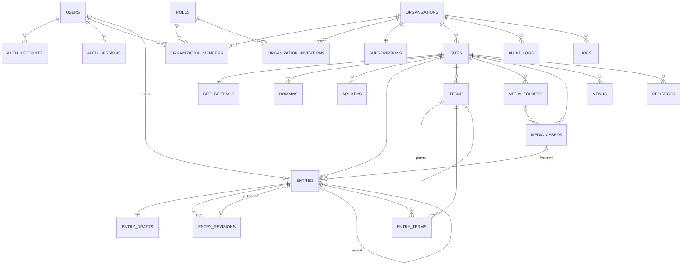

# Forge CMS — V1 Build Plan

| | |
|---|---|
| **Status** | Build plan v1.0; deployment section updated 2026-10-01 (ADR 0006) |
| **Date** | 2026-09-30 |
| **Source** | Derived from [cms-architecture.md](cms-architecture.md), the long-term target. That document keeps its decisions D-01…D-40 |
| **Rule** | Where the two documents differ, **this plan governs what is built now**. The long-term document governs what we must not make impossible |
| **Issues** | [v1-github-issues.md](v1-github-issues.md) |

> **Design the architecture for the future, but build only what the product needs today.**

## 0. Deployment and URLs

> **Updated 2026-10-01 (ADR 0006).** V1 is built and run on **zero-cost infrastructure** under one existing domain. This section governs every URL and host in this plan. Mentions of separate admin, sites, API or media hosts elsewhere describe the **future production deployment**, which is not a V1 dependency.

### 0.1 V1 current deployment (development / private beta)

```text
forgelinetechnologies.com            existing Forgeline domain (untouched)
        └── cms.forgelinetechnologies.com   the ONE Forge host → one Vercel project (Hobby)
```

| Path on `cms.forgelinetechnologies.com` | Serves |
|---|---|
| `/login`, `/signup`, `/onboarding`, `/account`, `/invite/…` | Account screens |
| `/{orgSlug}/…` | Admin (`/{orgSlug}/sites/{siteSlug}/pages`, `/posts`, …) |
| `/api/auth/…`, `/api/v1/…`, `/api/app/…` | Better Auth, REST API, admin JSON |
| `/api/internal/cron`, `/api/internal/cron/daily` | Job runner (`Bearer $CRON_SECRET`) |
| `/s/{address}/…` | **Tenant websites** (public, read-only), e.g. `/s/acme/about`, `/s/acme/blog/hello-world` |
| `/_forge/preview/{token}` | Draft preview (signed, scoped token) |
| `/media/{key}` | Media objects, streamed from object storage with immutable caching |

- **`{address}`** is the site's platform address: a globally unique, DNS-label-shaped name stored in the site's `domains` row of kind `subdomain`. It is the same name that becomes `{address}.<sites domain>` later.
- **Infrastructure:** free tiers only. Vercel Hobby, Neon Free, Cloudflare R2 (no Cloudflare zone needed), Resend Free, Sentry Developer, Turnstile, Stripe test mode. Postgres + object storage + one Next.js deployment, nothing else.
- **Vercel Hobby limits that shape V1:**
  - Non-commercial use only. Live billing requires a paid plan.
  - Crons run at most daily. The job runner gets a daily cron + `after()` kicks + an optional free external scheduler (§16).
  - Functions run at most 300 s.
- **Security on one origin:** admin and public sites share an origin, so tenants must never be able to put script on it. ADR 0006 lists the controls (closed renderer, no tenant HTML/JS, no Server Actions on `/s/*`, the site tree never reads the session, per-surface framing headers, sandboxed media). Public sites move to their own origin before opening to untrusted tenants.

### 0.2 Future production deployment (post-V1, not a V1 dependency)

| Host | Serves | Needs |
|---|---|---|
| `app.example.com` (+ `api.example.com` if split) | Admin, auth, API | A domain |
| `{address}.sites.example.com` | Tenant sites' platform addresses | Wildcard DNS + certificate (Vercel nameservers), `HOST_ROUTING_ENABLED` |
| `client.com`, `www.client.com` | Tenant custom domains | Vercel for Platforms / Domains API, paid plan (M9) |
| `media.examplecdn.com` | Media CDN | Set `MEDIA_PUBLIC_BASE_URL`; R2 custom domains need a Cloudflare zone |

The routing for host mode is already implemented and tested (`HOST_ROUTING_ENABLED`, ADR 0002/0006), and the `domains` table models custom domains. Moving to this layout is configuration plus M9, with no change to content, tenancy or rendering.

---

## 1. Reclassifying the architecture

### 1.1 Foundations kept exactly as designed

These cost little now and are expensive or impossible to retrofit, so V1 keeps them even though no single feature "needs" them yet.

| Foundation | Why it stays in V1 |
|---|---|
| Modular monolith, one Next.js app (D-01) | It is the simplest option anyway |
| `organization_id` on every tenant row + composite FKs (D-03) | Retrofitting tenancy is the #1 SaaS rewrite |
| `TenantContext` + `withTenant()` transactions (D-04) | Every repository is written against it from day one |
| **Thin RLS**: one policy template, `FORCE`d, plus two lookup functions (D-04) | About 3 days of work in Phase 1. It turns a forgotten `WHERE` into an empty result instead of a data leak |
| UUIDv7 primary keys (D-06) | Changing ID types later touches every table and every URL |
| `pg` Pool driver with transactions (D-05) | Publish, audit and jobs need real transactions |
| Separate admin / sites / media domains (D-02) | Impossible to move once customers' sites are indexed |
| Entries aggregate: projection + draft + snapshot revisions (D-13) | It is the core of the CMS; changing it later rewrites everything |
| Versioned, structured content JSON with stable block IDs, never HTML (D-14/D-38) | Keeps the editor, API, future page builder and search possible without migrations |
| `entries.locale` in the unique path key (D-39) | The only expensive part of multilingual to retrofit |
| Storage driver abstraction (D-18) | One interface, one implementation |
| Reviewed SQL migrations, expand/contract (D-32) | There will be customer data from day one |
| Audit log written inside the transaction (D-30) | Needed for support and trust; cheap |
| Jobs table + cron runner (D-22) | Email, scheduling and domain checks need it |

### 1.2 Feature classification

| Feature (from the long-term architecture) | V1 class | Reason |
|---|---|---|
| Email/password, verification, reset, Google OAuth, sessions | **MUST V1** | Required to have users |
| MFA (TOTP/passkeys) | SHOULD after V1 | Expected by SaaS buyers, but not a launch blocker |
| Enterprise SSO / SCIM | FUTURE | No enterprise customers yet |
| Organizations, members, invitations | **MUST V1** | Core tenancy |
| 5 system roles, permissions in code | **MUST V1** | "Manage permissions" |
| Custom roles (`role_permissions`) | FUTURE | Five roles cover SMB and agency teams |
| Site-restricted members (`site_members`) | SHOULD after V1 | V1 answer for agencies: one organization per client |
| Agency ↔ client relationship, white-label | FUTURE | Orgs-per-client covers V1 |
| Sites, settings, site address (`/s/{address}`, §0) | **MUST V1** | Core product |
| Site publish switch (draft/"coming soon" → live) | **MUST V1** | "Publish a website" |
| Custom domains with TXT proof + Vercel API + SSL | **Post-V1 infrastructure** (data model and host routing kept) | Needs paid hosting; V1 is a zero-cost private beta (§0, ADR 0006) |
| Pages and posts as system content types | **MUST V1** | Core content |
| Content types as a **code** registry (no table) | **MUST V1** (simplified) | Keeps custom types possible without building the builder |
| Custom content-type builder (DB-defined types and fields) | FUTURE | Big UI + validation surface; not needed to launch |
| Additional code-defined types (Service, Case Study, Team Member) | SHOULD after V1 | Cheap once the registry exists (§5) |
| Filterable-field side index, relation fields | FUTURE | Only matters with custom types |
| Draft autosave + optimistic concurrency | **MUST V1** | Nobody should lose work |
| Full-snapshot revisions + restore | **MUST V1** | Explicitly required |
| Revision compare UI | SHOULD after V1 | Restore covers the need |
| Autosave checkpoint revisions | Removed | Autosave writes the draft; revisions come from explicit saves |
| Draft / Scheduled / Published / Trash | **MUST V1** | Explicitly required |
| In-review / archived statuses | SHOULD after V1 | Editorial workflow can wait |
| Scheduling changes to already-published entries | SHOULD after V1 | Same mechanism; UI deferred |
| Signed-token editor preview | **MUST V1** | Explicitly required |
| Shareable preview links (`preview_links`) | SHOULD after V1 | Stateless editor preview first |
| Soft edit locks (`entry_locks`) | SHOULD after V1 | Optimistic concurrency prevents lost writes |
| Real-time collaboration | DO NOT BUILD | High complexity, low V1 value |
| Block editor (11 block types, one Tiptap document) | **MUST V1** | Explicitly required |
| Full nested page builder, responsive controls | FUTURE | The V1 tree format is ready for it |
| Reusable / global blocks | FUTURE | Not needed to launch |
| Categories and tags | **MUST V1** | Explicitly required |
| Custom taxonomies (`taxonomies` table) | FUTURE | Two fixed taxonomies are enough |
| Media library: upload, images + PDF, metadata, folders, search, delete | **MUST V1** | Explicitly required |
| Direct-to-storage uploads | **MUST V1** | Avoids function body limits; not optional |
| Image variants | **MUST V1** (simplified) | Generated **synchronously** at upload; stored as JSONB |
| Media usage graph (`content_references`, "used in") | SHOULD after V1 | Block schemas already mark media refs, so a backfill is possible |
| SVG uploads, video uploads, transcoding | FUTURE / DO NOT BUILD | Security surface; use embeds for video |
| Menus (header, footer, nested) | **MUST V1** (simplified) | Items as validated JSONB on the menu |
| SEO fields, sitemap, robots, JSON-LD, redirects | **MUST V1** | Explicitly required |
| Prefix/regex redirects | FUTURE | Exact match covers V1 |
| Built-in themes with tokens (2 themes) | **MUST V1** | "Choose theme" + branding |
| Custom CSS, theme template-part editing | FUTURE | Support and security burden |
| Theme marketplace, tenant-uploaded themes | DO NOT BUILD | Code execution + support burden |
| GA4 / Plausible / Search Console as simple settings | **MUST V1** (simplified) | Two text fields; no integration framework |
| Integration framework (Mailchimp, HubSpot, Slack, Zapier) | FUTURE | No V1 journey needs it |
| Plugin runtime, third-party plugins | DO NOT BUILD | Security and isolation risk |
| Forms (builder, submissions) | SHOULD after V1 (**first** post-launch item) | Not in the V1 journey. Stopgap: allow-listed embed of Tally/Google Forms/HubSpot |
| Comments | FUTURE | Moderation and spam burden; declining use |
| REST API v1 (read + basic page/post writes), site-bound keys | **MUST V1** | Explicitly required; kept small |
| GraphQL | DO NOT BUILD | REST covers it |
| Outbound webhooks + outbox | SHOULD after V1 | No V1 journey needs them. Services already return domain events, so persisting them later is a small change |
| Stripe: plans, checkout, portal, subscription status, basic limits | **MUST V1** (simplified) | It is a SaaS |
| Usage counters, metering, usage-based billing, entitlement overrides | FUTURE | `COUNT` + a row lock is enough at V1 scale |
| Postgres job queue + cron + `after()` kick | **MUST V1** | Email, scheduling, domain checks |
| Transactional outbox | SHOULD after V1 | Lands with webhooks |
| Cache Components with tag invalidation | **MUST V1** | Hosted sites must be fast and correct after publish |
| Redis | DO NOT BUILD (until a trigger) | Not needed |
| Public site search (Postgres FTS) | SHOULD after V1 | Admin title search is enough to launch |
| External search engine (Typesense/Meilisearch/Elasticsearch) | FUTURE / DO NOT BUILD | No scale that justifies it |
| Audit log: writes + simple activity page | **MUST V1** | Support and trust |
| Sentry, structured logs, request IDs, uptime checks | **MUST V1** | Can't run a SaaS blind |
| OpenTelemetry, log drains | FUTURE | On a trigger |
| Isolation test suite, permission matrix tests, E2E | **MUST V1** | The tenancy guarantee |
| Visual regression for themes | SHOULD after V1 | Manual QA for two themes at V1 |
| Minimal staff console (find org/site, suspend) | **MUST V1** (tiny) | Abuse happens on day one |
| Per-site export/import (D-40) | SHOULD after V1 | V1 uses a runbook: Neon PITR branch + org-scoped extraction |
| Multilingual UI/routing | FUTURE | `locale` column already in place |
| Cells, data residency, multiple regions | FUTURE | `organization_id` keeps the door open |
| Microservices, DB-per-tenant, event sourcing, per-resource ACLs, own analytics engine, Kafka/Kubernetes | DO NOT BUILD | Complexity without V1 value |

### 1.3 Decision status (D-01 … D-40)

| Status | Decisions |
|---|---|
| **Kept as designed** | D-01 monolith · D-03 shared schema · D-04 isolation (thin RLS) · D-05 pg Pool · D-06 UUIDv7 · D-07 Better Auth (no MFA yet) · D-08 tenant in URL · D-13 entry aggregate · D-15 snapshot revisions · D-19 SEO resolver · D-27 cache tags · D-30 audit · D-31 testing · D-32 migrations · D-33 observability · D-34 domain TXT proof · D-36 actions vs handlers · D-37 separate root layouts · D-38 structured rich text · D-02 domain separation |
| **Simplified for V1** | D-09 (5 system roles, org-scope only) · D-10 (plan limits in code, checked by count) · D-11 (type registry in code, no `content_types` table) · D-12 (`fields` JSONB only, no side index) · D-14 (block tree stored in ProseMirror JSON shape, one Tiptap editor) · D-16 (scheduling via the `jobs` table, no `scheduled_actions`) · D-17 (sync variants, no reference graph) · D-20 (exact-match redirects) · D-21 (small surface, site-bound keys, on the app host) · D-22 (jobs table only, no outbox) · D-25 (2 themes, settings in `site_settings`) · D-28 (webhook → re-sync subscription, no `billing_events`) · D-39 (`locale` only) |
| **Deferred** | D-23 webhooks · D-24 integrations · D-26 search · D-29 usage counters · D-35 forms · D-40 export/import |

---

## 2. What Forge CMS V1 is

**Forge CMS V1 is a hosted website CMS for small businesses and agencies.** A team signs up, creates an organization and a website, writes pages and blog posts in a block editor, uploads media, sets navigation and SEO, connects its own domain, and publishes. Every organization's data is isolated. It is paid for with a Stripe subscription after a trial. A small REST API exposes the same content.

| # | Capability | V1 scope | Phase |
|---|---|---|---|
| 1 | Create an account | Email/password with verification, Google OAuth, forgot/reset password, logout | 2 |
| 2 | Create an organization | Onboarding step; slug; the creator is Owner; 14-day Pro trial starts | 3 |
| 3 | Create a website | Name, site address (`/s/{address}`), theme, timezone, language; Home page created automatically | 4 |
| 4 | Invite users | Email invitation with a role; accept by link; revoke; resend | 3 |
| 5 | Manage permissions | Change role, remove member, transfer ownership; 5 system roles | 3 |
| 6 | Create pages | Hierarchical pages (parent), templates from the theme | 5 |
| 7 | Create blog posts | Posts with excerpt, featured image, author, categories, tags | 5–6 |
| 8 | Upload media | Multi-file direct upload; images (JPEG, PNG, WebP, GIF) and PDF | 6 |
| 9 | Organize media | Folders (one level), title/alt/caption, search, filter, sort | 6 |
| 10 | Edit content | Block editor with 11 block types, reorder, block properties | 5 |
| 11 | Save drafts | Autosave + explicit "Save" (creates a revision) | 5, 7 |
| 12 | Publish content | Publish, unpublish, schedule, trash/restore | 5, 7 |
| 13 | Preview content | Signed-token preview on the site's host, in an iframe or a new tab | 7 |
| 14 | Categories and tags | CRUD, assignment, archive pages | 5 |
| 15 | Navigation | Header and footer menus, two levels, pages, posts, categories, URLs | 8 |
| 16 | Basic SEO | Per-entry SEO, site defaults, sitemap, robots, JSON-LD, redirects | 8 |
| 17 | Custom domain *(post-V1)* | Apex + www, TXT proof, SSL, primary, redirects to primary | 9 |
| 18 | Publish the website | Site switch: "Coming soon" → live (requires a verified email) | 4 |
| 19 | Website settings | Name, tagline, logo, favicon, homepage, blog path, timezone, analytics IDs, social links | 4, 8 |

**Also in V1** (supporting the above): billing (trial → Pro via Stripe), the REST API, activity log, and a minimal staff console.

**Not in V1:** see §17.

---

## 3. The V1 user journey

```text
Sign up ──────────────── /signup                       (email+password or Google; Turnstile)
 ↓  verify email ─────── /verify-email                 (can continue; publishing waits for verification)
Create organization ──── /onboarding (step 1)          (name → slug; Owner; Pro trial starts)
 ↓
Create site ──────────── /onboarding (step 2)          (site name, site address, language, timezone)
 ↓
Choose theme ─────────── /onboarding (step 3)          (2 themes with previews; tokens editable later)
 ↓                                                      → site created in "Coming soon" with a Home page draft
Create homepage ──────── /{org}/sites/{site}/pages/{homeId}
 ↓
Create pages ─────────── /{org}/sites/{site}/pages → /pages/new → editor
 ↓
Create posts ─────────── /{org}/sites/{site}/posts → /posts/new → editor (+ categories, tags)
 ↓
Upload media ─────────── /{org}/sites/{site}/media   (and the picker inside the editor)
 ↓
Configure navigation ─── /{org}/sites/{site}/menus   (header + footer)
 ↓
Configure SEO ────────── /{org}/sites/{site}/seo     (defaults, redirects) + SEO panel in the editor
 ↓
Connect domain ───────── /{org}/sites/{site}/domains (TXT + DNS records, live status)
 ↓
Publish ──────────────── /{org}/sites/{site}         ("Publish site" button: Coming soon → Live)
 ↓
Visit live website ───── https://client.com
```

**Screens required:**

| Screen | Route | Purpose |
|---|---|---|
| Sign up / Log in | `/signup`, `/login` | Credentials or Google |
| Verify email | `/verify-email` | "Check your inbox" + resend |
| Forgot / reset password | `/forgot-password`, `/reset-password` | Token flow |
| Accept invitation | `/invite/[token]` | Sign in or sign up, then join |
| Onboarding wizard | `/onboarding` | Org → site → theme (3 steps, resumable) |
| Account | `/account` | Profile, avatar, password, sessions |
| Org home / sites | `/{org}/sites` | Site cards, create site |
| Create site | `/{org}/sites/new` | Same form as the onboarding site step |
| Members | `/{org}/members` | Members, roles, invitations |
| Billing | `/{org}/billing` | Plan, trial status, upgrade, Stripe portal |
| Org settings | `/{org}/settings` | Name, slug, transfer ownership |
| Activity | `/{org}/activity` | Audit log list (filter by site, user, action) |
| Site overview | `/{org}/sites/{site}` | Status (Coming soon/Live), publish site, recent edits, scheduled items, domain status, checklist |
| Pages list / new / editor | `/…/pages`, `/…/pages/new`, `/…/pages/[entryId]` | Tree list; editor |
| Posts list / new / editor | `/…/posts`, `/…/posts/new`, `/…/posts/[entryId]` | List with filters; editor |
| Categories / Tags | `/…/posts/categories`, `/…/posts/tags` | Term management |
| Media library | `/…/media` | Upload, folders, search, details |
| Menus | `/…/menus` | Header and footer menu editor |
| SEO | `/…/seo`, `/…/seo/redirects` | Site defaults; redirect manager |
| Appearance | `/…/appearance` | Theme choice + customisation with live preview |
| Domains | `/…/domains` | Site address (V1); custom domains, status, DNS instructions (post-V1) |
| Site settings | `/…/settings`, `/…/settings/api-keys` | General, reading, analytics, social; API keys |
| Staff console | `/platform` | Find org/site, suspend/unsuspend (staff only) |

The **site overview checklist** is the product's onboarding spine: add pages, add a menu, set SEO, connect a domain, publish. Each item deep-links to its screen.

---

## 4. V1 database

### 4.1 Entity decisions

| Entity | V1 decision | V1 shape / reason |
|---|---|---|
| `users` + `auth_accounts`, `auth_sessions`, `auth_verifications` | **Required** | Better Auth tables mapped to our names, with UUIDv7 IDs |
| `organizations` | **Required** | — |
| `organization_members` | **Required** | `role_id` → `roles` |
| `organization_invitations` | **Required** | Hashed token; resolved through a `SECURITY DEFINER` function |
| `roles` | **Simplified** | 5 system rows seeded by migration (`organization_id` null). Custom roles later are just rows |
| `role_permissions` | **Deferred** | System-role permissions live in code |
| `site_members` | **Deferred** | Org-scope roles only |
| `sites` | **Required** | `status`: `coming_soon` \| `live` \| `suspended`; `theme_key` |
| `domains` | **Required** | The site address (kind `subdomain`; `hostname` holds the address label) and, post-V1, custom domains, in one table (platform class, no RLS) |
| `site_settings` | **Simplified** | 1:1 with the site; reference columns + JSONB groups (`general`, `reading`, `seo`, `analytics`, `theme`). Absorbs `site_theme_settings` and analytics integrations |
| `content_types` | **Deferred** (replaced) | `entries.type` text (`page`/`post`) backed by a **code registry** (§5) |
| `content_fields` | **Deferred** | Field definitions live in code type definitions |
| `entries` | **Required** | Projection; `locale` kept; `translation_group_id` deferred (a nullable column, trivial to add) |
| `entry_drafts` | **Required** | `content` (block doc), `fields`, `seo`, `term_ids`, `version` |
| `entry_revisions` | **Required** | Kinds: `save`, `publish`, `scheduled`, `restore` |
| `taxonomies` | **Deferred** (replaced) | `terms.taxonomy` text: `category` \| `tag` |
| `terms` | **Required** | Categories hierarchical (parent), tags flat |
| `entry_terms` | **Required** | Published assignments; drafts use `entry_drafts.term_ids` |
| `media_folders` | **Simplified** | One level in the UI (a `parent_id` column exists for later) |
| `media_assets` | **Required** | Includes a `variants` JSONB column |
| `media_variants` | **Removed** (merged) | Variants are always read with their asset, so a JSONB column suffices |
| `menus` | **Simplified** | One menu per location (`header`, `footer`); `items` JSONB tree |
| `menu_items`, `menu_locations` | **Removed** (merged) | Menus are small and edited as a whole |
| `redirects` | **Simplified** | Exact match only; auto-created on path change |
| `audit_logs` | **Required** | Written in the transaction |
| `jobs` | **Required** | Also carries scheduled publishes |
| `subscriptions` | **Simplified** | 1:1 with the org; plan, status, trial, Stripe IDs |
| `api_keys` | **Required** | Site-bound; scope `read` \| `write` |
| `scheduled_actions` | **Removed** | A `jobs` row with `run_at` does the same thing |
| `entry_locks`, `preview_links`, `config_revisions`, `content_references`, `reusable_blocks`, `entry_relations`, `entry_field_values` | **Deferred** | See §1.2 |
| `forms*`, `comments`, `webhook_*`, `integration_installations`, `idempotency_keys` | **Deferred** | Features deferred |
| `billing_events`, `entitlement_overrides`, `usage_counters`, `outbox_events`, `email_suppressions`, `platform_admins`, `user_two_factors` | **Removed for V1** | Replaced by simpler mechanisms (idempotent Stripe sync, plan in code, counts, direct job enqueue, a staff email allow-list) |

**Result: 24 tables** (from ~57).

### 4.2 Final V1 schema

Conventions (unchanged from long-term §6):
- UUIDv7 `id`
- `created_at`/`updated_at` as `timestamptz`
- enumerations as `text` + `CHECK`
- JSONB validated by Zod
- every tenant row has `organization_id`; site rows add `site_id` with a composite FK to `sites(organization_id, id)`
- intra-site references use composite FKs `(site_id, x_id)`

**Identity** (Better Auth managed; no RLS)

| Table | Key columns | Constraints |
|---|---|---|
| `users` | `id`, `email`, `email_verified`, `name`, `image`, timestamps | UQ `email` |
| `auth_accounts` | `id`, `user_id`, `provider_id`, `account_id`, `password` (scrypt hash, credential only) | UQ `(provider_id, account_id)` |
| `auth_sessions` | `id`, `user_id`, `token`, `expires_at`, `ip_address`, `user_agent` | UQ `token`; IX `user_id` |
| `auth_verifications` | `id`, `identifier`, `value`, `expires_at` | IX `identifier` |

**Tenancy**

| Table | Key columns | Constraints / RLS |
|---|---|---|
| `organizations` | `id`, `name`, `slug`, `status` (`active` \| `suspended`), `created_by`, `deleted_at` | UQ `slug`; RLS: own org **or** a member |
| `organization_members` | `id`, `organization_id`, `user_id`, `role_id` | UQ `(organization_id, user_id)`; IX `user_id`; RLS: own org **or** own row |
| `organization_invitations` | `id`, `organization_id`, `email`, `role_id`, `token_hash`, `invited_by`, `expires_at`, `accepted_at`, `revoked_at` | UQ `token_hash`; partial UQ `(organization_id, email)` while open; RLS + `resolve_invitation()` |
| `roles` | `id`, `key` (`owner`, `admin`, `editor`, `author`, `viewer`), `name`, `organization_id` (null) | UQ `(organization_id, key) NULLS NOT DISTINCT`; reference data, no RLS |
| `subscriptions` | `organization_id` (PK), `plan_key`, `status` (`trialing` \| `active` \| `past_due` \| `canceled` \| `free`), `trial_ends_at`, `stripe_customer_id`, `stripe_subscription_id`, `current_period_end`, `cancel_at_period_end`, `grace_until` | UQ Stripe IDs; RLS |
| `api_keys` | `id`, `organization_id`, `site_id`, `name`, `prefix`, `secret_hash`, `scope` (`read` \| `write`), `created_by`, `last_used_at`, `revoked_at` | UQ `secret_hash`; RLS + `resolve_api_key()` |
| `audit_logs` | `id`, `organization_id`, `site_id`, `actor_type`, `actor_id`, `actor_label`, `action`, `resource_type`, `resource_id`, `request_id`, `ip`, `metadata`, `created_at` | IX `(organization_id, created_at DESC)`; RLS; runtime role has INSERT/SELECT only |

**Sites**

| Table | Key columns | Constraints / RLS |
|---|---|---|
| `sites` | `id`, `organization_id`, `name`, `slug`, `status` (`coming_soon` \| `live` \| `suspended`), `theme_key`, `default_locale`, `timezone`, `created_by`, `deleted_at` | UQ `(organization_id, slug)`, UQ `(organization_id, id)`; RLS |
| `site_settings` | `site_id` (PK), `organization_id`, `homepage_entry_id`, `not_found_entry_id`, `logo_media_id`, `favicon_media_id`, JSONB `general` (tagline, social links), `reading` (blog path, posts per page), `seo` (title template, default description, default OG image ID, discourage indexing, Search Console token), `analytics` (GA4 ID, Plausible domain), `theme` (tokens, header, footer, layout), `version` | Composite FKs, `SET NULL (col)`; RLS |
| `domains` | `id`, `organization_id`, `site_id`, `hostname`, `kind` (`subdomain` \| `custom`), `is_primary`, `status` (`pending_verification` \| `pending_dns` \| `active` \| `failed`), `verification_token`, `verified_at`, `provider_state`, `last_checked_at`, `next_check_at`, `error` | UQ `hostname`; partial UQ `(site_id) WHERE is_primary`; **platform class (no RLS)**, because it is read before the tenant is known. For kind `subdomain`, `hostname` holds the site address label (`acme`), independent of any sites domain (ADR 0006) |

**Content**

| Table | Key columns | Constraints / RLS |
|---|---|---|
| `entries` | `id`, `organization_id`, `site_id`, `type` (CHECK `page`, `post`), `locale`, `parent_id`, `author_id`, `status` (`draft` \| `scheduled` \| `published`), `title`, `slug`, `path`, `excerpt`, `featured_media_id`, `published_revision_id`, `published_at`, `first_published_at`, `scheduled_at`, `sort_order`, `created_by`, `updated_by`, `deleted_at` | UQ `(site_id, locale, path) WHERE deleted_at IS NULL`; IX `(site_id, type, status, published_at DESC)`, `(site_id, type, updated_at DESC)`, `(site_id, parent_id, sort_order)`; RLS |
| `entry_drafts` | `entry_id` (PK), `organization_id`, `site_id`, `title`, `slug`, `excerpt`, `featured_media_id`, `template`, `content` (block doc), `fields`, `seo`, `term_ids` (uuid[]), `version`, `content_hash`, `updated_by` | CASCADE from entry; trigram IX on `title`; RLS |
| `entry_revisions` | `id`, `organization_id`, `site_id`, `entry_id`, `number`, `kind`, `label`, `title`, `slug`, `excerpt`, `featured_media_id`, `template`, `content`, `fields`, `seo`, `term_ids`, `content_hash`, `source_draft_version`, `created_by`, `created_at` | UQ `(entry_id, number)`; no UPDATE grant; RLS |
| `terms` | `id`, `organization_id`, `site_id`, `taxonomy` (CHECK `category`, `tag`), `parent_id`, `name`, `slug`, `description` | UQ `(site_id, taxonomy, slug)`; RLS |
| `entry_terms` | `organization_id`, `site_id`, `entry_id`, `term_id` | PK `(entry_id, term_id)`; IX `(term_id)`; RLS |

**Media, navigation, SEO, platform**

| Table | Key columns | Constraints / RLS |
|---|---|---|
| `media_folders` | `id`, `organization_id`, `site_id`, `parent_id`, `name` | UQ `(site_id, parent_id, name) NULLS NOT DISTINCT`; RLS |
| `media_assets` | `id`, `organization_id`, `site_id`, `folder_id`, `kind` (`image` \| `document`), `status` (`pending` \| `ready` \| `failed`), `storage_driver`, `storage_key`, `version`, `original_filename`, `mime_type`, `size_bytes`, `width`, `height`, `title`, `alt_text`, `caption`, `variants` (JSONB), `uploaded_by`, `deleted_at` | UQ `storage_key`; UQ `(site_id, id)`; IX `(site_id, created_at DESC)`; trigram IX on title/filename/alt; RLS |
| `menus` | `id`, `organization_id`, `site_id`, `location` (`header` \| `footer`), `items` (JSONB tree), `version`, `updated_by` | UQ `(site_id, location)`; RLS |
| `redirects` | `id`, `organization_id`, `site_id`, `source_path`, `destination`, `status_code` (CHECK 301/302/307/308), `origin` (`manual` \| `auto`), `is_active`, `created_by` | UQ `(site_id, source_path)`; RLS |
| `jobs` | `id`, `type`, `organization_id`, `payload`, `status`, `run_at`, `attempts`, `max_attempts`, `locked_until`, `last_error`, `dedupe_key`, `finished_at` | IX `(run_at) WHERE status = 'queued'`; partial UQ `dedupe_key` while queued/running; **platform class** |

### 4.3 RLS in V1 (thin)

- One policy template on every tenant table: `organization_id = nullif(current_setting('app.org_id', true), '')::uuid`, with `FORCE ROW LEVEL SECURITY`.
- Two special policies: `organizations` and `organization_members` are also visible to their own members via `app.user_id`, so the org switcher works.
- Two `SECURITY DEFINER` lookups: `resolve_api_key(hash)` and `resolve_invitation(token_hash)`. Preview tokens are stateless HMAC, so they need no lookup.
- Runtime role `forge_app` owns nothing. Migrations run as `forge_owner` from CI.
- Platform tables with no RLS: `domains`, `jobs`. Reference data: `roles`. Identity tables are managed by the auth module.
- **Fallback if spike S2 shows blocking problems:** ship with app-level scoping + the isolation suite, and enable the policies in Phase 12. `withTenant()` already sets the context, so that is a migration, not a refactor.

### 4.4 V1 ERD



### 4.5 How the deferred tables arrive later (no rewrites)

| Later need | Change | Why it's safe |
|---|---|---|
| Custom content types | Add `content_types` (+ `content_fields`); seed `page`/`post` rows; replace the `entries.type` CHECK with FK `(site_id, type) → content_types(site_id, key)` | `type` is already a key, not an ID. No backfill of IDs |
| Custom taxonomies | Add `taxonomies`; FK `(site_id, taxonomy) → taxonomies(site_id, key)` | Same trick |
| Site-level roles | Add `site_members` | Effective-permission function already takes an optional site role |
| Custom roles | Add `role_permissions`; custom rows in `roles` | Permissions for system roles stay in code |
| Media usage | Add `content_references`; backfill by walking documents | Block schemas mark media references from day one |
| Webhooks/integrations | Add `outbox_events` + `webhook_*`; persist the events services already return | Services already return events |
| Scale metering | Add `usage_counters`; switch `assertLimit()` internals | One function |
| Multilingual | Add `translation_group_id`, `site_locales` | `locale` already in the unique key |

---

## 5. Content architecture

**Kept from the long-term design:** the entry aggregate (D-13).
- `entries` holds the published projection.
- `entry_drafts` is the working copy.
- `entry_revisions` are immutable snapshots.
- `published_revision_id` points at the live snapshot.
- Public rendering reads the projection + the published revision. The editor reads the draft.

**Simplified:** content types are a **code registry**, not a table.

```ts
// Illustrative contract — src/modules/content/types/registry.ts
interface ContentTypeDefinition<F = Record<string, never>> {
  key: 'page' | 'post';                 // widened when new types are added
  label: { singular: string; plural: string };
  hierarchical: boolean;                // pages: parent/child paths
  routing: (e: { slug: string; parentPath?: string }, settings: ReadingSettings) => string;  // path builder
  supports: { excerpt: boolean; featuredImage: boolean; taxonomies: ('category' | 'tag')[]; templates: boolean };
  fields: z.ZodType<F>;                 // extra typed fields → entry_drafts.fields (empty for page/post)
  seoDefaults: { schemaType: 'WebPage' | 'BlogPosting' | string; titleTemplate?: string };
  permissionsKey: string;               // entries.{key}.*
}
```

| Concern | Page | Post |
|---|---|---|
| Path | `/{parent-path}/{slug}` (Home = `/`) | `/{blogPath}/{slug}` (`blogPath` default `blog`, set in reading settings) |
| Archive | — | `/{blogPath}`, `/{blogPath}/category/{slug}`, `/{blogPath}/tag/{slug}`, `…/page/{n}` |
| Extras | Parent, template (from the theme), sort order | Excerpt, featured image, author, categories, tags |

**How Service, Case Study, Team Member, Property, Product or Event arrive later, without a rewrite:**

1. **Code-defined types (V1.x, days of work each).**
   - Add `types/service.ts` implementing `ContentTypeDefinition`, with its `fields` Zod schema (e.g. `price`, `duration`, `icon`).
   - Add one migration widening the `entries.type` CHECK.
   - Add a theme template per type.
   - Enable it per site in `site_settings.general.enabledTypes`.
   - The editor renders the fields form **automatically from the Zod schema**, the same mechanism as block property panels (§6). Storage is `entry_drafts.fields`, which exists from day one.
   - Routing, revisions, publishing, SEO, API and permissions (`entries.service.*`) all work unchanged, because they are keyed on `type`.
2. **Customer-defined types (FUTURE).**
   - Add `content_types` + `content_fields` tables.
   - A DB-backed registry produces the same `ContentTypeDefinition` at runtime (fields → generated Zod).
   - The CHECK becomes an FK (§4.5).
   - Nothing that consumes the interface changes.

**What V1 deliberately includes for this:** `entries.type` as a key; `entry_drafts.fields` JSONB; `entry_revisions.fields`; the registry interface; schema-generated forms; permission keys parameterised by type.

---

## 6. Editor

> **V1 decision (refines D-14):** one Tiptap/ProseMirror document per entry. The "blocks" are the document's top-level nodes. Custom nodes (image, button, columns, spacer, embed) are registered in a code **block registry** with Zod-validated attributes, a per-node `v` version, a React NodeView for editing and a server renderer. The stored JSON is a tree of typed nodes (`type` / `attrs` / `content`): the same abstraction as the long-term block tree, in ProseMirror's shape.

**Why this rather than a Gutenberg-style block list:**
- A single ProseMirror document gives natural typing across paragraphs, plus undo/redo, copy/paste, selection and keyboard handling for free.
- A list of separate text blocks forces us to rebuild cross-block editing (Enter, Backspace-merge, multi-block selection), which is the part that makes Gutenberg hard.
- Posts and pages use the **same editor**. Pages get layout from columns plus theme templates.

### 6.1 Block set

| Requested block | Node | Properties (`attrs`, Zod-validated) | Render |
|---|---|---|---|
| Heading | `heading` (native) | `level` 2–4 | `<h2–4>` |
| Paragraph | `paragraph` (native) | — | `<p>` |
| Rich text | Marks on text: bold, italic, underline, strike, code, link | `link.href`: `http(s)`, `mailto`, `tel`, `/path`, `entry:{id}` | Inline elements |
| Quote | `blockquote` (native) | `cite?` | `<blockquote>` |
| List | `bulletList`, `orderedList` (native) | — | `<ul>`, `<ol>` |
| Divider | `horizontalRule` (native) | `style`: `line` \| `space` | `<hr>` |
| Image | `image` (custom) | `mediaId`, `alt?` (override), `caption?`, `size` (`content` \| `wide` \| `full`), `link?` | `<figure>` from variants |
| Button | `button` (custom) | `label`, `href`, `style` (theme variant: `primary` \| `secondary`), `align`, `newTab` | `<a class>` |
| Columns | `columns` → `column` (custom) | `count` 2–3, `ratio`, `stackOnMobile`; columns may contain any block **except** columns | CSS grid |
| Video / embed | `embed` (custom) | `provider` (`youtube`, `vimeo`, or `generic`), `url`, `aspect`. **Decided 2026-10-01:** YouTube and Vimeo get privacy-enhanced URLs; `generic` accepts an https URL only after it passes URL-safety validation (`platform/net/url-safety`); no provider-specific integrations and no unvalidated remote embeds in V1 | Sandboxed `<iframe>` (privacy-enhanced URL for YouTube/Vimeo) |
| Spacer | `spacer` (custom) | `size` (`sm` \| `md` \| `lg` \| `xl`) | `<div>` with a theme spacing token |

### 6.2 Stored structure

```json
{
  "v": 1,
  "doc": {
    "type": "doc",
    "content": [
      { "type": "heading", "attrs": { "id": "01JAB…", "level": 2 },
        "content": [ { "type": "text", "text": "What we do" } ] },
      { "type": "paragraph", "attrs": { "id": "01JAC…" },
        "content": [ { "type": "text", "text": "See our " },
                     { "type": "text", "text": "services", "marks": [ { "type": "link", "attrs": { "href": "entry:0192f…" } } ] } ] },
      { "type": "image", "attrs": { "id": "01JAD…", "v": 1, "mediaId": "0192e…", "caption": "Our team", "size": "wide" } },
      { "type": "columns", "attrs": { "id": "01JAE…", "v": 1, "count": 2, "stackOnMobile": true },
        "content": [
          { "type": "column", "content": [ { "type": "paragraph", "attrs": { "id": "01JAF…" }, "content": [] } ] },
          { "type": "column", "content": [ { "type": "button", "attrs": { "id": "01JAG…", "v": 1, "label": "Contact us", "href": "/contact", "style": "primary" } } ] }
        ] },
      { "type": "embed", "attrs": { "id": "01JAH…", "v": 1, "provider": "youtube", "url": "https://www.youtube.com/watch?v=…" } },
      { "type": "spacer", "attrs": { "id": "01JAJ…", "v": 1, "size": "md" } }
    ]
  }
}
```

**Rules:**
- **Closed schema.** Only allow-listed nodes and marks exist; pasted HTML is normalised into them by Tiptap.
- Every top-level node and every custom node gets a stable **`id`** (a UniqueID extension: Tiptap's, or a ~40-line custom one). Custom nodes carry **`v`**, and their registry entry holds `migrate[v]`.
- **Links to internal content** are stored as `entry:{id}` and resolved to the live path at render time, so slug changes never break links.
- **Limits** (validated on save): document ≤ 1 MB, ≤ 2,000 nodes, columns not nested.
- **Rendering** uses our own node → React mapper (as Forgeline's closed Markdown renderer does): no stored HTML, no `dangerouslySetInnerHTML`. Unknown nodes render nothing and log a warning.
- **Search text and excerpt** are extracted from the same tree on publish.

### 6.3 Editing behaviour

| Capability | V1 implementation |
|---|---|
| Insert blocks | `/` slash menu + "+" button between blocks |
| Reorder | Drag handle on each top-level block (Tiptap's drag-handle extension), plus keyboard (Alt+↑/↓) and "Move up/down" in the block menu. **Decided 2026-10-01:** a top-level drag **snaps to the gaps between top-level blocks**, and the editor visibly marks the insertion gap. Drops into containers (quote, columns, other container nodes) keep ProseMirror's normal drop behaviour |
| Block properties | Selecting a custom node opens a **side panel auto-generated from its Zod `attrs` schema** (UI hints in the schema metadata); inline toolbar for marks and links |
| Entry settings | Sidebar tabs: *Page/Post* (slug, parent or categories/tags, template, excerpt, featured image, author) and *SEO* (§10) |
| Autosave | Debounced 2 s after the last change, forced every 30 s. `saveDraft(entryId, expectedVersion, draft)`. Status shown ("Saved · 10:42"). Unsynced changes buffered in `localStorage` per entry + version |
| Conflict | Version mismatch → dialog: reload latest / overwrite (the other version saved as a revision first) / copy my content |
| Save | "Save" creates a `save` revision (for history). Autosave never does |
| Preview | "Preview" opens the preview iframe or tab (§9) after flushing autosave |
| Publish | Publish button with a menu: *Publish now*, *Schedule…*, *Unpublish* |

**Not built in V1:** real-time collaboration, multiplayer cursors, reusable/global blocks, block patterns library, plugin-provided blocks, nested columns, per-breakpoint controls, custom HTML block.

**Future path:** the tree already has typed nodes, stable IDs and versions. A full page builder (P7 in the long-term plan, custom or Puck) consumes the same structure through an adapter. No content migration is needed beyond `v` bumps.

---

## 7. Themes

**V1: two built-in themes on a shared theme kit.**
- **Studio** is business-site first.
- **Journal** is blog first.

Tenants configure them; they never upload code (D-25).

```text
src/themes/
├── registry.ts                  list of themes (key → manifest)
├── _kit/                        shared by all themes
│   ├── tokens.ts                settings schema (colors, fonts, header, footer, layout) + CSS-variable builder
│   ├── fonts.ts                 curated fonts via next/font (~10), only the selected ones preloaded
│   ├── components/              Container, Nav, MenuRenderer, Button, Prose, Pagination, Breadcrumbs, SEO head helpers
│   └── blocks/                  default renderers for every block node (themes may override)
├── studio/
│   ├── manifest.ts              key, name, version, extra settings, defaults, templates map, header/footer variants
│   ├── templates/               page · page-full-width · page-landing · post · blog-index · term-archive · not-found · coming-soon
│   ├── components/              theme-specific Header/Footer variants, hero styling
│   └── styles.css               scoped under [data-theme="studio"], driven by CSS variables
└── journal/                     same shape
```

| Customer can change | Stored in `site_settings.theme` | Notes |
|---|---|---|
| Logo, favicon | `site_settings.logo_media_id`, `favicon_media_id` | Favicon sizes produced from the image at upload |
| Colours | `tokens.colors`: primary, accent, background, text | Validated hex; contrast warning below WCAG AA |
| Fonts | `tokens.fonts`: heading, body (from the curated list) | Self-hosted via `next/font` (no runtime Google Fonts request) |
| Header | `header`: variant (`classic` \| `centered` \| `minimal`), sticky, CTA button (label + link) | Menu from the `header` location |
| Footer | `footer`: variant (`simple` \| `columns`), copyright text, show social links | Menu from the `footer` location |
| Layout | `layout`: content width (`narrow` \| `normal` \| `wide`), corner radius, spacing density | Mapped to CSS variables |

- **Security:** the server emits a `<style>` of CSS variables built from *validated* values only. Tenant-provided CSS text is never emitted.
- **Switching themes:** kit-level settings (colours, fonts, header, footer, layout) are shared by all themes, so switching keeps the customer's branding. Theme-specific extras live under `theme.options[themeKey]`.
- **Adding a theme later:**
  1. Create a folder implementing `ThemeManifest` with the kit.
  2. Add it to the registry.
  3. It appears in the picker.
  No database change. A theme's settings schema carries `migrateSettings` for its own major versions.
- **Not in V1:** marketplace, uploaded themes, custom CSS, editable template parts.

---

## 8. Media

| Concern | V1 design |
|---|---|
| Types and limits | Images: JPEG, PNG, WebP, GIF (≤ 20 MB, ≤ 50 megapixels). Documents: PDF (≤ 25 MB). No SVG or video uploads (video via the embed block) |
| Upload | Direct to object storage: `requestUploads` (validate, check storage limit, create `pending` rows, return presigned PUTs) → browser PUTs in parallel → `completeUpload` per file |
| Validation | `completeUpload` HEADs the object (size must match), sniffs the first 4 KB (magic bytes must match an allowed type) and deletes on mismatch |
| Image variants | **Synchronous in `completeUpload`** using `sharp`: widths 400 (thumb, cropped square), 800, 1600, 2400 (never above the original), WebP ~q75, auto-rotated, **all metadata stripped** (no GPS). Written to `media_assets.variants` JSONB. Takes about 1–3 s per image. The function is written so it can move into a job unchanged if needed |
| Storage keys | `o/{orgId}/s/{siteId}/m/{mediaId}/v{n}/{variant}/{slugified-name}.{ext}`. Immutable, so CDN caching is `immutable` |
| Metadata | `title`, `alt_text`, `caption`, filename, MIME, size, dimensions, uploader, dates |
| Folders | One level ("All media" + folders); move by drag or bulk action |
| Search, filter, sort | Trigram search over title/filename/alt; filter by kind and folder; sort by newest, name, size |
| Delete | Soft delete (trash). Public pages omit a missing image (never a broken ``). The `trash.purge` job deletes objects and rows after 30 days |
| Replace file | SHOULD after V1 (`version + 1`, new keys) |
| Delivery | V1: `https://cms.forgelinetechnologies.com/media/<key>` (`MEDIA_PUBLIC_BASE_URL`, default `${APP_ORIGIN}/media`). A route handler streams the object from storage with `Cache-Control: public, max-age=31536000, immutable` (keys are immutable, so Vercel's CDN caches each one), `X-Content-Type-Options: nosniff`, `Content-Security-Policy: default-src 'none'; sandbox`, and only allow-listed MIME types. PDFs inline; everything else as attachment. Post-V1: a CDN domain via `MEDIA_PUBLIC_BASE_URL` |
| Abstraction | `StorageDriver` interface (§13 of the long-term doc, ADR 0008). V1 ships two drivers behind one contract: **local filesystem** for development and tests (no account; `.storage/`), and **S3-compatible** for production (Cloudflare R2 by configuration; RustFS in tests). Modules get tenant-scoped storage from `storageFor({ organizationId, siteId })`; keys outside the tenant's prefix are refused |
| Picker | The same library in a modal, used by the image block, featured image, OG image, logo and favicon |

---

## 9. Publishing

| State | Meaning | Public? |
|---|---|---|
| `draft` | Never published, or unpublished | No |
| `scheduled` | Not yet live; a `publish` job exists for a frozen revision | No |
| `published` | Live (`published_revision_id` set) | Yes |
| **Trash** | `deleted_at` set (orthogonal to status); path released | No |

| Action | Effect | Permission |
|---|---|---|
| Autosave | Updates `entry_drafts` (`version + 1`) | edit |
| Save | Autosave + a `save` revision (capped at the plan's revision limit; publish revisions always kept) | edit |
| Preview | Signed token (HMAC, 15 min, bound to site + entry + user) → `https://cms.forgelinetechnologies.com/_forge/preview/{token}` (V1, same origin as the admin: `frame-ancestors 'self'`), which renders the **draft** uncached with `noindex` + `no-store`. Post-V1: always the platform subdomain host | read |
| Publish | One transaction: lock entry → idempotency check on `expectedDraftVersion` → `publish` revision → update projection → auto-redirect if the path changed → replace `entry_terms` → audit. Then `updateTag` for the entry, routes and lists | publish |
| Unpublish | `published` → `draft`; offer "redirect this URL to…" (creates a redirect) | publish |
| Schedule | Validate as for publish → `scheduled` revision → `jobs` row `entry.publish_scheduled` with `run_at`, `dedupe_key = entry:{id}` → status `scheduled` | publish |
| Cancel schedule | Cancel the job → `draft` | publish |
| Scheduled run | Job runner (§16: per-minute only with a scheduler; on V1's free hosting a scheduled post waits for the next runner call) → the same publish function with the frozen revision → `revalidateTag(…, { expire: 0 })` | system |
| Trash / Restore | Trash unpublishes in the same transaction. Restore returns to `draft` (never auto-republishes) with the slug re-suffixed if taken | delete |
| Revision restore | Copies the revision into the draft + a `restore` revision; never publishes | edit |

**Revisions:** full snapshots (D-15). The history panel lists author, time, kind and label, with Restore. Compare UI is SHOULD after V1.

---

## 10. SEO

| Feature | V1 implementation |
|---|---|
| SEO title, meta description | Per entry (`seo` JSONB). Fallbacks: entry title + site title template; excerpt → first 160 characters of body text |
| Canonical | Default: primary domain + path. Override must be an absolute `https` URL |
| Open Graph image | Per entry → featured image → site default. A 1200×630 crop generated on demand from the original (stored as a variant) |
| Robots | Per-entry `noindex`/`nofollow`. Site-wide "discourage indexing". **Forced `noindex`** for coming-soon sites, previews and non-production deployments |
| Sitemap | `/sitemap.xml` generated per host from published, indexable entries and non-empty term archives; cached with the `list` tags |
| robots.txt | Per host: `Disallow: /_forge/` + `Sitemap:`; `Disallow: /` when discouraged or coming soon |
| JSON-LD | `WebSite`, `Organization` (from site settings), `WebPage` / `BlogPosting`, `BreadcrumbList`; serialised with `<` escaped |
| Redirects | Exact-match manager (301/302/307/308). **Auto 301** when a published path changes (slug, parent, blog path). Validation: leading `/`, not reserved, no self-redirect, loop detection (depth 10), chains flattened on write. Loaded as a cached per-site map |
| Search Console | Verification token field in the site SEO settings |
| Resolver | Pure `resolveSeo()` with field-level precedence: entry → derived → type defaults → site → platform. Safety overrides applied last. Table-tested |

Not in V1: SEO scoring/analysis, hreflang, 404 monitor, prefix/regex redirects, RSS (SHOULD).

---

## 11. Custom domains (post-V1 infrastructure)

> **Deferred (ADR 0006).** V1 runs on zero-cost hosting: no wildcard domains, Vercel Domains API, automated SSL or `domain.check` polling. Every site is reached at its site address, `/s/{address}`. The design below stays the target. The `domains` table, host-mode routing (`HOST_ROUTING_ENABLED`) and `host:` cache tags already exist, so adding it changes no content or tenancy code.

This keeps D-34 in its simplest secure form.

1. **Site address / platform subdomain.** Every site gets an address at creation (a `domains` row with `kind = 'subdomain'`, whose `hostname` holds the label). In V1 it is served at `/s/{address}`; with paid hosting, also at `{address}.<sites domain>` under the wildcard certificate, with nothing to verify.
2. **Add a custom domain** (Owner/Admin, paid plan):
   - Normalise the hostname: lowercase, IDNA, strip port and trailing dot.
   - Validate it with the Public Suffix List (`tldts`).
   - Reject platform domains and hostnames already **active** anywhere.
   - Create `pending_verification` rows for the **apex and `www`** pair, each with a random token.
   - Call Vercel `projectsAddProjectDomain` for both.
   - Show **exactly** the DNS records Vercel returns (A/CNAME), plus our TXT record `_forge-challenge.<apex>` = token.
3. **Verify ownership** ("Verify now" button + `domain.check` job with backoff 1 → 5 → 30 min → 6 h, for up to 7 days):
   - Node `dns.promises.resolveTxt` must contain the token → `pending_dns`.
   - Vercel's config/verify endpoints report the domain configured and the certificate issued → `active`.
   - Unverified claims expire after 7 days.
4. **Primary domain.** The owner picks apex or www (default apex).
   - The other gets Vercel's domain-level 308 to the primary.
   - The renderer also 308s any non-primary host (including the subdomain) to the primary, except `/_forge/preview/*`.
   - Canonical URLs, sitemap and OG URLs use the primary.
5. **SSL** is automatic via Vercel once DNS points at it. The UI shows status from `provider_state`.
6. **Remove:** detach from Vercel first, then delete the rows, and invalidate `host:*` tags. When a site is deleted, its domains are detached first.

**Why the TXT proof is kept even in V1:** without it, anyone can claim a domain whose DNS still points at Vercel after its owner left (takeover), or squat a brand's domain. It is one DNS record for the customer.

**Daily recheck** of active domains is SHOULD after V1. V1 shows status on the Domains page and a banner on failure.

---

## 12. Authentication

Better Auth (D-07), identity only. It is mounted at `/api/auth/[...all]` on the app host.

| Feature | V1 configuration |
|---|---|
| Email/password | Minimum 12 characters; scrypt; generic "Email or password is incorrect"; rate-limited (Better Auth limiter + a Vercel WAF rule on `/api/auth/*` and on `POST` to the account screens, whose forms are Server Actions) |
| Email verification | Required before publishing a site, inviting members or adding domains. Sent via the `email.send` job with an immediate `after()` kick. Resend throttled |
| Forgot / reset password | "If an account exists…" response; hashed single-use token (60 min); all sessions revoked on reset |
| Google OAuth | Auto-link only when Google asserts a verified email equal to the account's verified email |
| Sessions | DB-backed, host-only secure cookie on the app domain, `SameSite=Lax`; 7-day sliding idle, 30-day absolute; `cookieCache` off; session list + revoke on `/account` |
| Logout | Deletes the session row, then clears the cookie |
| Abuse | Turnstile on sign-up |
| Not in V1 | MFA, passkeys, SSO/SCIM, GitHub/Microsoft OAuth |

Only `modules/auth` imports Better Auth. It exports `getCurrentUser()`, `requireUser()` and `requireVerifiedUser()`.

---

## 13. RBAC

Permissions live in code (`modules/tenancy/permissions.ts`). Roles are five seeded rows. One role per member, organization-wide.

| Permission | Owner | Admin | Editor | Author | Viewer |
|---|:-:|:-:|:-:|:-:|:-:|
| `org.manage` (rename, transfer ownership, delete) | ✓ | | | | |
| `org.billing.manage` | ✓ | | | | |
| `org.members.manage` (invite, change role, remove) | ✓ | ✓ | | | |
| `org.activity.read` | ✓ | ✓ | | | |
| `sites.create` | ✓ | ✓ | | | |
| `sites.delete` | ✓ | | | | |
| `site.settings.manage` (settings, appearance, domains, API keys, publish site) | ✓ | ✓ | | | |
| `site.menus.manage`, `site.seo.manage` (incl. redirects) | ✓ | ✓ | ✓ | | |
| `entries.page.*` (create, update, publish, delete) | ✓ | ✓ | ✓ | | |
| `entries.post.create`, `.update.own`, `.publish.own`, `.delete.own` | ✓ | ✓ | ✓ | ✓ | |
| `entries.post.update.any`, `.publish.any`, `.delete.any` | ✓ | ✓ | ✓ | | |
| `entries.*.read` (admin, drafts, preview) | ✓ | ✓ | ✓ | ✓ | ✓ |
| `terms.manage` / `terms.assign` | ✓ / ✓ | ✓ / ✓ | ✓ / ✓ | — / ✓ | |
| `media.upload`, `media.update.own`, `media.delete.own` | ✓ | ✓ | ✓ | ✓ | |
| `media.update.any`, `media.delete.any` | ✓ | ✓ | ✓ | | |

- `can(ctx, permission, resource?)` evaluates code-defined role permissions plus ownership rules (`.own` compares `author_id`/`uploaded_by`). Unknown roles hold nothing.
- **Invariants:** at least one Owner; only an Owner can grant Owner; only Owner/Admin see settings.
- Resources outside the tenant → **404**; inside without permission → **403**.
- Tested as a generated matrix (catalog × roles).

---

## 14. SaaS billing (minimum)

| Piece | V1 design |
|---|---|
| Plans | Code: `modules/billing/plans.ts`. **Free** and **Pro** (illustrative limits below); a 14-day **Pro trial** at organization creation, no card |
| Storage | `subscriptions` (1:1 with the org): `plan_key`, `status`, `trial_ends_at`, Stripe customer/subscription IDs, `current_period_end`, `cancel_at_period_end`, `grace_until` |
| Checkout | `startCheckout` action → Stripe Checkout Session (subscription mode; `client_reference_id` + metadata `organization_id`) |
| Self-service | `openBillingPortal` action → Stripe Customer Portal (card, invoices, cancel) |
| Webhook | `/api/webhooks/stripe`: verify signature → read `organization_id` from metadata → **re-fetch the subscription from Stripe and upsert** (idempotent and order-independent, so no events table) → audit. A handler error returns 500 so Stripe retries |
| Events used | `checkout.session.completed`, `customer.subscription.created`, `.updated`, `.deleted`, `invoice.payment_failed` |
| Limits | `assertLimit(tx, org, key)`: `SELECT … FROM organizations WHERE id = $org FOR UPDATE` (serialises per org), then a `COUNT`/`SUM` (sites, members + pending invites, storage bytes, custom domains). Checked in the same transaction as the create |
| Trial end | Daily job: trial over without a subscription → `free` + a 7-day `grace_until` → then Free limits apply |
| Over limit (after downgrade or grace) | Nothing is deleted. Creation actions are blocked with an upgrade prompt. Sites beyond the Free limit go to `coming_soon`. Custom domains show a "domain requires Pro" page. Upgrading restores everything instantly |
| Not in V1 | Metering, usage-based pricing, invoices UI, taxes beyond Stripe defaults, enterprise contracts, multiple providers, coupons UI |

| Illustrative limit | Free | Pro (and trial) |
|---|---|---|
| Sites | 1 | 5 |
| Members (incl. pending invites) | 2 | 10 |
| Storage | 1 GB | 20 GB |
| Custom domains *(post-V1)* | — | Yes (apex + www per site) |
| "Powered by Forge" badge | Shown | Removable |
| API keys | 1 read-only | Read and write |
| Manual revisions kept per entry | 20 | 100 |

---

## 15. API

REST, versioned from day one, on the app host (`/api/v1`). No GraphQL. **Site-bound API keys** (`Authorization: Bearer fk_live_…`), SHA-256 stored, shown once, scope `read` or `write`.

| Endpoint | Scope | Notes |
|---|---|---|
| `GET /api/v1/sites` | read | Sites the key can access (one in V1; org keys can come later with no URL change) |
| `GET /api/v1/sites/{siteId}` | read | Name, locale, timezone, primary URL |
| `GET /api/v1/sites/{siteId}/pages` · `/posts` | read | Published by default; `status=draft` needs `write`. Filters: `parent` (pages), `category`, `tag` (posts). `cursor`, `limit` ≤ 100 |
| `GET /api/v1/sites/{siteId}/pages/{id}` · `/posts/{id}` | read | `?version=published\|draft`. Returns `content` (JSON) **and** `contentHtml` (rendered by the same closed renderer) |
| `GET /api/v1/sites/{siteId}/pages/by-path?path=/about` | read | For headless routing |
| `POST /api/v1/sites/{siteId}/pages` · `/posts` | write | Create a draft |
| `PATCH /api/v1/sites/{siteId}/pages/{id}` · `/posts/{id}` | write | Update the draft; `If-Match: <version>` → 412 on mismatch |
| `POST …/{id}/publish` · `…/{id}/unpublish` | write | Same service functions as the admin |
| `DELETE …/{id}` | write | Moves to trash |
| `GET /api/v1/sites/{siteId}/media`, `/media/{id}` | read | Metadata + variant URLs. Upload via the API is FUTURE |
| `GET /api/v1/sites/{siteId}/menus/{location}` | read | Resolved items |
| `GET /api/v1/sites/{siteId}/categories` · `/tags` | read | — |
| `GET /api/v1/openapi.json` | public | Generated from the Zod schemas |

**Conventions:**
- Envelope: `{ data }` / `{ data, page: { nextCursor } }`.
- Errors: RFC 9457 `problem+json` with `instance = requestId`.
- Cursor pagination.
- Rate limit per key (`@vercel/firewall` `checkRateLimit`) plus a WAF rule per IP.
- `/v1` never breaks: additive changes only.

**Implementation:**
- Route handlers under `app/api/v1/**` wrapped by `withApi({ scope })`.
- `withApi` resolves the key through `resolve_api_key()`, checks that the site matches the key, builds `ctx` (`actor = api_key`), parses input with Zod, and calls the **same services** as the Server Actions.

---

## 16. Background jobs

**Mechanism** (D-22, simplified; no outbox):
- `jobs` table.
- Services enqueue **inside their transaction**, so a job exists only if the change committed.
- The runner at `/api/internal/cron` is called **every minute** by a scheduler, and in-process via `after()` right after an enqueue.
  - **V1 (Vercel Hobby, ADR 0006):** Vercel crons may only run daily, so the only Vercel cron is `/api/internal/cron/daily`, which enqueues the maintenance jobs and runs the runner.
  - Minute-level running comes from `after()` kicks plus an optional free external scheduler calling `/api/internal/cron` with the cron secret.
  - On paid hosting it is a per-minute Vercel cron.
- It claims jobs with `FOR UPDATE SKIP LOCKED`, retries with exponential backoff, and marks failures `dead` after `max_attempts`.
- A daily cron (`0 3 * * *`) enqueues the daily maintenance jobs.

| Runs synchronously (in the request) | Runs asynchronously (job) |
|---|---|
| All admin CRUD, autosave, publish/unpublish/trash transactions + cache invalidation | `email.send`: verification, reset, invitations, billing notices (Resend with idempotency key = job ID) |
| Upload request/complete **including image variants** | `entry.publish_scheduled`: at `run_at`, publishes the frozen revision |
| Domain add (Vercel API call) and "Verify now" | `domain.check`: pending domains, with backoff |
| Stripe Checkout/Portal session creation; the Stripe webhook's subscription re-sync | `trial.expire` (daily) |
| API requests; audit writes (same transaction) | `trash.purge` (daily): entries + media deleted over 30 days ago, including storage objects |
| Preview token issue and render | `uploads.cleanup` (daily): `pending` media over 24 h |
| — | `sessions.cleanup`, `jobs.cleanup` (daily) |

**Best-effort `after()` only:** kicking the runner, updating `api_keys.last_used_at`.

**Implementation details (M1-3, ADR 0005):**
- Tenant jobs take their organization from the enqueuing `withTenant()` transaction, and handlers get a tenant transaction for that organization only.
- The outcome is fenced on `attempts`, so delivery is at least once and handlers are idempotent.
- The default claim is 900 s, longer than any Vercel function runs.
- `dead` means attempts were exhausted; `failed` means a permanent error that is not retried.
- `kickJobs()` runs only the job types just enqueued.
- `jobs.cleanup` keeps finished jobs 14 days, and `dead`/`failed` jobs 30 days.
- `email.send` (M1-4, ADR 0007): recipients come from records, the sender from `EMAIL_FROM`, and the idempotency key is the job id. It uses the `inherit` scope, and its links are redacted from the payload once finished. Providers: Resend (production), Mailpit (local), console (default elsewhere), capture (tests).

**Webhook delivery** is deferred with webhooks (§17). The runner design already supports it.

---

## 17. Complexity removed from V1

| Item | Decision | Reasoning |
|---|---|---|
| Custom content-type builder | FUTURE | The code registry covers V1. Code-defined vertical types come after V1 in days each (§5) |
| Plugin runtime | DO NOT BUILD | Third-party code in a multi-tenant process breaks isolation |
| Third-party plugins / marketplace | DO NOT BUILD | Same; the later answer is webhooks + API + first-party integrations |
| Real-time collaboration | DO NOT BUILD | Optimistic concurrency and a conflict dialog are enough; the ProseMirror model keeps it possible |
| Comments | FUTURE | Spam and moderation burden; low demand from SMB sites |
| Forms | SHOULD after V1 (first) | Real SMB need, but not in the V1 journey. Stopgap: the `generic` embed (URL-safety validated) |
| Advanced analytics | FUTURE | V1 stores GA4/Plausible IDs; no dashboards |
| External search engine | FUTURE | No V1 search feature beyond admin title search |
| Redis | DO NOT BUILD (yet) | Postgres + Vercel WAF rate limits cover V1 |
| Elasticsearch | DO NOT BUILD | Overkill even later (Typesense/Meilisearch preferred) |
| Enterprise SSO | FUTURE | No enterprise customers yet |
| SCIM | FUTURE | Same |
| Multiple infrastructure cells | FUTURE | `organization_id` everywhere keeps it possible |
| Advanced usage metering | FUTURE | `COUNT` + row lock suffices |
| White-labeling | FUTURE | Removable badge on Pro is enough |
| Theme marketplace | DO NOT BUILD | Support and security burden |
| Agency/client relationship system | FUTURE | One org per client + multi-org users covers V1 |
| Complex webhook platform | SHOULD (simple) after V1; complex FUTURE | No V1 journey needs webhooks; services already return events |
| Advanced localization | FUTURE | `locale` column in place; UI later |
| Multiple regions | FUTURE | Public pages are CDN-cached globally; admin in one region |
| Outbox, usage counters, billing events, entitlement overrides, config revisions, preview links, edit locks, media usage graph | Deferred | Simpler V1 mechanisms listed in §4.1 |

---

## 18. V1 project structure

```text
forge/
├── src/
│   ├── proxy.ts                             host routing · request ID · /render guard · admin CSP nonce
│   ├── app/
│   │   ├── (admin)/                         ROOT LAYOUT 1 — admin (app host)
│   │   │   ├── layout.tsx
│   │   │   ├── (auth)/login · signup · verify-email · forgot-password · reset-password · invite/[token]
│   │   │   ├── onboarding/
│   │   │   ├── account/
│   │   │   ├── platform/                    staff console
│   │   │   └── [orgSlug]/
│   │   │       ├── layout.tsx               requireOrgContext()
│   │   │       ├── sites/ · sites/new/ · members/ · billing/ · settings/ · activity/
│   │   │       └── sites/[siteSlug]/
│   │   │           ├── layout.tsx           requireSiteContext()
│   │   │           ├── page.tsx             site overview
│   │   │           ├── pages/ (page.tsx · new/ · [entryId]/)
│   │   │           ├── posts/ (page.tsx · new/ · [entryId]/ · categories/ · tags/)
│   │   │           └── media/ · menus/ · seo/ (redirects/) · appearance/ · domains/ · settings/ (api-keys/)
│   │   ├── (sites)/render/[site]/           ROOT LAYOUT 2 — tenant sites (reached only via proxy rewrite of /s/{address}, or tenant hosts post-V1)
│   │   │   ├── layout.tsx                   resolveSiteByHost() → theme
│   │   │   ├── [[...path]]/page.tsx         route resolution → theme template
│   │   │   ├── sitemap.xml/route.ts · robots.txt/route.ts
│   │   │   └── platform/preview/[token]/page.tsx    public URL /_forge/preview/{token}
│   │   └── api/
│   │       ├── auth/[...all]/route.ts       Better Auth
│   │       ├── v1/…/route.ts                REST API (thin, withApi)
│   │       ├── app/…/route.ts               JSON for admin client components (media picker, entry search)
│   │       ├── webhooks/stripe/route.ts
│   │       ├── internal/cron/route.ts · internal/cron/daily/route.ts
│   │       └── health/route.ts
│   ├── modules/                             BUSINESS LOGIC
│   │   ├── auth/            Better Auth config · session helpers · account actions
│   │   ├── tenancy/         orgs · members · invitations · roles · permissions · context (requireOrg/SiteContext)
│   │   ├── sites/           sites · settings · site status · onboarding
│   │   ├── domains/         site address · (post-V1) custom domains: Vercel provider · TXT verification · domain.check job
│   │   ├── content/         types/ (registry, page, post) · entries · drafts · revisions · publishing · terms · editor/ (client)
│   │   ├── media/           upload protocol · image processing · folders · library ui/
│   │   ├── navigation/      menus
│   │   ├── seo/             resolver · sitemap · robots · json-ld · redirects
│   │   ├── rendering/       host → site · path → route · cached public queries · page assembly
│   │   ├── api/             withApi · api keys · serializers · OpenAPI assembly
│   │   ├── billing/         plans · limits · Stripe adapter · webhook sync
│   │   └── audit/           record() · activity queries
│   ├── blocks/              block registry: per node → schema.ts · extension.ts (Tiptap) · editor.tsx · render.tsx
│   ├── themes/              registry · _kit/ · studio/ · journal/
│   ├── platform/            INFRASTRUCTURE (no business rules)
│   │   ├── db/              pool · withTenant · columns · tenantTable · schema barrel
│   │   ├── jobs/            enqueue · runner · registry
│   │   ├── cache/           tag builders · invalidate() · cacheLife profile
│   │   ├── storage/         StorageDriver · s3 adapter
│   │   ├── email/           EmailProvider · resend adapter · templates/
│   │   ├── security/        crypto (HMAC tokens) · rate-limit · turnstile · url-safety
│   │   ├── observability/   logger · request ID · Sentry
│   │   └── config/          env.ts (Zod, lazy)
│   ├── components/ui/       shadcn/ui (owned)
│   ├── components/admin/    shell, nav, page header, data table, empty states
│   └── lib/                 small pure helpers (slugify, dates)
├── drizzle/                 generated + reviewed SQL migrations
├── tests/                   e2e/ · isolation/ · fixtures/
├── scripts/                 seed · staff utilities
└── docker-compose.yml       postgres · minio · mailpit
```

**Inside every module:**

| Concern | Location | Rule |
|---|---|---|
| Public API | `modules/<m>/index.ts` (server-only), `shared.ts` (client-safe types, Zod, constants) | Other modules and `app/` import **only** these (ESLint `no-restricted-imports`) |
| Server Actions | `modules/<m>/actions.ts` (`"use server"`) | Thin: parse (Zod) → context → service → invalidate → `ActionResult`. In the module (not `app/`) because they're reused across screens, e.g. media actions used by the library and the picker |
| Route handlers | `src/app/api/**/route.ts`, `src/app/(sites)/render/[site]/**/route.ts` | Thin wrappers over module APIs |
| Services | `modules/<m>/<thing>.service.ts` | Business rules; open `withTenant` transactions; return domain events; never import `next/*` |
| Repositories | `modules/<m>/<thing>.repository.ts` | Drizzle only; take `tx`; always scoped by `site_id`/`organization_id` |
| Queries | `modules/<m>/queries.ts` (admin reads); `modules/rendering/queries.ts` (public `'use cache'` reads) | Read models; may join other modules' tables |
| Validation | `modules/<m>/validation.ts` (re-exported from `shared.ts`) | Shared by forms (client) and actions/API (server) |
| Policies | `modules/<m>/policies.ts` | `can…` helpers over the permission catalog |
| Schema | `modules/<m>/schema.ts` | Drizzle tables owned by the module |
| Editor code | `modules/content/editor/` (editor shell, sidebar, autosave, conflict UI) + `src/blocks/*` (node definitions) | Client components; lazy-loaded on editor routes |
| Theme code | `src/themes/*` | Server components + scoped CSS; no DB access (data passed in by `rendering`) |

---

## 19. V1 routes

**Admin: the app host** (V1: `cms.forgelinetechnologies.com`, §0)

| Route | Purpose | Minimum role | Phase |
|---|---|---|---|
| `/login`, `/signup`, `/verify-email`, `/forgot-password`, `/reset-password` | Authentication | — | 2 |
| `/invite/[token]` | Accept invitation | — | 3 |
| `/onboarding` | Org → site → theme wizard | signed in | 3–4 |
| `/account` | Profile, password, sessions | signed in | 2 |
| `/` | Redirect to last org's sites, or `/onboarding` | signed in | 3 |
| `/{orgSlug}` | Redirect to `/{orgSlug}/sites` | Viewer | 3 |
| `/{orgSlug}/sites`, `/{orgSlug}/sites/new` | Site list; create site | Viewer; Admin | 4 |
| `/{orgSlug}/members` | Members, invitations, roles | Admin (Viewer+ read) | 3 |
| `/{orgSlug}/billing` | Plan, trial, upgrade, portal | Owner | 11 |
| `/{orgSlug}/settings` | Org name/slug, transfer ownership | Owner | 3 |
| `/{orgSlug}/activity` | Audit log | Admin | 3 |
| `/{orgSlug}/sites/{siteSlug}` | Site overview + publish site + checklist | Viewer | 4 |
| `/…/pages`, `/…/pages/new`, `/…/pages/[entryId]` | Page tree, new-page form, editor | Viewer (read) / Editor | 5 |
| `/…/posts`, `/…/posts/new`, `/…/posts/[entryId]` | Post list, new-post form, editor | Viewer (read) / Author | 5 |
| `/…/posts/categories`, `/…/posts/tags` | Terms | Editor | 5 |
| `/…/media` | Media library | Author | 6 |
| `/…/menus` | Header/footer menus | Editor | 8 |
| `/…/seo`, `/…/seo/redirects` | SEO defaults, redirects | Editor | 8 |
| `/…/appearance` | Theme + customisation | Admin | 4 (choose), 8 (customise) |
| `/…/domains` | Site address (V1, in site settings until M9); custom domains *(post-V1)* | Admin | 4 / 9 |
| `/…/settings`, `/…/settings/api-keys` | General/reading/analytics/social; API keys | Admin | 4, 10 |
| `/platform` | Staff console | staff allow-list | 12 |

`/pages/new` and `/posts/new` are small **forms** (title, and parent or template). The action creates the entry and redirects to the editor. Creating on GET is avoided because Next.js prefetches links.

Reserved org slugs: `login`, `signup`, `onboarding`, `account`, `invite`, `platform`, `api`, `verify-email`, `forgot-password`, `reset-password`, `settings`, `new`, `_next`, `s` (tenant sites), `media`.

**Tenant sites: `/s/{address}/…` on the app host** (V1; rewritten by `proxy.ts` to `/render/address~{address}/…`). Post-V1 also `{address}.<sites domain>` and custom domains (`HOST_ROUTING_ENABLED`). The paths below are relative to the site's base: `/s/{address}` in V1, the host root later. Links, canonical URLs and sitemaps are built from that base.

| Public URL | Purpose |
|---|---|
| `/` | Homepage (the site's Home page) |
| `/{path}` | Pages (hierarchical) |
| `/{blogPath}`, `/{blogPath}/{slug}` | Blog index, post |
| `/{blogPath}/category/{slug}`, `/{blogPath}/tag/{slug}`, `…/page/{n}` | Archives, pagination |
| `/sitemap.xml` | Per-site sitemap (V1: `/s/{address}/sitemap.xml`). In path mode `robots.txt` is the host's: it allows `/s/` and points to each live site's sitemap; a site that discourages indexing gets `noindex` meta and is left out |
| `/_forge/preview/{token}` | Draft preview. V1: on the app host root (`cms.forgelinetechnologies.com/_forge/preview/{token}`); the token alone identifies the site |

**Route handlers on the app host:** `/api/auth/[...all]` · `/api/v1/**` · `/api/app/**` · `/api/webhooks/stripe` · `/api/internal/cron` (+ `/daily`) · `/api/health`.

---

## 20. V1 system architecture

**V1 current deployment (zero-cost, ADR 0006):**

```text
                 Browsers: editors · site visitors · API clients
                                       │
                         cms.forgelinetechnologies.com
                                       ▼
                 Vercel (Hobby) — TLS · CDN cache (public pages, /media) · basic WAF
                                       │
                                  proxy.ts
        /s/{address} → site renderer · request ID · /render + Server-Action guards · framing headers
                                       │
                         Next.js app (one deployment)
        ┌──────────────────────────────┼──────────────────────────────┐
        │                              │                              │
      Admin                      Site renderer                       API
  /{orgSlug}/…                /s/{address}/…                     /api/v1/…
  RSC + Server Actions        'use cache' + tags                API keys · withApi
        └──────────────────────────────┼──────────────────────────────┘
                                       │
            Application modules — services · policies · repositories
                  withTenant(): org-scoped transactions (RLS)
                                       │
        ┌──────────────┬───────────────┼───────────────┬─────────────┐
        │              │               │               │             │
   PostgreSQL /    Object storage    Resend          Stripe        Sentry
   Neon Free       R2 (free) →       (email jobs)    (test mode)   (errors)
   (pooled)        /media route
        ▲
        │
   Job runner ← daily Vercel cron · after() kicks · optional external per-minute scheduler
```

**Future production deployment (post-V1):** the same app and modules, with sites on `{address}.<sites domain>` and custom domains (Vercel Domains API), a media CDN domain, and a per-minute Vercel cron (§0.2).

**Request paths:**
- **Admin:** proxy → `(admin)` layout → `requireSiteContext` (session → membership → site → permissions) → Server Action → service → `withTenant` transaction → audit → `updateTag`.
- **Public site:** edge cache hit → done. On a miss: proxy rewrite → `resolveSiteByHost` (cached, tag `host:{h}`) → `resolveRoute` (cached) → theme template → HTML with cache tags.
- **API:** `withApi` → `resolve_api_key` → same services, scope-checked.

**V1 cache tags:**

| Tag | Invalidated by |
|---|---|
| `host:{hostname}` | Domain changes |
| `site:{id}` | Site status or theme switch (umbrella) |
| `site:{id}:config` | Settings, theme customisation, menus, redirects |
| `site:{id}:routes` | Path resolution |
| `site:{id}:entry:{eid}` | A single entry |
| `site:{id}:list:{type}` | Blog index, archives, sitemap |
| `media:{mid}` | Media metadata; entry renders tag the media they use, capped |

---

## 21. V1 development order

| Phase | Weeks | Depends on | Parallel track |
|---|---|---|---|
| 0 — Repository, environments, spikes | 1–1.5 | — | all |
| 1 — Database + platform foundation | 1.5 | 0 | all |
| 2 — Authentication | 1.5 | 1 | A |
| 3 — Organizations, memberships, RBAC | 2 | 2 | A |
| 4 — Sites, settings, hostname resolution, theme foundation | 2 | 3 | A + B (theme kit) |
| 5 — Pages, posts, editor, categories/tags | 3.5 | 4 | **A** |
| 6 — Media library | 2 | 4 (image block needs 5's editor shell) | **B** |
| 7 — Publishing, revisions, preview | 2 | 5 | **A** |
| 8 — Theme customisation, navigation, SEO, redirects | 2.5 | 5 | **C** |
| 9 — Custom domains *(post-V1 infrastructure)* | 1.5 | 4 | **B** |
| 10 — REST API v1 | 1 | 5, 7 | **C** |
| 11 — Billing | 1.5 | 3 (limits) | **B** |
| 12 — Launch hardening | 2 | all | all |

**Total:** about 24 engineer-weeks of sequential scope. With 3 engineers on tracks A/B/C after Phase 4, that is **~17–19 calendar weeks (≈ 4–4.5 months)**; with 2 engineers, ≈ 5.5 months.

The editor (Phase 5) is the critical path and the biggest risk, so the strongest frontend engineer owns it from the Phase 0 spike onward.

### Phase 0 — Repository, environments, spikes

- **Goal:** a deployable skeleton, and the four riskiest assumptions proven.
- **Features:**
  - repo scaffold (Next 16, TS strict, Tailwind 4, shadcn/ui, ESLint boundaries, Vitest, Playwright)
  - `docker-compose` (Postgres, MinIO, Mailpit), CI
  - environments on free tiers (Vercel Hobby, Neon Free, R2, Resend, Sentry) and the one subdomain `cms.forgelinetechnologies.com` (§0)
- **Spikes (each ends in a one-page ADR):**
  - **S1** host routing + Cache Components + tag invalidation for on-demand hosts on Vercel
  - **S2** `pg` Pool + `withTenant` + RLS through Neon's pooler: latency, `nullif` gotcha
  - **S3** Tiptap custom nodes (image, columns) + closed server renderer + drag handle
  - **S4** Better Auth on our table names with UUIDv7
- **Tables:** none. **Routes:** `/api/health`, placeholder admin page, placeholder renderer.
- **Tests:** CI runs unit + E2E smoke.
- **Definition of done:** the deployment answers on `cms.forgelinetechnologies.com`, admin and `/s/{address}`; ADRs merged; CI green.

### Phase 1 — Database + platform foundation

- **Goal:** the platform layer every feature builds on.
- **Features:**
  - `platform/db`: pool with `attachDatabasePool`, `withTenant`, column helpers, `tenantTable`, migrations pipeline, roles `forge_owner`/`forge_app`, RLS template, `pg_trgm`
  - `platform/config/env.ts`; `AppError` model; logger + request ID + Sentry
  - `platform/jobs`: table, enqueue, runner, cron routes
  - `platform/email`: Resend adapter + dev adapter + base template
  - `platform/storage`: S3 adapter + MinIO
  - `platform/cache`: tag builders, `invalidate()`
  - `proxy.ts`: host classification, rewrite, guards
  - test harness: DB per worker, factories, **isolation-suite framework**
- **Tables:** `jobs` (+ roles, grants, extensions).
- **Routes:** `/api/internal/cron`, `/api/internal/cron/daily`, `/api/health`.
- **Server Actions:** none. **APIs:** none. **UI:** none.
- **Tests:**
  - `withTenant` sets and clears context
  - a table with RLS returns nothing without context
  - job claim/retry/dead with a fake clock
  - email job idempotency key
  - proxy routing table tests
- **Definition of done:** migrations run from zero locally and in CI; a job enqueued in a transaction executes via the cron route on preview; Sentry receives a test error; the proxy routes app vs site hosts.

### Phase 2 — Authentication

- **Goal:** people can have accounts.
- **Features:** sign-up (Turnstile), login, logout, email verification, forgot/reset password, Google OAuth, account page (profile, avatar via the storage driver, password change, sessions).
- **Tables:** `users`, `auth_accounts`, `auth_sessions`, `auth_verifications`.
- **Routes:** `/signup`, `/login`, `/verify-email`, `/forgot-password`, `/reset-password`, `/account`, `/api/auth/[...all]`.
- **Server Actions:** `updateProfile`, `changePassword`, `revokeSession`, `revokeOtherSessions`.
- **APIs:** Better Auth endpoints.
- **UI:** auth pages (shadcn forms with `useActionState`), account page.
- **Tests:**
  - sign-up → verification link from the captured email → login (E2E)
  - reset revokes sessions
  - Google linking rule (integration, with the provider mocked)
  - generic errors
  - rate limit
- **Definition of done:** all auth flows work on preview with real email delivery; sessions are revocable; only `modules/auth` imports Better Auth.

### Phase 3 — Organizations, memberships, RBAC

- **Goal:** multi-tenancy that is provably isolated.
- **Features:**
  - onboarding step 1 (create org, slug rules, Owner, trial subscription row)
  - org switcher; org settings; transfer ownership
  - invitations (send, resend, revoke, accept with email match, expiry)
  - members (change role, remove, leave; last-Owner invariant)
  - permission catalog + `can()`; `requireOrgContext`/`requireSiteContext`
  - audit `record()` in transaction; activity page
- **Tables:** `organizations`, `organization_members`, `organization_invitations`, `roles` (seeded), `subscriptions` (plan/trial columns), `audit_logs`; `resolve_invitation()`.
- **Routes:** `/onboarding` (step 1), `/`, `/{org}`, `/{org}/members`, `/{org}/settings`, `/{org}/activity`, `/invite/[token]`.
- **Server Actions:** `createOrganization`, `updateOrganization`, `transferOwnership`, `inviteMember`, `resendInvitation`, `revokeInvitation`, `acceptInvitation`, `changeMemberRole`, `removeMember`, `leaveOrganization`.
- **APIs:** none.
- **UI:** onboarding step, org switcher, members table + invite dialog, activity table with filters.
- **Tests:**
  - generated permission matrix
  - last-Owner invariant under concurrency
  - invitation token single-use, expiry, email match
  - **isolation suite** over tenancy tables (two orgs)
  - E2E: invite → accept → role enforced
- **Definition of done:** a user in two orgs works in two tabs; nobody can read or act on another org (suite green); every mutation is audited.

### Phase 4 — Sites, settings, hostname resolution, theme foundation

- **Goal:** a site exists and answers at its site address (`/s/{address}`).
- **Features:**
  - create site (name, site address with reserved words, locale, timezone; the `domains` row of kind `subdomain` holding the address; `site_settings`; plan limit)
  - onboarding steps 2–3 (site, theme)
  - site overview with checklist + "Publish site" (coming soon → live; requires a verified email)
  - site settings (general, reading, analytics, social)
  - renderer: `resolveSiteByHost`, coming-soon page (noindex), unknown host page, suspended page
  - theme kit + Studio skeleton (layout, header, footer, coming-soon)
- **Tables:** `sites`, `site_settings`, `domains`.
- **Routes:** `/{org}/sites`, `/{org}/sites/new`, `/{org}/sites/{site}`, `/…/settings`, `/…/appearance` (theme choice only), `/onboarding` (steps 2–3); site host `/`.
- **Server Actions:** `createSite`, `updateSiteSettings`, `changeSiteAddress`, `chooseTheme`, `setSiteStatus`, `deleteSite` (soft).
- **APIs:** none.
- **UI:** sites grid, create-site form, overview, settings forms, theme picker with thumbnails.
- **Tests:**
  - site address validation (DNS-label shape, reserved words)/uniqueness
  - `/render/*` blocked directly
  - `host:` cache tag invalidated on address change
  - site limit per plan
  - isolation suite (sites)
  - E2E: create site → `/s/{address}` shows coming soon → publish site → live placeholder
- **Definition of done:** `cms.forgelinetechnologies.com/s/acme` renders the themed site shell; coming-soon sites are `noindex`; theme switch is visible immediately.

### Phase 5 — Pages, posts, editor, categories/tags

- **Goal:** the core CMS: write and publish content that appears on the site.
- **Features:**
  - content-type registry (page, post); path/slug service
  - entries/drafts/revisions schema
  - create entry; autosave with optimistic version; basic publish transaction
  - editor with text nodes, button, columns, quote, list, divider, spacer, embed; drag reorder; properties panel; slash menu
  - entry sidebar (slug, parent, template, excerpt, author, categories/tags)
  - categories/tags CRUD
  - Home page auto-created at site creation
  - renderer routes (pages, blog index, posts, term archives, pagination) + closed renderer + Studio templates
- **Tables:** `entries`, `entry_drafts`, `entry_revisions`, `terms`, `entry_terms`.
- **Routes:** `/…/pages`, `/…/pages/new`, `/…/pages/[entryId]`, `/…/posts`, `/…/posts/new`, `/…/posts/[entryId]`, `/…/posts/categories`, `/…/posts/tags`; site routes `/{path}`, `/{blogPath}/…`.
- **Server Actions:** `createEntry`, `saveDraft`, `publishEntry`, `setHomepage`, `createTerm`, `updateTerm`, `deleteTerm`, `reorderPages`.
- **APIs:** `/api/app/entries/search` (link picker).
- **UI:** page tree list, post list (filters: status, category, author; search), editor, term screens.
- **Tests:**
  - path computation (pages with parents, blog path)
  - slug uniqueness races
  - publish transaction atomicity
  - version conflict
  - renderer against an XSS payload corpus
  - link `entry:{id}` resolution
  - isolation suite (content)
  - E2E: create page with columns + button → publish → visible; post in a category → on the archive
- **Definition of done:** an Editor builds and publishes pages and posts with all non-media blocks, and sees them live at the site address within seconds; autosave never loses work.

### Phase 6 — Media library

- **Goal:** images and PDFs managed properly and served fast.
- **Features:**
  - upload protocol (request → PUT → complete) with sniffing and storage limit
  - synchronous `sharp` variants
  - folders (one level); metadata editing; search/filter/sort; soft delete + purge job
  - picker modal; image block; featured image; OG image; logo/favicon settings
  - CDN domain with security headers
- **Tables:** `media_folders`, `media_assets`.
- **Routes:** `/…/media`; `/api/app/media` (picker JSON).
- **Server Actions:** `requestUploads`, `completeUpload`, `updateMedia`, `moveMedia`, `createFolder`, `renameFolder`, `deleteFolder`, `trashMedia`, `restoreMedia`.
- **APIs:** none public yet.
- **UI:** dropzone with progress, grid/list, folder sidebar, detail drawer, picker.
- **Tests:**
  - magic-byte mismatch rejected
  - oversize and megapixel limits
  - storage limit race
  - variants generated with metadata stripped
  - composite FK blocks cross-site media
  - isolation suite (media)
  - E2E: upload 3 images → insert in a page → live page serves `srcset` from the CDN
- **Definition of done:** uploads never pass through our functions; every image is served as responsive WebP from `/media` (immutable, CDN-cached); PDFs are linkable from content.

### Phase 7 — Publishing, revisions, preview

- **Goal:** the full editorial lifecycle.
- **Features:**
  - lifecycle state machine; unpublish (+ redirect prompt); trash/restore; purge job
  - schedule/cancel via jobs
  - manual save revisions + history + restore
  - preview tokens + preview route + editor preview pane
  - local autosave buffer + conflict dialog polish
  - scheduled items on the site overview
- **Tables:** no new tables (revision kinds; `jobs` for schedules).
- **Routes:** `/_forge/preview/[token]` (app host in V1); editor panels.
- **Server Actions:** `saveRevision`, `restoreRevision`, `unpublishEntry`, `scheduleEntry`, `cancelSchedule`, `trashEntry`, `restoreEntry`, `purgeEntry`, `createPreviewToken`.
- **APIs:** none.
- **UI:** publish menu, status badges, revision drawer, preview pane/tab, trash filter, scheduled list.
- **Tests:**
  - lifecycle unit tests
  - scheduled publish with a fake clock
  - preview token tamper/expiry
  - preview `noindex` + `no-store`
  - restore never publishes
  - E2E: schedule → run cron → live
- **Definition of done:** Draft/Scheduled/Published/Trash all work end to end; any revision can be restored; previews are private, uncached and unindexed.

### Phase 8 — Theme customisation, navigation, SEO, redirects

- **Goal:** the site looks like the customer's brand and is search-ready.
- **Features:**
  - Appearance customisation (logo, colours, fonts, header/footer variants, layout) with live preview
  - Journal theme
  - menus (header/footer, 2 levels, entries/terms/URLs)
  - SEO panel in the editor; site SEO defaults; `resolveSeo`; meta/OG/JSON-LD output; sitemap; robots
  - redirects manager + auto-redirects on path changes
  - custom 404 page setting
- **Tables:** `menus`, `redirects`.
- **Routes:** `/…/appearance`, `/…/menus`, `/…/seo`, `/…/seo/redirects`; site `/s/{address}/sitemap.xml`; the host's `/robots.txt`.
- **Server Actions:** `updateThemeSettings`, `saveMenu`, `updateSeoDefaults`, `createRedirect`, `updateRedirect`, `deleteRedirect`.
- **APIs:** none.
- **UI:** appearance editor with preview iframe, menu tree editor (drag, nest), SEO forms with "inherited from" hints, redirects table.
- **Tests:**
  - `resolveSeo` table tests
  - redirect validation/loop/flatten
  - auto-redirect E2E (rename slug → old URL 301s)
  - sitemap excludes drafts/noindex
  - menu items for trashed entries omitted
  - theme settings reject invalid tokens
- **Definition of done:** a site has branded themes, working menus, correct meta tags, sitemap and robots, and no URL breaks on slug changes.

### Phase 9 — Custom domains *(post-V1 infrastructure; not built on the free deployment, ADR 0006)*

- **Goal:** sites live on the customer's own domain over HTTPS.
- **Features:**
  - add domain (apex + www), normalisation, Vercel provider, TXT verification, `domain.check` job
  - primary selection + 308s; SSL status; remove
  - plan gate (Pro/trial)
- **Tables:** `domains` (custom rows).
- **Routes:** `/…/domains`.
- **Server Actions:** `addDomain`, `verifyDomainNow`, `setPrimaryDomain`, `removeDomain`.
- **APIs:** Vercel Domains API (outbound).
- **UI:** domains page with per-record DNS instructions, copy buttons, live status.
- **Tests:**
  - normalisation/PSL cases
  - lifecycle with a fake provider
  - TXT mismatch
  - a second org can't claim an active domain
  - pending claims expire
  - E2E with the fake provider
  - one manual end-to-end with a real domain on staging
- **Definition of done:** a real domain connects on staging with a certificate; non-primary hosts redirect; removal detaches from Vercel.

### Phase 10 — REST API v1

- **Goal:** content available to other systems, safely.
- **Features:** API keys (create, show once, revoke, scopes); `withApi`; read endpoints; page/post write endpoints; cursor pagination; `problem+json`; rate limits; OpenAPI document.
- **Tables:** `api_keys`; `resolve_api_key()`.
- **Routes:** `/…/settings/api-keys`; `/api/v1/**` (§15).
- **Server Actions:** `createApiKey`, `revokeApiKey`.
- **APIs:** all of §15.
- **UI:** API keys table + create dialog.
- **Tests:**
  - scope enforcement
  - site mismatch → 404
  - revoked key → 401
  - pagination stability
  - `If-Match` 412
  - OpenAPI snapshot
  - isolation: a key from site A can't read site B
- **Definition of done:** a documented, versioned API reads published content and manages page/post drafts with a site key.

### Phase 11 — Billing

- **Goal:** customers can pay; limits are enforced.
- **Features:**
  - plans in code; `assertLimit()` wired into site/member/invite/upload/domain creation
  - Stripe Checkout + Portal; webhook re-sync
  - trial expiry job + grace; over-limit behaviour; banners; "Powered by" badge on Free
- **Tables:** `subscriptions` (Stripe columns).
- **Routes:** `/{org}/billing`, `/api/webhooks/stripe`.
- **Server Actions:** `startCheckout`, `openBillingPortal`.
- **APIs:** Stripe (outbound + webhook).
- **UI:** billing page, upgrade prompts, trial/past-due/grace banners.
- **Tests:**
  - webhook signature
  - duplicate and out-of-order events converge
  - limit races
  - trial expiry → Free
  - over-limit site goes to coming soon, restored on upgrade
  - E2E in Stripe test mode
- **Definition of done:** trial → paid → cancel → free works with correct limits and no data loss.

### Phase 12 — Launch hardening

- **Goal:** safe to take real customers' money and websites.
- **Features:**
  - **Security pass:** admin nonce CSP, security headers per surface, WAF rules, isolation-suite coverage of every tenant table, dependency audit, OWASP ZAP baseline, external pentest if budget allows.
  - **Staff console:** find org/site, suspend/unsuspend with reason.
  - **Observability:** alerts, uptime checks (admin, API, a canary site at `/s/{address}`, job-runner heartbeat).
  - **Runbooks:** tenant restore via a Neon PITR branch, domain troubleshooting, Stripe issues.
  - **Performance:** Lighthouse on both themes, cache-hit verification.
  - **Quality:** accessibility pass (axe) on admin and themes; error pages.
  - **Launch admin:** legal pages; production environment checklist.
- **Tables:** none.
- **Routes:** `/platform`.
- **Tests:** the V1 acceptance suite (§23) on production-like staging with two tenants; light k6 load test on renderer misses and publish.
- **Definition of done:** §23 passes; alerts and runbooks are in place; the go-live checklist is signed off.

---

## 22. GitHub issues

The full issue set lives in **[v1-github-issues.md](v1-github-issues.md)**: 56 issues across 13 milestones. Each has a title, description, dependencies, acceptance criteria, likely files/modules and testing requirements.

| Milestone | Issues | Theme |
|---|---|---|
| M0 Repository & spikes | 6 | Scaffold, environments, S1–S4 |
| M1 Platform foundation | 7 | DB/RLS, config/observability, jobs, email, storage, test harness, proxy |
| M2 Authentication | 4 | Better Auth, flows, OAuth, account |
| M3 Organizations & RBAC | 5 | Tenancy schema, permissions/context, onboarding, invitations/members, audit |
| M4 Sites | 5 | Sites, settings, renderer, theme kit, site publish |
| M5 Content & editor | 8 | Schema, registry/paths, services, editor shell, blocks, renderer, lists, terms |
| M6 Media | 4 | Upload protocol, processing/CDN, library, picker/image block |
| M7 Publishing | 4 | Lifecycle, scheduling, revisions, preview |
| M8 Website | 5 | Customisation, second theme, menus, SEO, redirects |
| M9 Domains | 2 | Provider/verification, UI/primary |
| M10 API | 2 | Keys/withApi, endpoints/OpenAPI |
| M11 Billing | 2 | Plans/limits, Stripe |
| M12 Launch | 2 | Hardening/staff console, acceptance suite/launch |

---

## 23. V1 Definition of Done

Forge CMS V1 is complete when **all** of the following pass on production-like staging, as an automated Playwright suite plus a manual run on real domains:

**The journey:**
- [ ] Sign up (email + password) and verify email. Also sign up with Google
- [ ] Create organization (becomes Owner, trial active)
- [ ] Create site (`/s/{address}` live as "coming soon", theme chosen)
- [ ] Invite a user as Author; they accept and see only what Author allows (no settings, no pages, can write posts)
- [ ] Create page (Home + About with columns, button, embed); edit page; autosave survives a reload
- [ ] Upload images and a PDF; use an image in a page and as a post's featured image
- [ ] Create post with category and tags; save draft; preview (renders the draft; `noindex`; not cached)
- [ ] Publish; unpublish; schedule a post and see it go live within 60 s of its time; trash and restore
- [ ] Restore an earlier revision into the draft
- [ ] Manage navigation (header + footer menus) and see it live
- [ ] Configure SEO (site defaults + per-page override); verify meta tags, canonical, OG image, sitemap, robots, JSON-LD
- [ ] Change a published slug; the old URL 301s to the new one
- [ ] *(post-V1)* Connect a custom domain (apex + www) with the TXT proof; HTTPS works; www and the subdomain 308 to the primary
- [ ] Publish the site; visit the live website at `/s/{address}` (custom domain post-V1)
- [ ] Upgrade to Pro via Stripe (test mode); cancel; limits apply without data loss
- [ ] Read the published page through `/api/v1` with a site API key
- [ ] Log out; log back into the CMS; everything is as left

**Tenant isolation (must all hold):**
- [ ] The isolation suite passes for every tenant table: RLS enabled + forced, no cross-org reads through any repository, action or API route
- [ ] A member of org A gets 404 for every org-B URL, action argument and API resource
- [ ] Cross-site references (media, parent page, terms) are rejected by the database
- [ ] Cache keys and tags are site-scoped; the preview of site A can't render site B's draft
- [ ] *(post-V1)* Custom domain claims can't be taken over or squatted

**Operational gates:**
- [ ] Public pages are served from cache after the first view; publish-to-live < 5 s
- [ ] Admin p95 < 500 ms for list and editor loads on staging data
- [ ] Sentry, uptime checks and alerts are live; the tenant-restore runbook has been rehearsed once
- [ ] No critical or high findings open from the security pass

---

## Forge CMS V1 — Recommended Build

**1. Final V1 feature list.**
- **Accounts:** email/password, verification, reset, Google, sessions.
- **Organizations:** invitations, 5 roles.
- **Sites:** site address (`/s/{address}`), settings, coming-soon → live.
- **Pages** (hierarchical, templates) and **posts** (categories, tags, excerpt, featured image).
- A **one-document block editor** with 11 blocks, reordering, properties, autosave.
- **Drafts, revisions + restore, preview, publish, unpublish, schedule, trash.**
- **Media library:** images + PDF, direct upload, sync variants, folders, search.
- **Two themes** with branding tokens.
- **Header/footer menus.**
- **Basic SEO:** meta, canonical, OG, robots, sitemap, JSON-LD, redirects.
- **Custom domains** with TXT proof and SSL *(post-V1 infrastructure)*.
- **Stripe billing:** trial, Free/Pro, limits.
- **REST API v1:** read + page/post writes.
- **Operations:** activity log, minimal staff console.

**2. Final V1 database tables (24):**
- `users`, `auth_accounts`, `auth_sessions`, `auth_verifications`
- `organizations`, `organization_members`, `organization_invitations`, `roles`, `subscriptions`, `api_keys`, `audit_logs`
- `sites`, `site_settings`, `domains`
- `entries`, `entry_drafts`, `entry_revisions`, `terms`, `entry_terms`
- `media_folders`, `media_assets`
- `menus`, `redirects`
- `jobs`

**3. Final V1 module structure:**
- Modules: `auth`, `tenancy`, `sites`, `domains`, `content`, `media`, `navigation`, `seo`, `rendering`, `api`, `billing`, `audit`
- Plus `src/blocks`, `src/themes`, and `src/platform` (`db`, `jobs`, `cache`, `storage`, `email`, `security`, `observability`, `config`)
- See §18.

**4. Final V1 route structure:**
- Admin under `/{orgSlug}/sites/{siteSlug}/…` (pages, posts, media, menus, seo, appearance, domains, settings)
- Org pages: `/{orgSlug}/members`, `/billing`, `/settings`, `/activity`
- Auth pages, `/onboarding`, `/account`, `/platform`
- Tenant sites via the proxy rewrite
- API under `/api/v1/sites/{siteId}/…`
- See §19.

**5. Final V1 architecture diagram:** §20. One Next.js app on one host (`cms.forgelinetechnologies.com`, Vercel Hobby) with three surfaces behind `proxy.ts`, module services over Neon (RLS), plus R2 (served via `/media`), Resend, Stripe (test mode), Sentry, and a cron/kick-driven Postgres job runner.

**6. Final implementation phases:**

| # | Phase |
|---|---|
| 0 | Repository & spikes |
| 1 | Platform foundation |
| 2 | Authentication |
| 3 | Organizations & RBAC |
| 4 | Sites & hostname resolution |
| 5 | Pages, posts & editor |
| 6 | Media |
| 7 | Publishing & preview |
| 8 | Themes, menus & SEO |
| 9 | Custom domains *(post-V1)* |
| 10 | API |
| 11 | Billing |
| 12 | Launch hardening |

About 4–4.5 months with 3 engineers.

**7. Final GitHub milestone structure:** M0–M12 mirroring the phases, 56 issues (§22, [v1-github-issues.md](v1-github-issues.md)). Labels:
- `area:<module>`
- `type:feature|infra|spike|test`
- `risk:high` on the editor, RLS, caching and domains issues

**8. Deferred features:**
- **First after V1:** forms, webhooks + outbox, site-restricted members, MFA, revision compare, shareable preview links, media "used in", public search, RSS, code-defined vertical content types, site export/import.
- **Later:** custom type builder, page builder, custom roles, integrations, multilingual, comments, SSO/SCIM, cells.
- **Never:** plugin runtime, theme marketplace, real-time collaboration, microservices, GraphQL.

**9. Biggest architectural risks:**

| Risk | Mitigation |
|---|---|
| **The editor** (columns, drag handle, NodeViews, paste normalisation) | Spike S3 in week 1; strongest engineer owns it; strict node allow-list; no nested columns |
| **Caching with host-based routing** (on-demand hosts under Cache Components; invalidation correctness) | Spike S1; publish→live E2E in CI; `site:{id}` purge button as an escape hatch |
| **RLS through Neon's pooler** (transaction per request, GUC reset, developer friction) | Spike S2; `withTenant` as the only DB entry; documented fallback (§4.3) |
| **Custom domains in the real world** *(post-V1)* (DNS confusion, certificate delays, Vercel limits) | Clear DNS UI, verify-now, a staging domain test, support runbook |
| **Better Auth schema mapping and upgrades** | Spike S4; pin version; auth flow E2E |
| **Synchronous `sharp` in functions** (memory/time on large images) | Pixel caps; route `maxDuration`/memory; move to a job if p95 > 5 s |
| **Scope creep** | §17 is the contract; anything new needs a MUST swapped out |

**10. First 10 development tasks** (issue IDs from [v1-github-issues.md](v1-github-issues.md)):

1. **M0-1** Scaffold the repository and CI
2. **M0-2** Provision environments (free tiers) and `cms.forgelinetechnologies.com`
3. **M0-3** Spike S2: `pg` Pool + `withTenant` + RLS through Neon's pooler
4. **M0-4** Spike S1: host routing + Cache Components tag invalidation on Vercel
5. **M0-5** Spike S3: Tiptap custom nodes + closed renderer + drag reorder
6. **M0-6** Spike S4: Better Auth on our schema with UUIDv7
7. **M1-1** Database layer: pool, `withTenant`, helpers, migrations, roles, RLS template
8. **M1-6** Test harness + isolation-suite framework
9. **M1-7** `proxy.ts` host routing and guards
10. **M1-2** Config, error model, logging, request IDs, Sentry
